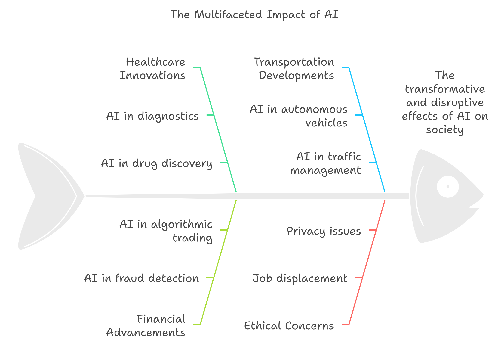

Artificial Intelligence (AI) is not just a technological advancement; it's a revolutionary force reshaping industries, redefining jobs, and sparking ethical debates worldwide. As we enter a new era of intelligent machines, AI promises to enhance productivity and solve complex problems, but it also challenges us to consider its broader implications on society, ethics, and the workforce. In this post, we'll explore the impact of AI on key industries, address pressing ethical considerations, and offer some predictions for where AI might take us by 2025.

{/* truncate */}

## How AI is Transforming Industries

AI applications are vast and touch nearly every sector, from healthcare to finance. Below, we explore a few key areas where AI's impact is particularly transformative:

### 1. Healthcare
AI is driving incredible advancements in healthcare. Machine learning algorithms are now being used to analyze patient data to predict health outcomes, identify risk factors, and personalize treatment plans. Technologies like **deep learning** have enhanced medical imaging, allowing radiologists to detect diseases like cancer earlier and with greater accuracy.

#### Key Applications
- **Diagnostics**: AI-powered tools are assisting doctors in diagnosing conditions by analyzing patient records, medical images, and even genetic information.
- **Drug Discovery**: AI algorithms can simulate drug interactions, speeding up the discovery of new medications and significantly reducing research costs.
- **Personalized Medicine**: AI can recommend treatment plans based on individual genetic profiles, improving outcomes and reducing side effects.

### 2. Finance
In finance, AI is optimizing operations, enhancing security, and enabling personalized customer experiences. AI algorithms analyze vast datasets for trading, fraud detection, and credit risk assessment.

#### Key Applications
- **Fraud Detection**: Machine learning models can detect anomalies in transaction patterns, which helps to prevent fraud in real-time.
- **Algorithmic Trading**: AI algorithms execute trades at speeds and efficiencies impossible for humans, leading to more stable and efficient markets.
- **Customer Service**: AI-driven chatbots provide instant support to customers, handling inquiries 24/7 and personalizing interactions based on user data.

### 3. Transportation
AI is at the heart of autonomous driving technology. Companies like Tesla, Google, and Uber are investing heavily in self-driving cars, promising safer and more efficient transportation systems.

#### Key Applications
- **Autonomous Vehicles**: Self-driving cars could dramatically reduce accidents, lessen traffic congestion, and improve fuel efficiency.
- **Logistics Optimization**: AI helps logistics companies streamline delivery routes, optimize fuel consumption, and reduce operational costs.
- **Traffic Management**: AI models predict traffic flows and manage traffic signals, aiming to reduce congestion in urban areas. 

## Ethical Considerations of AI

With the rapid advancement of AI, ethical concerns have also emerged. As AI systems become more integrated into society, it is essential to consider their impact on jobs, privacy, and decision-making.

### 1. Job Displacement
Automation has raised fears of widespread job displacement, especially in sectors like manufacturing, transportation, and customer service. Although AI could create new job categories, workers will likely need to reskill to stay relevant.

### 2. Privacy and Surveillance
AI's ability to analyze massive datasets has led to concerns about privacy. From facial recognition in public spaces to tracking consumer behavior, AI technology can collect and analyze personal data, raising questions about consent and data protection.

### 3. Bias in AI Systems
AI systems are only as good as the data they're trained on. When biased data is used, AI models may replicate or even amplify these biases. For example, AI systems used in hiring have, at times, discriminated against certain demographic groups due to biases in the training data.

## Predictions for AI by 2025

Looking forward, here are a few predictions for how AI might evolve by 2025:

1. **AI in Everyday Life**: AI will become more prevalent in daily life, embedded in devices like smart homes, wearables, and personalized virtual assistants.
2. **Improved Healthcare**: AI-driven diagnostics and predictive healthcare will advance, leading to earlier and more accurate diagnoses and treatments.
3. **Autonomous Vehicles**: Self-driving technology could reach new levels of maturity, allowing for limited autonomous vehicle deployment in urban areas.
4. **Workforce Transformation**: AI will shift job markets, creating demand for roles focused on data science, machine learning, and AI maintenance, while reducing demand for manual or repetitive tasks.
5. **Global Standards and Regulations**: As AI becomes ubiquitous, nations and organizations may adopt standardized ethical guidelines and regulatory frameworks to ensure responsible use and transparency in AI systems.

## Conclusion

The future of AI holds immense promise, with the potential to transform industries, improve quality of life, and address some of humanity's most pressing challenges. However, it also requires careful consideration of ethical issues and a proactive approach to potential risks. By understanding both the opportunities and the limitations of AI, we can work towards a future where technology serves society’s best interests.

As we approach 2025, it’s crucial to stay informed and engaged in conversations around AI's role in our world. The journey of AI is just beginning, and its trajectory will shape the future in ways we can only begin to imagine.
