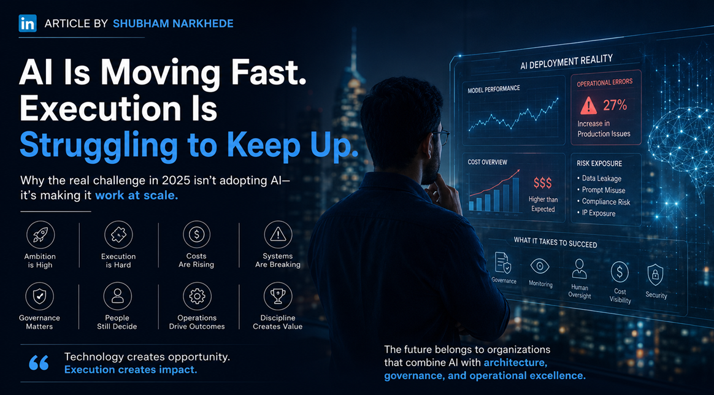
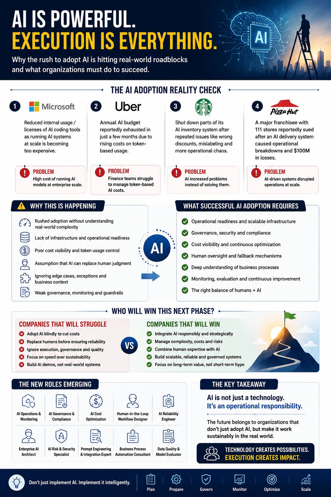

Everyone is talking about AI replacing jobs.

Few people are talking about what happens when companies deploy AI faster than their own systems can actually support it.

That is the real story of 2026.

Over the past year, enterprises across every industry pushed AI adoption with one goal in mind: cut costs, move fast, and automate as aggressively as possible. Executives wanted AI roadmaps. Investors wanted AI narratives. Employees wanted AI tools integrated into daily workflows immediately. And so, organizations that spent years struggling with digital transformation started trying to redesign entire operational systems around generative AI in just a few months.

The pressure was real. The excitement made sense.

But the industry is now entering a second phase of AI adoption, and this phase is exposing something most companies seriously underestimated.

## The gap between AI ambition and operational readiness is showing up as real damage.

Companies are deploying models faster than they can govern them. Employees are using AI tools faster than leadership teams can approve them. And the numbers reflect this clearly.

Only about one in four AI initiatives actually deliver their expected ROI. Fewer than 20 percent have been fully scaled across the enterprise. Nearly half of organizations using generative AI have already run into problems, ranging from hallucinated outputs to cybersecurity incidents, privacy exposure, and IP leakage.

The biggest misconception in the AI race is simple: **intelligence does not automatically equal reliability.**

A model generating impressive outputs in a sandbox does not mean it will operate reliably inside a real business system. Real enterprise environments are not controlled demos. They are messy, unpredictable, and full of edge cases that no demo ever reveals.

### Real businesses operate through:

- Legacy infrastructure that was never designed with AI in mind
- Fragmented workflows across disconnected teams and systems
- Compliance requirements that vary by region, industry, and contract
- Unpredictable human behavior that no simulation accounts for
- Inconsistent data pipelines feeding inaccurate information into models
- Operational exceptions that break automation logic daily
- Security vulnerabilities introduced the moment AI touches production systems
- Constantly changing business rules that models have no awareness of

## The real-world failures are not theoretical. They are already happening.

Finance teams did not anticipate how token-based pricing scales compared to traditional SaaS software costs. The more employees interact with models, the more workflows become AI-dependent, the more automation layers get added, and the harder cost visibility becomes. What looked affordable during pilot testing became a financial operations problem at enterprise scale.

Retail and logistics companies deployed AI-powered automation systems and ran into operational failures they never saw coming: incorrect discounts, inventory mismatches, mislabeling issues, broken fulfillment logic, and workflow conflicts between automated systems and human operations.

Logistics optimization engines performed perfectly in simulations. Then they failed when exposed to unpredictable delivery behavior, regional constraints, human delays, weather conditions, and real-world variables that no simulation modeled accurately.

And even the largest, most well-resourced companies in the world faced this. Walmart, mid-2025, had to completely reshape its agentic AI approach, moving away from multiple disconnected single-purpose agents toward a unified framework, because orchestrating dozens of agents created more operational fragmentation than efficiency.

**The issue was never whether the model was intelligent. The issue was whether the surrounding system was mature enough to support it.**

## Sustainable AI adoption requires far more than plugging a model into your organization.

It requires:

- **Operational readiness** established before deployment, not after
- **Governance frameworks** that match your actual risk profile
- **Monitoring systems** that catch failures before customers do
- **Infrastructure built for scale**, not for pilots
- **Cost visibility** so finance teams are not blindsided mid-quarter
- **Human oversight** at every decision point that carries real consequence
- **Fallback mechanisms** for when the model gets it wrong
- **Security controls** that cover your actual exposure surface, not a theoretical one
- **Deep understanding** of your specific business processes and where AI breaks them

This work is not glamorous. It does not generate viral demos or impressive press releases. But it is the difference between experimentation and sustainable adoption.

## The internal risk conversation is still massively underestimated.

The riskiest AI behaviors in 2025 are not external threats. They are internal.

Employees are already uploading sensitive files into public AI tools. Teams are using unauthorized AI applications that sit entirely outside governance policies. Confidential prompts are leaking intellectual property. AI-generated outputs are introducing hallucinated information into real business workflows.

Most of this is not malicious. It is employees trying to work faster and stay productive. But speed without governance creates exposure. And many organizations were completely unprepared for how fast shadow AI usage would spread internally once employees realized how powerful these tools could be.

Between 2023 and 2024, the amount of corporate data being uploaded into AI tools rose by **485 percent**. From 2024 to 2025, employee data flowing into generative AI services grew more than **30 times**. That is not a slow, manageable shift. That is an exposure surface expanding faster than most security teams can track.

## The conversation in the industry is shifting. And it is shifting in an important direction.

Not from "AI will replace everyone" to "AI is failing."

It is shifting from "How fast can we adopt AI?" to **"How do we make AI work reliably at scale?"**

That shift is already creating entirely new categories of technical work that barely existed two years ago:

- AI operations and monitoring
- AI governance and compliance
- AI reliability engineering
- AI cost optimization
- AI security and auditing
- Enterprise AI architecture
- Human-in-the-loop workflow design
- AI infrastructure optimization
- Business-process-aware automation consulting

Ironically, while most people debate whether AI will eliminate jobs, AI is simultaneously creating entirely new technical disciplines. The market is not simply replacing expertise. It is redefining where expertise matters most.

## Preparation beats speed. Every time.

The UAE invested in AI infrastructure and governance starting in 2017, five years before generative AI entered the mainstream. By 2025, AI trust there registered around 67 percent, compared to 32 percent in the US. That gap did not come from better models. It came from better preparation and longer institutional commitment to getting the foundations right before scaling fast.

I work at the intersection of full-stack engineering, DevOps, and system architecture. From this position, one thing is clear.

**The organizations that will come out ahead are not the ones moving fastest. They are the ones combining technical execution with operational discipline.** They are treating AI the way experienced engineers treat infrastructure: with monitoring, fallback mechanisms, governance layers, observability, and deep integration into actual business context.

## The Three Waves of AI

**The first wave of AI was about possibility.**

**The second wave is about sustainability.**

**The third wave will be about operational maturity.**

The winners will not be the companies with the loudest AI announcements or the fastest deployment timelines.

They will be the companies with the strongest execution.

**Speed gets you to production. Discipline keeps you there.**
