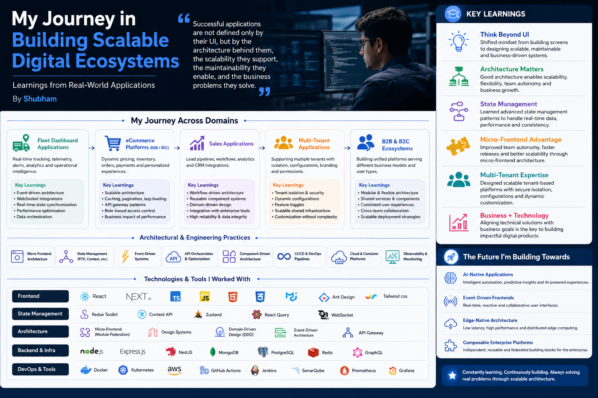

### My Journey Through Fleet Systems, eCommerce Platforms, Sales Applications, and Modern Architecture

Over the years, my journey as a software engineer has been shaped by building enterprise-grade products that solved real operational and business problems across Fleet Management systems, eMobility platforms, eCommerce ecosystems, Sales applications, and multi-tenant B2B/B2C products.

What started as a frontend-focused career gradually evolved into something much deeper: understanding how modern applications are architected, scaled, observed, and continuously evolved to support millions of events, global users, and complex business workflows.

Early in my career, I focused heavily on frontend engineering — building interfaces, integrating APIs, managing components, and improving user experiences. But as systems became larger and operational complexity increased, I realized something important: building applications is not just about writing code. It is about designing systems that can evolve, scale, and continuously adapt to business needs.

That realization completely changed the way I approached software engineering.

---

# Learning Real-Time Architecture Through Bosch eMobility Systems

One of the most transformative phases of my career came while working at Bosch eMobility on large-scale charging infrastructure platforms.

## Connected Charging Cable Platform

At Bosch eMobility R&D, I contributed to the **Connected Charging Cable Platform**, a real-time operator interface processing more than 10,000+ OCPP messages per second across eight European markets with sub-200ms latency. The platform was built using Angular, TypeScript, Vite, PHP (Symfony), OCPP, Docker, and AWS.

This project introduced me deeply to event-driven architecture, streaming communication systems, real-time synchronization, high-frequency state updates, and cloud-native deployment models.

Initially, I viewed frontend systems primarily as presentation layers. But working on real-time charging infrastructure changed that perspective entirely. The frontend was not simply rendering data — it was participating in a distributed operational ecosystem handling continuous device communication, live charging states, operator workflows, event streams, real-time telemetry, fault monitoring, and infrastructure diagnostics.

This became one of my earliest and most important lessons in systems thinking.

---

# Event-Driven Thinking Changed My Perspective

Fleet and charging systems introduced me deeply to Event-Driven Architecture. In operational platforms, polling APIs every few seconds becomes inefficient and expensive. Devices continuously emit events: charging status updates, device telemetry, fault diagnostics, operator actions, location tracking, and energy consumption streams.

To support real-time operations, we evolved toward architectures powered by WebSockets, streaming pipelines, RabbitMQ, asynchronous communication models, and reactive UI systems. This dramatically improved latency, responsiveness, operational visibility, and scalability.

Most importantly, it taught me a foundational principle: modern applications are evolving from request-response systems into event-driven ecosystems. That understanding later influenced how I approached eCommerce systems, sales applications, and SaaS platforms.

---

# Scaling Enterprise Infrastructure Through CPMS

Another major milestone was working on the **Charge Point Management System (CPMS)** at Bosch GmbH. This enterprise platform managed 450,000+ charge points across 30 countries with 99.9% uptime requirements. The technology stack included React, Vue.js, TypeScript, Symfony, Redis, RabbitMQ, Docker, Kubernetes, and AWS.

This project fundamentally changed how I viewed scalability and distributed systems. I learned how enterprise applications maintain reliability under massive operational loads using message-driven architectures, distributed caching, queue-based processing, horizontal scalability, container orchestration, and infrastructure automation.

Working closely with backend and DevOps teams exposed me to Kubernetes orchestration, Dockerized deployments, CI/CD pipelines, service communication patterns, and operational observability. I gradually shifted from building frontend features to understanding how entire platforms operate in production.

---

# Understanding State Management Beyond Global Stores

As these real-time systems scaled, managing frontend state became increasingly complex. Applications started facing unnecessary re-renders, state inconsistencies, memory bottlenecks, delayed UI synchronization, and difficult debugging scenarios.

This is where I explored advanced state management patterns using Redux Toolkit, Pinia, Context APIs, reactive state handling, scoped state management, and server-state synchronization. Initially, centralized global stores seemed like the perfect solution. But over time, I learned that not all state belongs globally. Some state belongs within feature boundaries, inside components, in caching layers, within streaming systems, or synchronized directly from backend services.

This architectural separation significantly improved rendering performance, maintainability, debugging, developer productivity, and runtime efficiency. I also worked closely with backend teams to optimize data flow using WebSocket integrations, Redis caching, pagination, lazy loading, incremental rendering, and API orchestration.

This experience fundamentally changed how I viewed frontend systems. I no longer saw frontend applications as UI layers. I started seeing them as distributed runtime ecosystems managing data, rendering, events, and business workflows simultaneously.

---

# High-Performance Visualization Systems

Working on Bosch's **Real-Time Geospatial Dashboard** and **High-Volume Data Visualization Platform** introduced me to another dimension of engineering: performance-first architecture. These systems required rendering 50,000+ geospatial data points, 10,000+ streaming updates per second, 60fps visualization performance, and sub-300ms rendering latency. The stack included React, TypeScript, D3.js, Canvas API, Leaflet.js, and WebSockets.

Traditional DOM rendering approaches were insufficient at this scale. This pushed me toward learning canvas-based rendering pipelines, rendering virtualization, memory optimization, incremental rendering strategies, event throttling, and efficient reconciliation patterns.

These projects taught me that performance is not only a frontend concern — it is an architectural concern. Every rendering decision, state update, and event synchronization directly impacts scalability and user experience.

---

# eCommerce Platforms Taught Me Business Architecture

Another major learning phase came while building enterprise eCommerce platforms and B2B/B2C ecosystems. At Bosch Rexroth, I contributed to the **Application Product Selector (APS)**, a SAP-connected platform supporting over 100 global partners. The platform involved product catalog orchestration, dynamic pricing, inventory workflows, enterprise integrations, SAP synchronization, and role-based access systems. The technology stack included Vue.js, Pinia, TypeScript, Symfony, Redis, MySQL, and SAP Integration.

Unlike traditional storefronts, these systems were deeply interconnected business ecosystems. This was where I truly started appreciating domain-driven architecture, modular system design, API gateway patterns, enterprise integration strategies, scalable state management, and cloud-native deployment workflows.

One of the biggest lessons from these systems was that architecture directly impacts business outcomes. Milliseconds matter: faster workflows improve conversion, better caching reduces infrastructure costs, independent deployments accelerate releases, and reliable integrations improve operations. Engineering decisions became business decisions as well.

---

# Discovering Micro-Frontend Architecture

As enterprise applications evolved, frontend systems became increasingly large and team collaboration became more complex. Different teams worked on product catalogs, analytics dashboards, checkout systems, support portals, customer management systems, and reporting modules. Managing everything inside monolithic frontends created slower deployments, merge conflicts, shared dependency issues, long testing cycles, and reduced team autonomy.

This is where I started working deeply with **Micro-Frontend Architecture (Micro-FE)**. Instead of one large application, applications were divided into independently deployable modules, teams owned isolated business domains, features evolved independently, release cycles became faster, and failures became isolated. I worked with concepts like Module Federation, shared dependency management, federated routing, shared authentication, cross-module communication, and design system standardization.

But one of the most important lessons I learned was that micro-frontends are not simply about splitting applications — they are about balancing autonomy with platform consistency. Without governance, Micro-FE systems can become fragmented and operationally expensive. Successful Micro-FE ecosystems require shared design standards, unified observability, platform governance, consistent user experiences, and cross-team collaboration. That balance became one of the most valuable architectural lessons in my journey.

---

# Multi-Tenant Applications Expanded My Architectural Thinking

Another transformative experience was building multi-tenant SaaS platforms like **Smart Project Management v3.0**, serving more than 1,000 users. These systems introduced complex architectural challenges including tenant isolation, runtime configurations, feature toggles, role-based permissions, tenant-specific branding, and shared infrastructure optimization.

At first glance, multi-tenancy looked simple: add tenant identifiers. But the real complexity was much deeper. We had to carefully design systems where APIs adapted dynamically, themes changed at runtime, features enabled selectively, security remained isolated, and performance stayed consistent.

I learned that successful multi-tenant architecture is fundamentally about creating flexibility without sacrificing maintainability or security.

---

# Sales and Workflow Platforms Taught Me Business-Driven Engineering

Working on enterprise workflow systems and support platforms expanded my understanding of process-oriented architectures. While contributing to **Support Portal 2.0**, the focus was not simply building interfaces — it was improving operational efficiency. The platform achieved 40% faster ticket resolution and 60% automation of L1 support tasks.

These systems involved workflow orchestration, analytics dashboards, approval systems, CRM-style workflows, and operational automation. This pushed me toward designing reusable component systems, configurable workflows, domain-driven UI architectures, and business capability-aligned systems.

I started understanding the importance of aligning technical architecture with business domains rather than purely technical layers. I also deeply appreciated concepts like Domain-Driven Design (DDD), service boundaries, workflow orchestration, and business capability modeling. These systems taught me that good engineering is not only about writing clean code — it is about designing systems flexible enough to evolve with changing business requirements.

---

# Building My Own AI-Native Product

Outside enterprise environments, I independently built **Chase My Career**, an AI-powered job matching and resume review platform currently live in Germany. The stack included Next.js, React, TypeScript, Supabase, Cloudflare, and AI/LLM APIs.

Unlike enterprise projects with large teams, this experience gave me full ownership over product architecture, frontend systems, backend integrations, AI orchestration, deployment pipelines, and scalability planning. This project became a complete end-to-end engineering experience. It also strengthened my belief that the future of applications is becoming increasingly AI-native, event-driven, edge-powered, modular, and personalized.

---

# Modern Engineering Beyond Frontend Development

Across all these projects, I continuously explored modern engineering practices including component-driven architecture, design systems, CI/CD pipelines, cloud-native deployment, containerization, observability platforms, distributed tracing, and infrastructure automation.

One major realization throughout this journey was that if a system cannot be observed, it cannot be scaled effectively. As applications became increasingly distributed through microservices, micro-frontends, event-driven systems, and cloud-native platforms, debugging and operational visibility became critical. This introduced me deeply to centralized logging, metrics monitoring, distributed tracing, real-time alerting, and platform observability.

I gradually shifted from building features to designing scalable and observable ecosystems.

---

# The Future of Application Architecture

Based on my experiences, I strongly believe the future of software architecture is moving toward AI-native systems where applications integrate AI copilots, predictive workflows, intelligent automation, and adaptive user experiences. Modern frontends will become highly reactive event-driven systems powered by live streaming data, real-time collaboration, event synchronization, and reactive rendering. Applications will move closer to users through edge-native architectures using edge rendering, distributed execution, CDN-powered compute, and regional caching. And future enterprise applications will evolve into composable platforms built from independent services, shared business capabilities, federated frontend systems, and reusable platform modules.

---

# My Biggest Learning Throughout This Journey

Looking back across Bosch eMobility systems, fleet platforms, eCommerce ecosystems, sales applications, B2B/B2C products, visualization platforms, and multi-tenant SaaS architectures, my biggest learning has been this: successful applications are not defined only by their UI. They are defined by the architecture behind them, the scalability they support, the maintainability they enable, and the business problems they solve.

What truly shaped me throughout these experiences was the shift in mindset — from someone who builds screens, to someone who understands how entire digital ecosystems function.

Today, whenever I approach a new application, I naturally think in terms of system design, scalability, modularity, state orchestration, event-driven architecture, observability, performance engineering, business alignment, and long-term maintainability.

My journey across fleet systems, eMobility platforms, enterprise SaaS products, sales systems, and AI-driven applications has helped me grow into an engineer who values both technical depth and product thinking equally.

And that journey continues with every system I design and every problem I solve.
