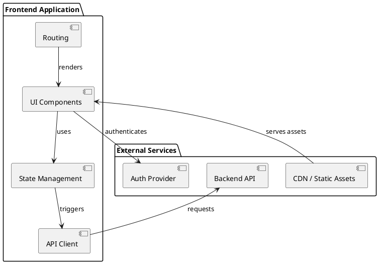
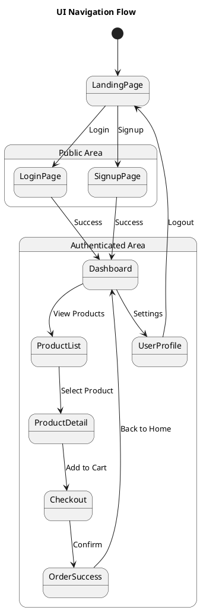
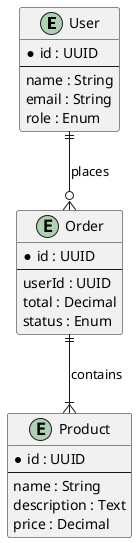
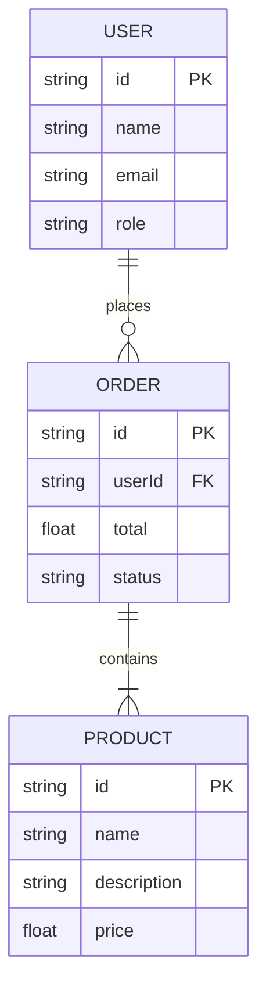
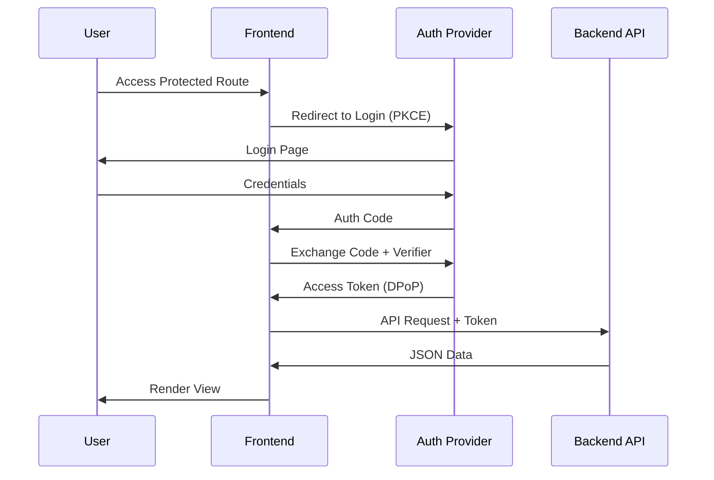
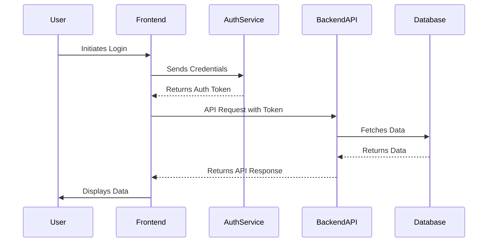
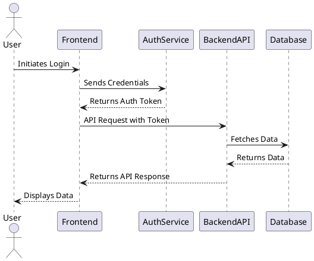

# v2 Master Frontend Architect Framework: The Grand Selection Matrix

This module provides a comprehensive decision-making framework for selecting the most appropriate frontend architecture, structural patterns, rendering strategies, and state management solutions. These choices are critical and depend heavily on project size, team structure, performance needs, long-term goals, and business requirements.

## 1. How to Decide Frontend Architecture for a Project

Deciding on the optimal frontend architecture is a multi-faceted process that requires careful consideration of various factors. A good architectural decision balances immediate project needs with future scalability, maintainability, and cost-effectiveness [1].

### 1.1 Key Decision Factors

| Factor | Description | Impact on Architecture Choice |
| :----- | :---------- | :---------------------------- |
| **Project Size & Complexity** | The overall scope, number of features, and intricacy of business logic. | Larger, more complex projects often benefit from modular or micro-frontend approaches. Smaller projects might thrive with simpler monolithic SPAs. |
| **Team Size & Structure** | Number of frontend developers, their experience, and how teams are organized (e.g., feature teams, domain teams). | Larger, independent teams are better suited for micro-frontends. Smaller, co-located teams might prefer modular monoliths to reduce coordination overhead. |
| **Performance Needs** | Criticality of initial load time, responsiveness, and overall user experience. | High performance demands (e.g., e-commerce, real-time apps) push towards SSR, SSG, ISR, or RSC. |
| **Long-Term Goals & Scalability** | Anticipated growth in features, user base, and future team expansion. | Architectures that support independent deployment and scaling (micro-frontends) are beneficial for long-term growth. |
| **Business Requirements** | Specific needs like SEO, real-time updates, offline capabilities, security compliance. | SEO requirements heavily influence rendering choices. Real-time features necessitate WebSockets. |
| **Maintenance Cost** | The ongoing effort and resources required to manage and evolve the application. | Simpler architectures generally have lower maintenance costs, but complex ones can reduce maintenance for individual teams. |
| **Team Expertise & Tooling Choice** | Familiarity of the development team with specific frameworks, libraries, and architectural patterns. | Leveraging existing team expertise can accelerate development and reduce learning curves. |
| **Cost (Development & Infrastructure)** | Budget constraints for initial development and ongoing hosting/operational costs. | Complex architectures (e.g., micro-frontends) often have higher initial development and infrastructure costs. |

### 1.2 Prototyping and Architectural Diagrams

Before committing to a specific architecture, it is highly recommended to engage in **prototyping** and create detailed **architectural diagrams**. Prototypes can validate technical feasibility and user experience, while diagrams (HMI, Sequence, UI Flow, Class, ER, Security) serve as critical documentation and communication tools, helping to visualize the system and identify potential issues early [2].

## 2. High-Level Frontend Architecture Selection

This section evaluates common high-level architectural patterns for frontend applications, guiding the selection based on project characteristics.

| Architecture | Description | Key Benefits | Ideal Use Cases | Considerations |
| :----------- | :---------- | :----------- | :--------------- | :------------- |
| **Static Page** | Simple HTML, CSS, and JavaScript files served directly from a web server or CDN. | Extremely fast, highly scalable, low cost, excellent SEO. | Marketing sites, landing pages, simple blogs, documentation. | Limited interactivity, requires full page reload for content changes, not suitable for dynamic applications. |
| **Monolithic SPA (Single Page Application)** | A single, large JavaScript application that handles all UI rendering and routing on the client-side. | Rich user experience, fast transitions, good for complex interactions. | Dashboards, internal tools, SaaS applications where SEO is less critical. | Large initial bundle size, potential for slow initial load, SEO challenges, tight coupling can hinder scalability for large teams. |
| **MVC (Model-View-Controller)** | A traditional pattern separating application logic (Model), presentation (View), and user interaction handling (Controller). | Clear separation of concerns, well-understood pattern. | Often seen in traditional server-rendered applications or older client-side frameworks. | Can become rigid, less common in modern frontend frameworks which often use component-based architectures. |
| **Modular Monolith** | A single deployable frontend application structured into loosely coupled, independent modules. | Better separation of concerns than a pure monolith, easier to refactor, shared infrastructure. | Medium to large applications with evolving feature sets, where independent team deployment is not a primary concern. | Still a single deployment unit, potential for module coupling if not managed well. |
| **BFF (Backend-for-Frontend)** | An API layer specifically designed for a particular frontend client, aggregating data from multiple backend services. | Tailored API for frontend needs, reduces client-side complexity, can handle client-specific logic. | Complex microservices backends, mobile applications, multiple frontend clients with different data needs. | Adds another layer of complexity, requires additional operational overhead. |
| **Micro-Frontends** | Breaking down a monolithic frontend into smaller, independently deployable applications, often owned by autonomous teams. | Independent deployment, technologyagnostic, scalable for large organizations, improved team autonomy. | Large-scale enterprise applications, multi-brand platforms, complex domains with many independent teams. | High operational complexity, increased infrastructure, potential for inconsistent UX/UI if not governed by a strong design system. |

**Decision Logic for High-Level Architecture:**
*   **Small Project, Simple Content**: **Static Page**.
*   **Small-to-Medium, Interactive, Single Team**: **Monolithic SPA**.
*   **Medium-to-Large, Evolving Features, Co-located Teams**: **Modular Monolith**.
*   **Complex Backend, Multiple Frontend Clients**: Consider **BFF**.
*   **Large Enterprise, Multiple Autonomous Teams, Independent Deployment**: **Micro-Frontends**.

## 3. Structural Pattern Selection: Clean vs. Hexagonal Architecture

These architectural patterns focus on organizing code within the application to promote maintainability, testability, and flexibility, primarily by separating business logic from external concerns [3].

| Pattern | Description | Key Benefits | Ideal Use Cases | Considerations |
| :------ | :---------- | :----------- | :--------------- | :------------- |
| **Clean Architecture** | Organizes code into concentric layers, with the domain (business rules) at the center, independent of frameworks, databases, or UI. | High testability, framework-agnostic, strong separation of concerns, long-term maintainability. | Applications with complex, stable business logic that needs to be isolated from infrastructure changes. | Can be overkill for simple applications, higher initial complexity, requires strict adherence to rules. |
| **Hexagonal Architecture (Ports & Adapters)** | Defines application boundaries through "ports" (interfaces) and "adapters" (implementations), making external dependencies pluggable. | Excellent for isolating business logic, easy to swap external services (databases, APIs), high testability. | Applications with many external integrations, complex domain logic, need for future flexibility in infrastructure. | Can introduce boilerplate, requires careful design of ports and adapters. |

**Decision Logic for Structural Patterns:**
*   **Complex, Stable Business Logic, Framework Agnostic**: **Clean Architecture**.
*   **Many External Integrations, Need for Swappable Dependencies**: **Hexagonal Architecture**.
*   **Simpler Applications**: A well-structured component-based architecture might suffice without the overhead of these patterns.

## 4. Rendering Strategy Selection

Revisiting rendering strategies with a focus on project-specific benefits and trade-offs [4].

| Strategy | Key Benefits | Key Drawbacks | When to Use |
| :------- | :----------- | :------------ | :---------- |
| **CSR (Client-Side Rendering)** | Rich interactivity, fast transitions after initial load, good for authenticated dashboards. | Poor initial load performance, SEO challenges, larger initial JS bundle. | Internal tools, highly interactive applications where SEO is not critical, strong authentication required. |
| **SSR (Server-Side Rendering)** | Excellent for SEO, faster Time-To-Content (TTC), good for dynamic data. | Increased server load, slower Time-To-Interactive (TTI) if heavy hydration, complex caching. | E-commerce, content-heavy sites, applications requiring strong SEO and fast initial load. |
| **SSG (Static Site Generation)** | Blazing fast performance, highly scalable, low hosting costs, excellent SEO. | Not suitable for highly dynamic content, requires re-build for content updates. | Blogs, marketing sites, documentation, portfolios, content that changes infrequently. |
| **ISR (Incremental Static Regeneration)** | Combines SSG benefits with dynamic content updates without full rebuilds. | More complex deployment, potential for stale content if revalidation fails. | E-commerce product pages, news articles, content that updates periodically. |
| **RSC (React Server Components)** | Reduces client-side JavaScript bundle size, improves initial load and interactivity, co-locates data fetching with components. | Still evolving, requires specific framework support (e.g., Next.js App Router), new mental model. | Data-intensive components, parts of the UI that don't require client-side interactivity, Next.js applications. |

**Decision Logic for Rendering:**
*   **High SEO & Fast Initial Load**: Prioritize SSR, SSG, or ISR. Choose SSG for static content, ISR for periodically updated content, and SSR for highly dynamic, user-specific content.
*   **High Interactivity & Authenticated Experience (SEO less critical)**: CSR is suitable.
*   **Reduced Client-Side Bundle & Improved Performance (React Ecosystem)**: Consider RSC for specific parts of the application.

## 5. State Management Selection

Choosing the right state management solution depends on the scope, complexity, and nature of the data being managed [5].

| Type | Description | Key Libraries/Patterns | When to Use |
| :--- | :---------- | :--------------------- | :---------- |
| **Local Component State** | State managed within a single component. | `useState` (React), `ref` (Vue) | Component-specific UI toggles, form inputs, temporary data. |
| **Global UI State** | Application-wide state that affects UI, but not necessarily server data. | Zustand, Jotai, Pinia (Vue) | User authentication status, theme settings, global notifications, modal visibility. |
| **Server State** | Data fetched from a server, involving caching, revalidation, and synchronization. | TanStack Query, SWR, Apollo Client | API data, database records, any data that originates from a backend. |
| **Complex Domain State (Machine State)** | State managed by a finite state machine or statechart for explicit, complex transitions. | XState, Zustand with state machines | Complex forms, multi-step wizards, drag-and-drop interfaces, media players. |

**Decision Logic for State Management:**
*   **Simple, Component-Specific UI Logic**: **Local Component State**.
*   **Application-Wide UI Concerns**: Lightweight **Global UI State** manager.
*   **Data from APIs**: Robust **Server State** management solution.
*   **Complex, Explicit State Transitions**: **Machine State** for clarity and maintainability.

## 6. Good Principles of Frontend Architecture

Regardless of the specific architectural choices, adhering to fundamental principles ensures a robust, maintainable, and scalable frontend application [6].

*   **Separation of Concerns**: Divide the application into distinct sections, each responsible for a specific functionality. This improves modularity and makes the codebase easier to understand and modify.
*   **Reusability**: Design components, modules, and logic to be easily reused across different parts of the application or even in other projects. This reduces development time and ensures consistency.
*   **Scalability**: Design the architecture to accommodate future growth in features, user base, and development teams without significant re-architecture.
*   **Maintainability**: Ensure the codebase is easy to understand, debug, and update. This includes clear naming conventions, consistent coding styles, and comprehensive documentation.
*   **Testability**: Design components and modules in a way that facilitates easy and effective automated testing (unit, integration, E2E).
*   **Performance**: Prioritize fast loading times, smooth interactions, and efficient resource utilization to provide an optimal user experience.
*   **Accessibility (A11y)**: Build applications that are usable by people with disabilities, adhering to standards like WCAG.
*   **Security**: Implement robust security measures at every layer to protect against common frontend vulnerabilities.
*   **Extensibility**: Design the architecture to allow for easy addition of new features or integration with new technologies without disrupting existing functionality.
*   **Observability**: Integrate logging, monitoring, and tracing to understand application behavior in production and quickly identify issues.

---

## References

[1] The Complete Guide to Frontend Architecture Patterns in 2026 - DEV Community. (2026, January 4). Retrieved from [https://dev.to/sizan_mahmud0_e7c3fd0cb68/the-complete-guide-to-frontend-architecture-patterns-in-2026-3ioo](https://dev.to/sizan_mahmud0_e7c3fd0cb68/the-complete-guide-to-frontend-architecture-patterns-in-2026-3ioo)
[2] Architectural Decision Records (ADRs) - ThoughtWorks. (n.d.). Retrieved from [https://www.thoughtworks.com/insights/blog/architectural-decision-records](https://www.thoughtworks.com/insights/blog/architectural-decision-records)
[3] Hexagonal vs Clean vs Onion: which one actually survives your app ... - DEV Community. (2025, September 23). Retrieved from [https://dev.to/dev_tips/hexagonal-vs-clean-vs-onion-which-one-actually-survives-your-app-in-2026-273f](https://dev.to/dev_tips/hexagonal-vs-clean-vs-onion-which-one-actually-survives-your-app-in-2026-273f)
[4] The rendering revolution: Your 2026 guide to CSR, SSR ... - JavaScript in Plain English. (2026, January 11). Retrieved from [https://javascript.plainenglish.io/the-rendering-revolution-your-2026-guide-to-csr-ssr-ssg-and-react-server-components-3ccfa700410b](https://javascript.plainenglish.io/the-rendering-revolution-your-2026-guide-to-csr-ssr-ssg-and-react-server-components-3ccfa700410b)
[5] Modern Frontend State Management: A Comprehensive Guide - Medium. (n.d.). Retrieved from [https://medium.com/@Adekola_Olawale/the-future-of-frontend-architecture-in-2026-372e51c1dd25](https://medium.com/@Adekola_Olawale/the-future-of-frontend-architecture-in-2026-372e51c1dd25)
[6] Good Principles of Software Architecture - GeeksforGeeks. (n.d.). Retrieved from [https://www.geeksforgeeks.org/good-principles-of-software-architecture/](https://www.geeksforgeeks.org/good-principles-of-software-architecture/)
# v2 Master Frontend Architect Framework: Diagram-as-Code Blueprint Library

This module provides ready-to-use source code for various architectural diagrams using **PlantUML** and **Mermaid**. These "Diagram-as-Code" blueprints allow for version-controlled, easily maintainable, and professional-grade visualizations.

## 1. PlantUML Blueprints

PlantUML is excellent for complex structural and behavioral diagrams.

### 1.1 High-Level Architecture (`architect.plantuml`)
Visualizes the relationship between the frontend application, its internal modules, and external services.


### 1.2 UI Navigation Flow (`ui_navigation.plantuml`)
Maps the user journey through public and authenticated areas of the application.


### 1.3 Entity Relationship Diagram (`er_diagram.plantuml`)
Defines the core data entities and their relationships from a frontend perspective.


## 2. Mermaid Blueprints

Mermaid is ideal for quick, markdown-integrated diagrams.

### 2.1 ER Diagram (`er_diagram.mmd`)
A concise representation of data entities and relationships.


### 2.2 Sequence Diagram (Auth Flow)
Visualizes the step-by-step interaction for a secure authentication process.


---

## How to Render
- **PlantUML**: Use the [PlantUML Online Server](http://www.plantuml.com/plantuml) or VS Code extensions.
- **Mermaid**: Use the [Mermaid Live Editor](https://mermaid.live/) or native support in GitHub/GitLab/Manus.
# Product Requirement Document (PRD) Template

## 1. Introduction
### 1.1 Purpose
[Briefly describe the purpose of this document and the product it defines.]

### 1.2 Scope
[Define the boundaries of the product. What is included and what is explicitly out of scope?]

### 1.3 Target Audience
[Who are the primary users of this product? Describe their needs and pain points.]

## 2. Business Goals
[What are the overarching business objectives this product aims to achieve? (e.g., Increase user engagement, reduce operational costs, enter new market.)]

## 3. User Stories / Functional Requirements
[List user stories or functional requirements. Use the format: "As a [type of user], I want [some goal] so that [some reason]."]

*   As a [User Role], I want to [Action] so that [Benefit].
*   As a [User Role], I want to [Action] so that [Benefit].

## 4. Non-Functional Requirements
### 4.1 Performance
[Specify performance targets (e.g., page load times, response times, concurrent users).]

### 4.2 Security
[Outline security requirements (e.g., authentication, authorization, data encryption, compliance).]

### 4.3 Scalability
[Describe expected growth and scalability needs.]

### 4.4 Usability / UX
[Define usability goals and user experience principles.]

### 4.5 Accessibility (A11y)
[Specify accessibility compliance standards (e.g., WCAG 2.1 AA).]

### 4.6 Internationalization (i18n)
[List target languages and localization requirements.]

## 5. Technical Requirements
[High-level technical considerations or constraints that impact the frontend architecture.]

## 6. Design & UI/UX
[Reference to design mockups, wireframes, or design system guidelines.]

## 7. Open Questions / Future Considerations
[Any unresolved questions or potential future features.]

## 8. Approvals
[Sign-off section for stakeholders.]
# API Design Document Template

## 1. Introduction
### 1.1 Purpose
[Briefly describe the purpose of this API and its role within the system.]

### 1.2 Scope
[Define the boundaries of the API. What functionalities does it cover?]

### 1.3 Target Audience
[Who will be consuming this API? (e.g., Frontend applications, other microservices, third-party developers.)]

## 2. API Overview
### 2.1 API Type
[Specify the API type: REST, GraphQL, tRPC, WebSockets, etc.]

### 2.2 Base URL
[e.g., `https://api.example.com/v1`]

### 2.3 Authentication & Authorization
[Describe the authentication mechanism (e.g., OAuth 2.1, API Keys, JWT) and authorization policies.]

### 2.4 Error Handling
[Define standard error response formats and HTTP status codes.]

## 3. Resources / Endpoints
[For REST/tRPC, list and describe each resource/endpoint. For GraphQL, describe the schema.]

### 3.1 Resource: `[Resource Name]`
*   **Endpoint**: `[e.g., /users]`
*   **Description**: [Brief description of the resource.]

#### 3.1.1 `GET /users`
*   **Description**: Retrieve a list of users.
*   **Request Parameters**: 
    *   `limit` (optional, integer): Max number of users to return.
    *   `offset` (optional, integer): Starting offset for pagination.
*   **Response**: 
    ```json
    [
      {
        "id": "uuid",
        "name": "string",
        "email": "string"
      }
    ]
    ```
*   **Status Codes**: `200 OK`, `401 Unauthorized`, `403 Forbidden`

#### 3.1.2 `POST /users`
*   **Description**: Create a new user.
*   **Request Body**: 
    ```json
    {
      "name": "string",
      "email": "string"
    }
    ```
*   **Response**: 
    ```json
    {
      "id": "uuid",
      "name": "string",
      "email": "string"
    }
    ```
*   **Status Codes**: `201 Created`, `400 Bad Request`, `401 Unauthorized`

## 4. Data Models / Schema
[Define the structure of data objects used in the API.]

### 4.1 User Object
```json
{
  "id": "uuid",
  "name": "string",
  "email": "string",
  "createdAt": "datetime",
  "updatedAt": "datetime"
}
```

## 5. Versioning Strategy
[How will API versions be managed? (e.g., URL versioning, header versioning.)]

## 6. Rate Limiting
[Describe any rate limiting policies.]

## 7. Open Questions / Future Considerations
[Any unresolved questions or potential future API enhancements.]
# System Design Document Template

## 1. Introduction
### 1.1 Purpose
[Briefly describe the purpose of this document and the system it designs.]

### 1.2 Scope
[Define the boundaries of the system. What is included and what is explicitly out of scope?]

### 1.3 Goals & Non-Goals
[What are the primary objectives of this system? What is it explicitly NOT trying to achieve?]

## 2. High-Level Architecture
[Provide an overview of the system's architecture, including major components and their interactions. A high-level diagram (e.g., C4 Model Level 1: System Context) can be included here.]

### 2.1 Component Breakdown
[Describe each major component of the system, its responsibilities, and its interfaces.]

## 3. Data Model
[Describe the core data entities and their relationships. An ER diagram can be referenced or included.]

## 4. API Design
[Reference or summarize the API design, focusing on how different components communicate.]

## 5. Frontend Architecture
[Detail the frontend architectural choices, referencing the Grand Selection Matrix decisions (Rendering, State, High-Level Architecture, Structural Patterns).]

### 5.1 Rendering Strategy
[e.g., SSR with Next.js]

### 5.2 State Management
[e.g., TanStack Query for server state, Zustand for global UI state]

### 5.3 High-Level Frontend Architecture
[e.g., Modular Monolith]

### 5.4 Structural Pattern
[e.g., Hexagonal Architecture for domain logic]

## 6. Security Considerations
[Outline security measures, including authentication, authorization, data protection, and vulnerability management.]

## 7. Performance & Scalability
[Detail strategies for ensuring performance targets are met and how the system will scale.]

## 8. Deployment & Operations
[Describe how the system will be deployed, monitored, and maintained.]

## 9. Technologies Used
[List the main technologies, frameworks, and tools used in the system.]

## 10. Open Questions & Future Work
[Any unresolved issues, risks, or planned future enhancements.]
# Frontend Project File Tree Template

This template outlines a recommended file structure for a modern frontend project, promoting organization, scalability, and maintainability. Adjust as necessary based on project size, framework, and architectural patterns.

```
.editorconfig
.env
.env.development
.env.production
.eslintrc.js
.gitignore
.prettierrc.js
package.json
pnpm-lock.yaml
tsconfig.json
README.md

public/
├── index.html
└── assets/
    ├── images/
    └── fonts/

src/
├── main.tsx             # Main entry point for the application
├── App.tsx              # Root component
├── index.css            # Global styles
│
├── assets/              # Static assets like images, icons, fonts
│   ├── images/
│   ├── icons/
│   └── fonts/
│
├── components/          # Reusable UI components (Atoms, Molecules, Organisms)
│   ├── ui/              # Generic, framework-agnostic UI components (e.g., Button, Input)
│   │   ├── Button.tsx
│   │   └── Input.tsx
│   ├── layout/          # Layout components (e.g., Header, Footer, Sidebar)
│   │   ├── Header.tsx
│   │   └── Sidebar.tsx
│   └── feature/         # Components specific to a feature (e.g., ProductCard, UserProfile)
│       ├── ProductCard.tsx
│       └── UserProfile.tsx
│
├── features/            # Domain-specific features, often containing pages, components, and logic
│   ├── auth/            # Authentication-related logic, components, and pages
│   │   ├── components/
│   │   ├── hooks/
│   │   ├── pages/
│   │   │   ├── LoginPage.tsx
│   │   │   └── SignupPage.tsx
│   │   └── services/
│   ├── products/        # Product-related logic, components, and pages
│   │   ├── components/
│   │   ├── hooks/
│   │   ├── pages/
│   │   │   ├── ProductListPage.tsx
│   │   │   └── ProductDetailPage.tsx
│   │   └── services/
│   └── ...
│
├── hooks/               # Reusable custom hooks (e.g., useAuth, useDebounce)
│   ├── useAuth.ts
│   └── useDebounce.ts
│
├── lib/                 # Utility functions, helpers, third-party integrations
│   ├── api.ts           # API client setup
│   ├── utils.ts         # General utility functions
│   └── constants.ts     # Application-wide constants
│
├── pages/               # Top-level pages/routes of the application
│   ├── HomePage.tsx
│   ├── AboutPage.tsx
│   └── NotFoundPage.tsx
│
├── services/            # Data fetching and business logic related to external services
│   ├── authService.ts
│   └── productService.ts
│
├── store/               # Global state management (e.g., Zustand, Redux, Pinia)
│   ├── authStore.ts
│   └── productStore.ts
│
├── styles/              # Global styles, theme definitions, utility classes
│   ├── theme/
│   │   ├── colors.ts
│   │   └── typography.ts
│   ├── base.css
│   └── utilities.css
│
├── types/               # TypeScript type definitions and interfaces
│   ├── auth.ts
│   ├── product.ts
│   └── global.d.ts
│
└── router/              # Routing configuration
    └── index.ts

```
# Sequence Diagram Template

This template outlines how to document a sequence diagram, which illustrates the order of interactions between objects or components in a system. It's particularly useful for visualizing complex processes like user authentication, data fetching, or event flows.

## 1. Introduction
### 1.1 Purpose
[Briefly describe the purpose of this specific sequence diagram. What interaction or process does it illustrate?]

### 1.2 Context
[Provide any necessary background or context for understanding the diagram. Which system or feature is this part of?]

## 2. Participants
[List all the key participants (actors, objects, components) involved in the sequence, along with their roles.]

*   **User**: The end-user interacting with the system.
*   **Frontend**: The client-side application (e.g., SPA, mobile app).
*   **Auth Service**: The authentication provider.
*   **Backend API**: The server-side API.
*   **Database**: The data persistence layer.

## 3. Interaction Flow
[Describe the step-by-step interaction flow. This can be a textual description that complements the diagram.]

1.  User initiates a login request from the Frontend.
2.  Frontend sends credentials to the Auth Service.
3.  Auth Service validates credentials and returns a token.
4.  Frontend stores the token and makes an API request to the Backend API.
5.  Backend API validates the token and fetches data from the Database.
6.  Database returns data to the Backend API.
7.  Backend API returns data to the Frontend.
8.  Frontend displays data to the User.

## 4. Diagram (Mermaid)

[Use Mermaid syntax to generate the sequence diagram. You can use an online editor (e.g., Mermaid Live Editor) to visualize and refine your diagram before pasting it here.]



## 5. Diagram (PlantUML - Optional)

[If preferred, or for more complex diagrams, use PlantUML syntax. You can use an online editor (e.g., PlantUML Online Server) to visualize and refine your diagram.]



## 6. Key Decisions & Assumptions
[Document any key architectural decisions made during the design of this interaction and any assumptions.]

## 7. Open Questions / Future Considerations
[Any unresolved questions or potential future changes to this sequence.]
