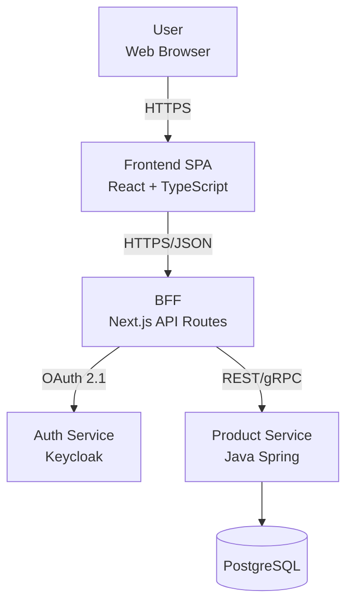

# Chapter 7 — Frontend Architecture Patterns
## Feature-Sliced Design, DDD, Clean Architecture, ADRs, and System Design

> Stage 4–5 | Where engineers become architects

---

## Chapter Overview

Architecture patterns are not abstract theory — they are proven solutions to recurring organizational and technical problems. This chapter covers every pattern a Frontend Architect is expected to know, recognize, and apply: from codebase organization methodologies to formal system design, decision documentation, and the frameworks borrowed from software architecture at large.

```
Chapter 7 Map

  7.1 Codebase organization patterns
   ├── Feature-Sliced Design (FSD)
   ├── Domain-Driven Design (DDD) applied to frontend
   ├── Atomic Design (and when to stop using it)
   └── Classic patterns: MVC, MVP, MVVM, Flux

  7.2 Structural patterns
   ├── Layered architecture
   ├── Hexagonal / Ports and Adapters
   ├── Clean Architecture
   └── BFF (Backends for Frontends)

  7.3 Architecture Decision Records (ADRs)
   ├── When to write one
   ├── Formats (Nygard, MADR, Y-statements)
   └── Tooling

  7.4 Architecture documentation
   ├── C4 model
   ├── arc42 template
   └── Diagrams as code

  7.5 Trade-off analysis frameworks
   ├── ATAM
   ├── Wardley Mapping
   └── Quality attributes (ISO 25010)
```

---

## 7.1 Codebase Organization Patterns

### 7.1.1 Feature-Sliced Design (FSD)

Feature-Sliced Design is a framework-agnostic methodology for organizing frontend codebases by feature and business domain. It enforces a **strict three-level hierarchy** that makes import direction deterministic:

```
FSD Hierarchy:

app/                    ← application-level setup (router, providers, global styles)
  ├── providers/
  └── styles/

pages/                  ← route-level compositions (combine widgets and features)
  ├── home/
  ├── product-listing/
  └── checkout/

widgets/                ← self-contained composite UI blocks
  ├── header/
  ├── product-card-grid/
  └── cart-sidebar/

features/               ← user interactions with business value
  ├── add-to-cart/
  ├── apply-coupon/
  └── user-auth/

entities/               ← business entities (data model + basic UI)
  ├── product/
  ├── user/
  └── order/

shared/                 ← reusable non-business code
  ├── ui/               (Button, Input, Modal)
  ├── api/              (base HTTP client)
  ├── lib/              (utility functions)
  └── config/           (environment variables)
```

**The core rules:**

1. **Upper layers can import from lower layers.** `pages` can import from `widgets`, `features`, `entities`, `shared`. Never the reverse.
2. **Slices cannot import each other directly** within a layer. A `product` entity cannot import from `user` entity. If you need cross-slice access, use the public `@x` convention.
3. **Each slice has a public API** defined by `index.ts`. External code imports from the index, never from internal module paths.

```
feature/add-to-cart/
  ├── ui/
  │   └── AddToCartButton.tsx
  ├── model/
  │   ├── store.ts
  │   └── types.ts
  ├── api/
  │   └── addToCart.ts
  └── index.ts          ← public API — only this is importable from outside

// index.ts
export { AddToCartButton } from './ui/AddToCartButton';
export type { CartItem } from './model/types';
// Internal implementation details not exported
```

**Tooling:**
- Official ESLint plugin: `@feature-sliced/eslint-config`
- Steiger: FSD architecture linter
- VS Code extension: FSD code snippets and navigation

**When FSD works best:** Medium-to-large teams, feature-rich applications where features are developed by different team members and need clear boundaries without heavy tooling overhead.

### 7.1.2 Domain-Driven Design (DDD) Applied to Frontend

DDD concepts translate directly to frontend architecture, particularly in Angular ecosystems:

**Strategic Design:**

```
Subdomains:
  Core Domain    → the primary business differentiator (product catalog, checkout)
  Supporting     → necessary but not differentiating (inventory, notifications)
  Generic        → commodity (auth, logging, analytics)

Bounded Contexts:
  Each context has its own Ubiquitous Language and data model.
  A "User" in the identity context (email, password, permissions)
  is different from a "User" in the order context (shipping address, payment methods).

Context Map patterns:
  Shared Kernel  → two contexts share a small model (both use the same Product ID type)
  Anti-Corruption Layer (ACL) → translate between different models without polluting
  Customer/Supplier → one context defines the contract, the other adapts
```

**Implementing DDD in a Nx monorepo (Angular convention):**

```
libs/
  product/
    feature/          ← smart components (containers), connect to store
    ui/               ← dumb/presentational components
    domain/           ← entities, value objects, domain services, facades
    data-access/      ← repositories, HTTP services, NgRx state
    util/             ← pure functions, formatters
  
  order/
    feature/
    ui/
    domain/
    data-access/
    util/
```

**Anti-Corruption Layer example:**

```typescript
// External API returns a legacy format
interface LegacyProductApiResponse {
  prod_id: string;
  prod_name: string;
  prod_price_cents: number;
  is_available: boolean;
}

// Our domain model
interface Product {
  id: ProductId;
  name: string;
  price: Money;
  inStock: boolean;
}

// ACL: translate at the boundary
class ProductApiAdapter {
  translate(apiResponse: LegacyProductApiResponse): Product {
    return {
      id: createProductId(apiResponse.prod_id),
      name: apiResponse.prod_name,
      price: Money.fromCents(apiResponse.prod_price_cents, 'EUR'),
      inStock: apiResponse.is_available,
    };
  }
}

// The rest of the application never sees the legacy format
```

### 7.1.3 Atomic Design — Know It, Don't Over-Implement It

Brad Frost's Atomic Design (Atoms → Molecules → Organisms → Templates → Pages) is valuable as a **design system mental model** but problematic as a code organization system.

**Use it for:** Component library documentation, talking with designers, design token hierarchy.

**Don't use it for:** Folder structure in a real application. "Is this a molecule or an organism?" is a question that consumes hours of debate with no business value. Use FSD or feature-based organization instead.

**What Atomic Design gets right:** The concept of composing larger patterns from smaller, reusable primitives. Apply this principle without the strict taxonomy.

### 7.1.4 Classic Patterns: MVC, MVVM, Flux

Understanding these helps you reason about framework design and interview questions:

```
MVC (Model-View-Controller):
  Model      → data and business logic
  View       → what the user sees (HTML/template)
  Controller → receives input, updates Model and View

  Used in: Rails, Django, early AngularJS (with $scope)

MVP (Model-View-Presenter):
  Model      → data
  View       → passive; delegates all logic to Presenter
  Presenter  → drives the View, handles input

  React with "container/presenter" split is MVP-influenced

MVVM (Model-View-ViewModel):
  Model      → data
  ViewModel  → transforms Model data for the View, two-way binding
  View       → binds to ViewModel declaratively

  Angular uses this model; React Hooks are MVVM-influenced

Flux / Redux:
  Strict unidirectional data flow:
  Action → Dispatcher → Store → View → Action

  The key insight: a single source of truth prevents the
  cascading update bugs of two-way binding (AngularJS 1.x)
```

---

## 7.2 Structural Patterns

### 7.2.1 Layered Architecture

```
Presentation Layer    → React components, routing, UI logic
        ↓
Application Layer     → Use cases, feature logic, orchestration
        ↓
Domain Layer          → Business entities, rules, pure logic
        ↓
Infrastructure Layer  → API clients, localStorage, WebSocket connections

Dependency Rule: Each layer depends only on layers below it.
```

```typescript
// Infrastructure layer: raw API communication
class ProductApiClient {
  async fetchProducts(params: ProductQueryParams): Promise<RawApiResponse> {
    return fetch(`/api/products?${new URLSearchParams(params)}`).then(r => r.json());
  }
}

// Domain layer: business entity + rules
class ProductCatalog {
  filterByBudget(products: Product[], maxPrice: number): Product[] {
    return products.filter(p => p.price.amount <= maxPrice);
  }
}

// Application layer: orchestrate use case
class BrowseProductsUseCase {
  constructor(
    private api: ProductApiClient,
    private catalog: ProductCatalog,
    private adapter: ProductApiAdapter,
  ) {}

  async execute(filters: ProductFilters): Promise<Product[]> {
    const raw = await this.api.fetchProducts(filters);
    const products = raw.items.map(item => this.adapter.translate(item));
    return filters.maxPrice
      ? this.catalog.filterByBudget(products, filters.maxPrice)
      : products;
  }
}

// Presentation layer: React component consumes the use case via a hook
function useProducts(filters: ProductFilters) {
  return useQuery({
    queryKey: ['products', filters],
    queryFn: () => browseProductsUseCase.execute(filters),
  });
}
```

### 7.2.2 Hexagonal Architecture (Ports and Adapters)

```
                    ┌─────────────────────────┐
                    │     Application Core      │
   Driving          │                           │   Driven
   Adapters  ──►   │  Ports (interfaces)        │  ◄── Adapters
                    │  Entities                  │
   React UI         │  Use Cases                 │   HTTP API
   CLI tool    ──►  │  Domain Services           │  ◄── localStorage
   E2E tests        │                           │   WebSocket
                    └─────────────────────────┘

Ports are interfaces. Adapters are implementations.
The core has no knowledge of HTTP, React, or localStorage.
Tests can swap adapters (real API → mock API) without changing the core.
```

```typescript
// Port (interface — lives in domain layer)
interface ProductRepository {
  findById(id: ProductId): Promise<Product>;
  findAll(filters: ProductFilters): Promise<Product[]>;
  save(product: Product): Promise<void>;
}

// Adapter (implementation — lives in infrastructure layer)
class HttpProductRepository implements ProductRepository {
  async findById(id: ProductId): Promise<Product> {
    const response = await fetch(`/api/products/${id}`);
    return adapter.translate(await response.json());
  }
  // ...
}

// Test adapter (in-memory for testing)
class InMemoryProductRepository implements ProductRepository {
  private store = new Map<string, Product>();
  async findById(id: ProductId) { return this.store.get(id) ?? null; }
  async save(product: Product) { this.store.set(product.id, product); }
}

// Use case depends on the port, not the adapter
class GetProductUseCase {
  constructor(private repository: ProductRepository) {}  // injectable
  async execute(id: ProductId) { return this.repository.findById(id); }
}
```

### 7.2.3 Backends for Frontends (BFF)

The BFF pattern (Sam Newman, Phil Calçado) creates a dedicated backend owned by the frontend team, shaped for the UI's specific needs:

```
Without BFF:
  Mobile App ─── REST API (optimized for web)
  Web App    ─── REST API (same API, wrong shape)
  Partners   ─── REST API

Problems: over-fetching, under-fetching, mobile-hostile response shapes,
          frontend team blocked waiting for backend changes

With BFF:
  Mobile App ─── Mobile BFF ─── Core APIs / Microservices
  Web App    ─── Web BFF   ─── Core APIs / Microservices

Benefits:
  - BFF owned by frontend team → no coordination overhead
  - Response shaped for the UI → no transformation in browser
  - Aggregation happens on server → no parallel client-side fetches
  - GraphQL BFF for complex data → REST/gRPC for simple services
```

**BFF at the edge (2026 pattern):**

```typescript
// Cloudflare Worker as a BFF — runs at edge, ~5ms response time
export default {
  async fetch(request: Request, env: Env) {
    const url = new URL(request.url);

    if (url.pathname === '/api/dashboard') {
      // Aggregate multiple backend calls in parallel
      const [user, stats, notifications] = await Promise.all([
        env.USER_SERVICE.fetch(`/users/${getUserId(request)}`),
        env.STATS_SERVICE.fetch(`/stats`),
        env.NOTIFICATION_SERVICE.fetch(`/notifications`),
      ]);

      // Shape for the UI
      return new Response(JSON.stringify({
        user: await user.json(),
        stats: await stats.json(),
        notificationCount: (await notifications.json()).length,
      }));
    }
  },
};
```

---

## 7.3 Architecture Decision Records (ADRs)

### 7.3.1 When to Write an ADR

An ADR is required when a decision is **architecturally significant** — when it:

1. Affects the structure of the system (folder organization, layering)
2. Affects a non-functional requirement (performance budget, security posture)
3. Creates a dependency on an external system or library
4. Affects interfaces between components
5. Is novel for your team (first time using this pattern)
6. Has caused trouble in the past ("we tried this before and it failed")
7. Has meaningful trade-offs that future engineers should understand

**Not required for:** Implementation details, library version bumps, naming conventions (those go in a style guide), routine refactors.

### 7.3.2 ADR Formats

**Nygard template (original, simplest):**

```markdown
# ADR-001: Use TanStack Query for server state management

## Status
Accepted — 2026-03-15

## Context
Our current approach uses custom hooks with useEffect + useState for data fetching.
As the codebase grows, we are building the same patterns repeatedly:
loading states, error handling, cache invalidation, background refresh, optimistic updates.
The inconsistency is causing bugs and increasing review time.

We evaluated: SWR, RTK Query, Apollo Client, and TanStack Query.

## Decision
We will use TanStack Query v5 for all server state management across the application.
SWR is eliminated (smaller ecosystem, fewer features).
RTK Query is eliminated (requires Redux infrastructure).
Apollo is eliminated (GraphQL-only, we primarily use REST).

## Consequences
- Positive: consistent patterns, built-in caching, background refetch, devtools
- Positive: reduces ~300 lines of duplicated fetch logic across the codebase
- Positive: optimistic updates become trivial to implement
- Negative: one more library to maintain and keep updated
- Negative: team needs to learn the query key design patterns (~1 week ramp-up)
- Neutral: replaces all existing useEffect fetch patterns — migration required
```

**MADR format (more detailed, with explicit options):**

```markdown
# ADR-002: Frontend architecture organization pattern

## Status
Accepted

## Context and Problem Statement
We need a consistent way to organize our growing React codebase.
Currently files are grouped by type (components/, hooks/, services/) which
causes cross-cutting feature code to be scattered across multiple directories.

## Decision Drivers
- Team of 8 frontend engineers, growing to 15
- Need to minimize merge conflicts between feature teams
- New engineers should locate feature code in under 2 minutes

## Considered Options
- [Option A] Type-based (components/, hooks/, pages/)
- [Option B] Feature-Sliced Design (FSD)
- [Option C] Domain-Driven Design with Nx

## Decision Outcome
Chosen option: Feature-Sliced Design (Option B)

## Pros and Cons of Options

### Option A: Type-based
- Pro: familiar to most engineers, low learning curve
- Con: feature code scattered across multiple directories
- Con: does not scale beyond ~20 components

### Option B: FSD
- Pro: feature code co-located, easy to find
- Pro: enforces strict import rules (no circular dependencies)
- Pro: framework-agnostic, long-term viable
- Con: learning curve (~1 week for the team)
- Con: requires ESLint plugin for enforcement

### Option C: DDD with Nx
- Pro: most explicit domain boundaries
- Con: significant Nx overhead for current team size
- Con: requires architectural knowledge most engineers don't have yet
```

### 7.3.3 Y-Statements (Olaf Zimmermann)

For one-line ADR summaries:

```
"In the context of [situation],
 facing [concern],
 we decided for [option],
 to achieve [quality],
 accepting [downside/trade-off],
 because [justification]."

Example:
In the context of our growing React monorepo with 8 engineers,
facing the need for consistent code organization and minimal merge conflicts,
we decided for Feature-Sliced Design,
to achieve clear feature boundaries and fast code location,
accepting a one-week learning curve,
because type-based organization fails to scale beyond ~20 components.
```

---

## 7.4 Architecture Documentation

### 7.4.1 C4 Model

The C4 model (Simon Brown) provides four levels of abstraction:

```
Level 1: System Context
  Shows your system in relation to users and external systems.
  Audience: everyone (technical and non-technical).
  
  [User] ──► [E-Commerce Platform] ──► [Payment Gateway]
                                    ──► [Inventory Service]

Level 2: Container
  Shows separately deployable units inside your system.
  Audience: technical team.
  
  [Browser SPA] ──► [BFF (Node.js)] ──► [Product API]
  [Mobile App]  ──►                 ──► [Order API]
                                    ──► [PostgreSQL]

Level 3: Component
  Shows logical components inside a container.
  Audience: developers working on that container.
  
  Inside BFF:
  [Route Handler] → [Auth Middleware] → [Product Controller]
                                     → [Cache Layer]
                                     → [Product API Client]

Level 4: Code
  Class/function level. Usually skip — low ROI, goes stale quickly.
  Generate from code instead (TypeDoc, Storybook).
```

**Diagrams as Code with Mermaid (renders natively in GitHub/GitLab):**



### 7.4.2 arc42 Template Structure

arc42 is the industry standard for architecture documentation in German-speaking countries (relevant for Kärcher, Bosch, STIHL):

```
arc42 Sections:

1. Introduction and Goals
   - Business requirements (top 3–5)
   - Quality goals (performance, security, maintainability)
   - Stakeholders

2. Constraints
   - Technical: must use React, must run in Chrome 100+
   - Organizational: 3-week release cycles
   - Legal: GDPR compliance required

3. System Scope and Context
   - Business context (external entities)
   - Technical context (protocols and interfaces)
   → C4 Level 1 diagram here

4. Solution Strategy
   - Core technology decisions
   - Approaches to fulfill quality goals
   → Reference ADRs

5. Building Block View
   - Level 1: overall system decomposition
   - Level 2: important subsystems
   → C4 Level 2/3 diagrams here

6. Runtime View
   - Critical use cases (checkout flow, login)
   - Sequence diagrams for complex interactions

7. Deployment View
   - Infrastructure mapping
   - CDN, edge, regions

8. Cross-cutting Concepts
   - Logging and monitoring approach
   - Error handling strategy
   - i18n and localization
   - Accessibility standard (WCAG 2.2 AA)

9. Architecture Decisions
   → Link to ADR index

10. Quality Requirements
    - Quality tree with scenarios
    - "LCP ≤ 2.5s for 75th percentile of product page loads"

11. Risks and Technical Debt
    - Top 5 risks with mitigation
    - Debt backlog with priority and cost estimate

12. Glossary
    - Domain terms
    - Technical acronyms
```

---

## 7.5 Trade-off Analysis Frameworks

### 7.5.1 ATAM — Architecture Tradeoff Analysis Method

ATAM (SEI Carnegie Mellon) is a structured evaluation of architectural decisions against quality attributes:

```
ATAM Process (simplified for frontend):

Step 1: Define Architecture Approaches
  Which rendering strategy? Which state model? Which component pattern?

Step 2: List Quality Attribute Utility Tree
  Performance: LCP ≤ 2.5s, INP ≤ 200ms
  Scalability: support 20 teams with independent deploys
  Maintainability: onboard new engineer in < 1 week
  Security: WCAG 2.2 AA, OWASP compliant

Step 3: Analyze Each Approach
  For each: risks, non-risks, sensitivity points, trade-off points

  Sensitivity point: a single architectural decision that critically affects one QA
    Example: image format choice (AVIF) affects LCP but has no effect on security

  Trade-off point: a decision that affects multiple QAs in opposing ways
    Example: SSR improves LCP and SEO (positive) but increases server complexity
             and cost (negative)

Step 4: Prioritize and Document
  Record all trade-off points in ADRs
  Flag risks that need mitigation
```

### 7.5.2 Quality Attributes (ISO 25010:2023)

```
ISO/IEC 25010:2023 Quality Attributes for Frontend:

Functional Suitability
  → Does the UI support all required user tasks?

Performance Efficiency
  → LCP, INP, CLS, TTI, bundle size

Compatibility
  → Cross-browser, cross-device, responsive layouts

Interaction Capability (new in 2023, replaces Usability)
  → Includes Accessibility (WCAG 2.2)
  → Learnability, operability, user error protection

Reliability
  → Error recovery, graceful degradation, offline support

Security
  → OWASP Top 10, CSP, OAuth 2.1, SRI

Maintainability
  → Testability, modularity, code coverage, coupling

Flexibility
  → Portability, adaptability, installability (PWA)

Additional attributes (arc42 Q42 model):
  Scalability    → Can 50 engineers develop in parallel?
  Deployability  → Can a single feature deploy independently?
  Energy efficiency → Bundle size as proxy for CO₂
```

---

## Chapter 7 — Interview Questions

### Q6: What is micro front-end architecture?

**Answer:**
Micro-frontends extend the microservices model to the frontend. Rather than a single monolithic JavaScript application, the UI is composed from independently developed, tested, and deployed frontend modules.

The defining characteristic is **independent deployability** — Team A can release their product catalog feature without coordinating with Team B's checkout team.

**Composition approaches:**
- **Build-time composition:** shared component library published as an npm package — Teams import at build time. Simplest but requires coordinated releases.
- **Run-time composition via Module Federation:** Webpack 5/Rspack share modules between applications at runtime. Most powerful — true independent deployment.
- **Server-side composition:** Nginx or edge workers stitch together HTML fragments. Zalando Mosaic, Podium.
- **iframes:** Strongest isolation, worst UX (no shared state, slow navigation). Avoid in 2026.

**When to use:**
- 50+ frontend engineers across distinct teams with different release schedules
- Teams cannot coordinate deployments due to organizational boundaries
- Different tech stacks on different features (legacy migration)

**When NOT to use:**
- Small or medium teams (< 25 engineers) — overhead exceeds benefit
- Tight feature interactions between modules
- You want to learn the pattern — it should be a solution, not a goal

---

## Chapter 7 Summary

```
What you should now know:

Codebase Organization
  ✓ FSD: app/pages/widgets/features/entities/shared
  ✓ FSD import rules: down-only, public index.ts
  ✓ DDD: Bounded Contexts, ACL, Ubiquitous Language
  ✓ Atomic Design: mental model for design systems, not for folders

Structural Patterns
  ✓ Layered: Presentation → Application → Domain → Infrastructure
  ✓ Hexagonal: Ports as interfaces, Adapters as implementations
  ✓ BFF: frontend-owned backend, shaped for UI needs

ADRs
  ✓ Nygard: Status/Context/Decision/Consequences
  ✓ MADR: adds options comparison
  ✓ Y-statements: one-liner summaries

Documentation
  ✓ C4: Context → Container → Component → Code
  ✓ arc42: 12 sections, German enterprise standard
  ✓ Mermaid for diagrams-as-code in repos

Trade-off Analysis
  ✓ ATAM: sensitivity points vs trade-off points
  ✓ ISO 25010:2023 quality attributes
```

**Next:** Chapter 8 — Micro-Frontends, Monorepos, and Multi-Team Scaling
