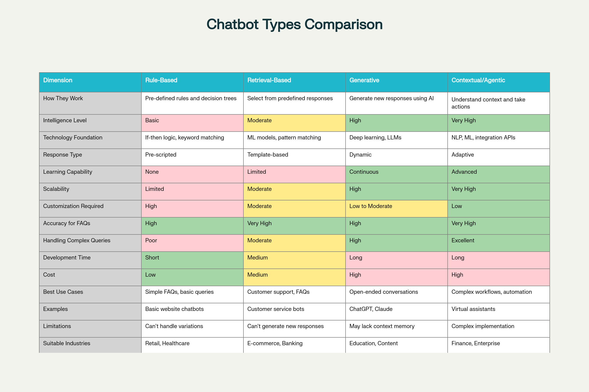
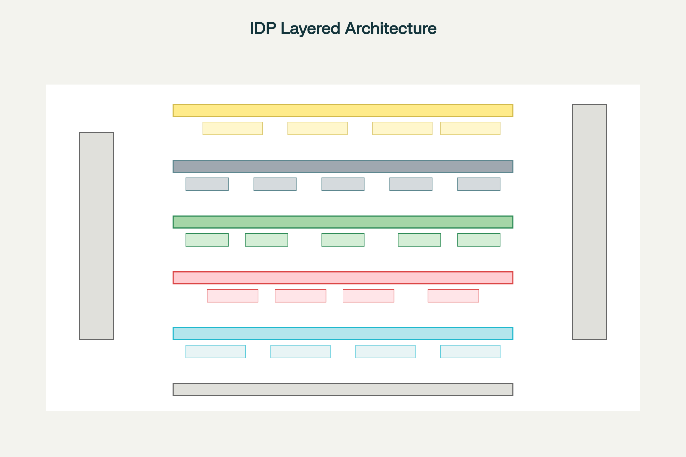
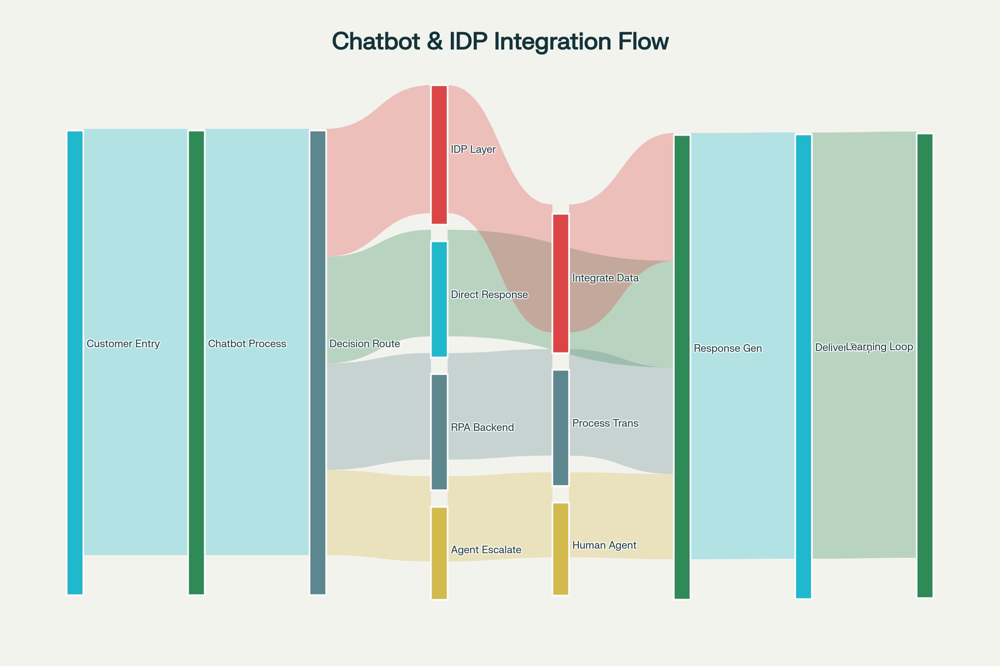

### Chatbots & Intelligent Document Processing (IDP) in Hyperautomation

Building on the hyperautomation, low-code/no-code, and RPA foundations we've covered, **chatbots and intelligent document processing represent the "sensory and cognitive" layer of intelligent automation**—enabling systems to understand human communication, interpret complex documents, and make informed decisions before orchestrating action through RPA and workflow systems.[1][2][3]

### Understanding Conversational AI and Chatbots

**Conversational AI (or Conversational Agents)** comprises software systems that enable natural, human-like interaction through multiple modalities—text chat, voice calls, messaging apps, email, or SMS. Unlike traditional software requiring users to navigate menus or type commands, conversational AI understands intent from natural human language ("How much do I have?") and responds conversationally, fundamentally changing how users interact with technology.[1][2]

**Chatbots** specifically are software programs engineered to interpret, understand, and respond to human language. The term encompasses multiple distinct architectures ranging from simple rule-based systems to sophisticated generative AI agents powered by large language models (LLMs).[2][4]

**Market Adoption is Accelerating Dramatically**: By end of 2025, **95% of all customer interactions will be handled by AI**, **80% of companies are either using or planning to adopt chatbot solutions for customer service**, and **51% of consumers prefer interacting with bots or AI assistants over humans when seeking immediate assistance**.[3][5]

### How Conversational AI Works: NLP Architecture Fundamentals

Modern chatbots operate through sophisticated **Natural Language Processing (NLP)** pipelines that transform raw user input into structured understanding, then generate contextually appropriate responses. Understanding this architecture is critical to appreciating how chatbots integrate into hyperautomation.[2][6]

**Phase 1: Input Reception and Preprocessing**

The journey begins when a user submits input through any channel—typing in chat, speaking to a voice interface, emailing a request, or completing a form. The system receives this input and performs preprocessing: normalizing text (converting to consistent format), removing noise (typos, filler words), tokenizing (breaking text into individual words), and handling language variations.[2]

**Phase 2: Natural Language Understanding (NLU)** 

NLU is the critical middle layer where the chatbot comprehends meaning. This involves several simultaneous processes:[6][2]

- **Intent Recognition** identifies what the user wants to accomplish. "I want to cancel my subscription" contains the cancellation intent. "Can you help me with my billing?" contains a request for assistance intent. The system maps user utterances to predefined intents using machine learning classification models. Intent recognition distinguishes between similar-sounding requests—distinguishing "What's my balance?" (account inquiry) from "I want to transfer money" (transaction request).[6]

- **Entity Extraction** pulls specific details the bot needs to fulfill the request. Entities are named pieces of information like names, dates, locations, product codes, amounts, or account numbers. For "Transfer $500 from my checking to savings account," entities include the amount ($500), source account (checking), destination account (savings), and transaction type (transfer). Advanced entity extraction recognizes context-dependent meanings—"tomorrow" recognized as a specific date in context, "New York" recognized as location in one conversation and product name in another.[6]

- **Sentiment Analysis** determines the emotional tone behind the user's message. Is the customer angry, happy, neutral, or frustrated? A customer saying "I've been on hold for an hour!" expresses frustration, which should trigger priority escalation rather than a standard FAQ response. Sentiment detection enables responsive service—recognizing when escalation to human agents becomes necessary before customers become even more frustrated.[6]

- **Context Management** maintains conversation history and state. The chatbot remembers previous exchanges in the conversation, enabling coherent multi-turn dialogue. In a conversation about loan applications, if the user first asks about interest rates, then asks "Is that fixed or variable?", the system understands "that" refers to the previously mentioned interest rate, not something entirely new. Context management differentiates first-time visitors asking basic questions from long-term customers asking nuanced questions.[6]

**Phase 3: Response Generation and Dialogue Management**

Once the chatbot understands what the user wants (intent), what specific information matters (entities), and emotional tone (sentiment), it must decide what to do:[7][2]

- **Dialogue State Tracking** maintains awareness of where the conversation stands. Different conversation states require different responses. A user who hasn't verified their identity can't access account information; a user who has can receive detailed information. State tracking prevents providing sensitive information to unverified users and guides the conversation logically.

- **Knowledge Base Search and System Integration** retrieves necessary information. For FAQ-type questions, the chatbot searches knowledge bases or documentation. For transaction requests, the chatbot triggers backend system access to retrieve real-time data (current balance, order status, delivery timeline). Retrieval-based chatbots (discussed below) select pre-written responses from a knowledge base. Generative chatbots create new responses from scratch.[4][2]

- **Response Selection or Generation** produces the actual response. The methodology depends on chatbot type. Simple systems retrieve best-matching pre-written responses. Advanced generative AI creates contextually appropriate original text on the fly.[4][2]

**Phase 4: Natural Language Generation (NLG) and Output**

The system must articulate its response in natural, human-friendly language. The same information can be expressed multiple ways; NLG chooses expressions matching conversation tone, user sophistication level, and context. A technical expert gets technical jargon; a non-expert gets simplified explanations. An angry customer gets a sympathetic tone; a casual inquiry gets friendly tone.[2]

Output is formatted for delivery channel—text responses for chat, voice synthesis for voice calls, email formatting for email channels, graphical interface for portal access.[2]

**Phase 5: Feedback Loop and Continuous Improvement**

Modern chatbots incorporate machine learning to improve over time. Every conversation provides training data. When users rate responses ("Was this helpful? Yes/No"), correct misunderstandings, or provide feedback, the system learns. Over time, intent recognition becomes more accurate, entity extraction improves, and responses become more relevant. This continuous improvement separates modern AI chatbots from static rule-based systems that never improve.[4][2]

### Four Chatbot Architectures: Capabilities and Limitations

Organizations deploy fundamentally different chatbot types depending on use case, complexity, and organizational capabilities.

**Rule-Based Chatbots** operate on explicit programmed rules. Developers hardcode decision trees: "If user says 'hello', respond with 'Hello! How can I help?'" These bots work predictably for simple scenarios but fail on variations. If the rule specifies exact matching for "hello" but a user types "hi" or "Hey", the bot won't recognize it. Rule-based chatbots cannot learn or adapt—they respond identically to thousands of variants of the same question with the same canned response, making interactions feel robotic. Development is tedious (manually writing thousands of rules), and maintenance is expensive (updating rules as business processes change). These systems are mostly obsolete today, replaced by smarter alternatives, though some organizations still maintain rule-based systems for compliance-heavy scenarios where predictability matters more than sophistication.[2][7]

**Retrieval-Based Chatbots** use machine learning to recognize user intent, then retrieve best-matching pre-written responses from a knowledge base. Unlike rule-based systems requiring exact matches, these bots handle language variations. Multiple ways of asking the same question ("What's my balance?", "Can you tell me my account balance?", "How much money do I have?") all map to the "balance inquiry" intent, retrieving the same pre-written response. Accuracy for FAQs improves dramatically—most common questions are handled well. However, retrieval-based chatbots are confined to responses previously written by humans. They cannot generate novel responses for unforeseen situations. If the knowledge base lacks a response, the bot fails or provides generic fallback responses. These systems work excellently for customer service scenarios where most interactions are variations of known questions—product specs, billing inquiries, order status, return policies—but struggle with complex conversations requiring original thinking or creative problem-solving.[4][2]

**Generative Chatbots** powered by large language models (LLMs) like GPT create original responses from scratch. Rather than retrieving pre-written answers, these systems process the user's input, understand context, access relevant information, and generate contextually appropriate text. This enables handling novel questions, complex conversations, and creative problem-solving that retrieval-based systems cannot. ChatGPT, Claude, and similar systems represent this category. Generative chatbots excel at nuanced conversations, explanation of complex topics, creative tasks (writing, brainstorming), and adapting communication style to different users. However, generative systems sometimes "hallucinate"—confidently stating false information. They may invent plausible-sounding facts that don't exist, creating liability for organizations if users rely on fabricated information. Generative chatbots require careful verification of critical outputs and are often combined with retrieval-based components (Retrieval-Augmented Generation or RAG) where actual company information is retrieved rather than generated.[2][4]

**Contextual/Agentic Chatbots** extend generative approaches by maintaining rich context across long conversations, understanding user goals and preferences, remembering previous interactions, and taking autonomous actions toward accomplishing user objectives. Unlike chatbots that answer one question at a time, agentic systems break down complex requests into steps, execute those steps (potentially calling RPA bots, querying systems, or escalating to humans), and follow up until the goal is accomplished. A user asking "Help me update my address and ensure my next shipment goes there" would trigger an agentic system to retrieve current address, prompt for new address, update all relevant systems, verify the change propagated, and confirm the next shipment destination matches the updated address. Traditional chatbots would answer "I can help with that" but require the user to manually complete multiple steps. Agentic systems are task-completion systems, not just conversation systems.

### Natural Language Processing: Core Technical Components

For professionals implementing chatbots in hyperautomation, understanding these NLP technologies is essential:[8][6]

**Intent Classification** uses machine learning models (typically neural networks) to map user input to predefined intents. Training data consists of example utterances labeled with their intended meaning. The model learns patterns distinguishing "I want to return this" (return request) from "Where is my return label?" (information request). Intent hierarchy matters—grouping related intents together (all purchase-related intents, all support-related intents) improves classification accuracy. Confidence thresholds prevent the bot from confidently misclassifying queries—if confidence drops below threshold, the bot escalates to humans rather than risking wrong classification.[6]

**Named Entity Recognition (NER)** identifies and extracts specific entity types from user input. A sentence like "I want to transfer $2,000 from my checking account to savings on Friday" contains multiple entities: amount ($2,000), source account type (checking), destination account type (savings), and date (Friday). Pre-trained NER models recognize common entity types (names, locations, dates, numbers, organizations). Domain-specific models are trained on company-specific entities (product codes, internal account types, specialized terminology).[8][6]

**Entity Normalization** standardizes entity values. "Tomorrow," "in 24 hours," "next day," and "March 15" might all refer to the same date. The system normalizes these to a consistent date value. "Checking," "chk," and "CH account" normalize to "checking account." This normalization ensures downstream systems receive consistent, standardized inputs.[6]

**Sentiment Analysis** classifies emotional tone—positive, negative, or neutral. Lexicon-based approaches check for positive/negative words. Machine learning approaches learn patterns from training data. Advanced systems detect nuanced emotions (frustration vs. anger, confusion vs. curiosity) enabling more appropriate responses.[6]

**Context Management** maintains conversation state through several mechanisms. Explicit state machines track which phase of the conversation the user is in. Embedding-based approaches convert conversation history into numerical representations capturing semantic meaning. Memory networks remember relevant historical information while discarding irrelevant details. Context windows (tracking the last N messages) balance freshness against computational efficiency.[6]

### Intelligent Document Processing: From OCR to AI-Powered Understanding

While chatbots handle real-time human communication, **Intelligent Document Processing (IDP)** addresses the other critical hyperautomation input source—documents. Documents contain massive amounts of business-critical information: invoices, contracts, loan applications, insurance claims, medical records, regulatory filings, purchase orders. But that information is often trapped in unstructured formats—scanned PDFs, handwritten notes, complex layouts—requiring human interpretation.[9][10][11]

**IDP Fundamentally Differs from Traditional OCR**

Traditional **Optical Character Recognition (OCR)** converts images of text into machine-readable text. A scanned invoice becomes extractable text. This was revolutionary when first introduced—before OCR, digitizing scanned documents required manual typing. However, OCR stops at character recognition. It doesn't understand meaning, context, or relationships. OCR might accurately extract the text "Amount Due: $15,000" but cannot determine whether this is unusual (compared to typical invoices), validate it against purchase orders, or route for approval based on business logic.[11][12]

**Intelligent Document Processing** builds atop OCR but adds layers of AI and machine learning enabling true comprehension.[10][9][11]

| **Aspect** | **Traditional OCR** | **Intelligent Document Processing (IDP)** |
|---|---|---|
| **Functionality** | Character-level text extraction from images | Semantic understanding, context interpretation, intelligent routing |
| **Document Handling** | Works only with clear, high-quality scans | Handles poor-quality, skewed, handwritten, or complex layouts |
| **Accuracy** | ~85-95% character accuracy | ~98-99.8% with contextual validation and learning |
| **Data Types** | Text extraction only | Structured, semi-structured, and unstructured data |
| **Contextual Understanding** | None | Understands document meaning and relationships |
| **Templates Required** | Yes, needs pre-built templates for each format | No, learns from examples and handles format variations |
| **Business Logic Integration** | Manual validation needed | Automated validation against business rules |
| **Workflow Automation** | Outputs to files; requires manual next steps | Automatically triggers downstream workflows and systems |
| **Continuous Improvement** | Static; doesn't improve over time | Learns from corrections; improves accuracy continuously |### IDP Five-Layer ArchitectureThe IDP process consists of five integrated stages:

**Layer 1: Input & Capture** receives documents in various formats—scanned paper (PDFs, images), digital documents (emails, Word documents, Excel spreadsheets), handwritten notes, or complex layouts (forms, contracts with tables). Preprocessing enhances document quality: deskewing (straightening tilted scans), binarization (converting to black-and-white), contrast enhancement (making faint text readable), and outlier filtering (removing noise).

**Layer 2: Document Understanding** performs initial analysis. **Document Classification** identifies document type ("This is an invoice, not a receipt"). **Optical Character Recognition (OCR)** converts printed text to machine-readable format. **Handwritten Text Recognition (HTR)** deciphers handwritten notes. **Layout Analysis** understands document structure—identifying headers, sections, tables, and form fields. Multiple specialized engines often work together, each optimized for specific document types or conditions, with results merged for maximum accuracy.

**Layer 3: Information Extraction & Interpretation** is where IDP demonstrates true intelligence. **Natural Language Processing (NLP)** understands the semantic meaning of extracted text. **Named Entity Recognition (NER)** identifies specific data points (company names, addresses, dates, amounts). **Machine Learning models** validate extracted data against learned patterns. For instance, invoice processing learns that "Invoice Amount" typically appears in specific locations on invoices, enabling targeted extraction. When an invoice arrives with unusual formatting, the ML model recognizes the pattern match based on context rather than precise location. **Relationship modeling** understands connections between entities—that an invoice belongs to a specific vendor, invoice date links to due date, and amounts across line items should sum to total.

**Layer 4: Workflow & Automation** routes extracted information through business processes. **Intelligent routing** sends different documents to appropriate next steps—invoices validating against purchase orders proceed to payment automation, invoices with discrepancies escalate for manual review. **Business rule validation** checks extracted data for compliance ("Does invoice amount match the PO within 3% tolerance?"). **Exception handling** manages validation failures—logging detailed information and escalating to appropriate humans. **RPA integration** passes clean data to RPA bots executing subsequent steps (posting to accounting systems, initiating payment, sending notifications).

**Layer 5: Business Application Integration** delivers results to enterprise systems. Extracted and validated data flows to **ERP systems** (SAP, Oracle), **CRM systems** (Salesforce), **accounting software** (QuickBooks), **databases**, and **downstream process automation**. Data triggers workflows—new customer onboarding documents trigger account creation, loan applications trigger underwriting workflows, insurance claims trigger assessment workflows.

**Cross-cutting concerns** run vertically: **AI/ML Model Training** continuously improves accuracy based on corrections and new examples. **Security and Compliance** encrypt data, maintain audit trails, and ensure regulatory compliance. **Governance** manages who can access documents, which systems they can reach, and how sensitive data is protected.

### IDP Core Capabilities

**Document Classification** automatically identifies document types from images or content without user input. A batch of incoming documents contains invoices, purchase orders, receipts, and shipping notices mixed together. IDP classification automatically categorizes each document, enabling appropriate processing. Classification handles format variations—invoices from different vendors with completely different layouts all get recognized as invoices because the system understands structural and semantic patterns rather than matching specific templates.[9][10][11]

**Data Extraction** pulls structured information from unstructured documents. From an invoice image, IDP extracts vendor name, invoice number, invoice date, due date, line items, amounts, tax, total, and payment terms—even if these appear in different locations on invoices from different vendors. Unlike traditional OCR requiring pre-built templates showing exactly where fields appear, IDP learns patterns and handles variations.[10][11][9]

**Data Validation & Enrichment** checks extracted data against business rules and augments with additional information. An extracted invoice amount is validated against the corresponding purchase order (ensuring amounts match within acceptable tolerance). Vendor names are validated against a vendor master list. Missing data is flagged for human follow-up. Extracted data is enriched with account codes, cost center assignments, or risk flags based on business logic.[11][13][10]

**Contextual Understanding** grasps meaning beyond simple data points. IDP understands that in a contract, dates establish timeline obligations, payment clauses indicate financial commitments, and performance obligations define service levels. In medical records, IDP understands that a medication prescribed relates to a diagnosis, and dosage recommendations consider patient history. This contextual understanding enables intelligent routing and compliance validation.[13][11]

**Continuous Learning** makes IDP progressively smarter. When humans correct IDP extraction errors, those corrections train updated models. The system learns from corrections improving accuracy on similar documents. Accuracy improves over time rather than remaining static. A system might achieve 92% accuracy initially; after processing thousands of documents and incorporating corrections, it reaches 98%+ accuracy.[14][11][13]

### IDP Use Cases: Industry Applications

**Invoice and Accounts Payable Automation** is IDP's most common use case. Manual invoice processing represents a time-consuming, error-prone bottleneck in finance departments. An invoice arrives in email (PDF format), requiring extraction of vendor, amount, invoice number, line items, and due date. Traditionally, an accounts payable clerk manually typed this information into the accounting system. With IDP:[15][16][17]

- Invoices are automatically classified and data extracted (vendor, amount, date, line items)
- Extracted data is matched against purchase orders (validating amounts match within tolerance)
- If validation passes, the bot automatically posts to the accounting system and schedules payment
- If discrepancies exist, the system flags for human review with the specific issue highlighted

Result: Processing that previously took 10 minutes per invoice (5,000 invoices weekly = 50,000 minutes = 833 hours = 20 staff-weeks) now takes seconds with ~3% of invoices requiring human review. Financial impact: dramatic labor savings, faster vendor payment (improving supplier relationships and enabling cash discount capture), and reduced error rates.[16][17][15]

**Loan Applications and Mortgage Processing** involves complex document analysis. Applicants submit diverse documents (credit reports, income statements, bank statements, identification, tax returns, employment verification) in various formats. IDP extracts key information from each document, validates completeness, cross-checks consistency (income on tax returns matches bank statements), and flags discrepancies. This accelerates underwriting, improves consistency, and reduces time-to-decision from weeks to days.[18][15][16]

**Insurance Claims Processing** faces similar complexity. Claims include claim forms, medical reports, police reports (for auto claims), repair estimates, photos, and supporting documentation. IDP extracts claim details, identifies claim type, validates against policy terms, flags fraud indicators (mismatched repair estimates, inconsistent damage photos, suspicious circumstances), and routes to appropriate claim adjuster with all extracted information pre-populated. Result: faster claims processing, better fraud detection, and improved customer satisfaction through rapid decisions.[19][17][15][16]

**Contract Management** uses IDP to analyze contract text, extracting critical information—parties involved, effective dates, expiration dates, renewal terms, termination clauses, payment obligations, performance requirements, liability limitations. Organizations can now automatically flag contracts nearing expiration, monitor renewal opportunities, identify obligations before deadlines, and maintain compliance. What previously required manual legal review of thousands of contracts annually becomes largely automated.[15][16]

**Compliance and Regulatory Reporting** leverages IDP to ensure organizations receive all required documents and maintain compliance. IDP classifies documents into required categories (proof of identity, proof of address, conflict of interest disclosures, etc.), identifies missing documentation, and routes automated reminders to responsible parties. This ensures organizations maintain compliance without relying on manual checklist management.[16][15]

**Order Processing** extracts data from purchase orders and sales orders—customer information, product codes, quantities, pricing, delivery instructions—automatically creating orders in ERP systems and triggering fulfillment. Variations in order format (orders submitted via email, web forms, EDI, paper) all get processed consistently and rapidly.[16]

**Supplier and Vendor Onboarding** collects documentation during onboarding (W-9 tax forms, vendor agreements, banking information, insurance certificates). IDP extracts critical information, validates tax IDs, verifies bank account information, and checks insurance coverage, accelerating approval and reducing onboarding delays.[16]

### Chatbots and IDP Integration in Hyperautomation

The true power emerges when chatbots and IDP work together within hyperautomation frameworks. Consider a customer service scenario: a customer emails a complex question with an attached document. The hyperautomation workflow might proceed as:

1. **Chatbot Initial Processing** analyzes the email, recognizing intent ("I have a billing question") and extracting basic entities (customer ID, general topic)

2. **IDP Processing** analyzes the attached document (invoice, account statement), extracting specific data points

3. **Contextual Decision-Making** combines chatbot understanding (customer's intent and tone) with IDP analysis (document details) to determine routing

4. **Intelligent Escalation or Automation** either:
   - For simple requests: Chatbot generates response immediately using extracted information
   - For complex issues: Routes to appropriate human agent with full context (customer history, extracted document data, identified issues, suggested solutions)
   - For transaction requests: Triggers RPA bot to execute necessary system updates

5. **Response Generation** chatbot composes personalized response including information from document analysis, system queries, and business logic

This integration dramatically increases automation—customers receive immediate answers rather than waiting for human response, complex requests route with full context enabling faster resolution, and human agents have all necessary information immediately available.[3][20][21]

**Customer Service Transformation**: AI chatbots handle up to 85% of support interactions that traditionally required human agents. When escalation is necessary, RPA and IDP ensure humans receive complete context—not a vague ticket description, but extracted information from documents, conversation history, sentiment analysis indicating customer frustration, and suggested solutions. This combination reduces response time by 50-80% while improving customer satisfaction.[5][3]

**Lead Qualification and Sales**: Chatbots engage website visitors, understanding interest levels through conversation. When documents are submitted (RFQs, proposals, applications), IDP extracts key information. This combined intelligence automatically qualifies leads, routes high-potential opportunities to sales teams, and schedules follow-up activities.[20]

**IT Helpdesk Automation**: Chatbots handle common requests (password resets, access requests, technical troubleshooting). When complex issues require system access, IDP processes error logs and diagnostic information from attached documents. RPA bots execute necessary changes (resetting passwords, creating accounts, updating systems) while chatbot maintains user communication.[20]

**Financial Services**: Customer service chatbots answer banking questions, process simple transactions (transfers, bill payments). IDP processes attached financial documents (loan applications, income verification). RPA executes transaction processing while chatbots maintain customer communication.[20]

### Leading Chatbot Platforms and Architectures

**Google Dialogflow** dominates the market with **1.5 million active developers**. Dialogflow offers web-based development with pre-built integrations for over 30 languages and dialects, making it ideal for global organizations. The platform includes small talk capabilities enabling bots to handle casual conversation, contextual understanding for multi-turn dialogue, and straightforward deployment to web, mobile, messaging apps, and voice platforms. Dialogflow integrates well with Google Cloud services and third-party platforms. Cons include limited 24/7 customer support and absence of broadcast capabilities for customer engagement campaigns. Best for: Organizations beginning chatbot journeys, global enterprises, startups prioritizing rapid deployment.[22][23][21]

**IBM Watson Assistant** emphasizes enterprise security and data privacy with stringent IBM security policies. Watson handles multi-channel interaction (web, mobile, messaging, phone), includes telephony platform integration for seamless human escalation, and provides context retention across conversations. IBM's approach appeals to heavily regulated industries (banking, healthcare, insurance) where data security and compliance are paramount. However, Watson requires developer expertise, doesn't provide customer access to chat history, and carries higher costs targeting larger organizations. Best for: Enterprises requiring strict security/compliance, regulated industries, organizations already invested in IBM ecosystem.[23][21][22]

**Amazon Lex** integrates tightly with AWS services, providing automatic scalability without manual infrastructure management. Lex offers broad SDK support (iOS, Android, Java, JavaScript, Python, .Net, Ruby, PHP, Go, C++) enabling deployment across platforms. However, Lex requires custom development for platforms outside AWS, may present challenges with data reindexing, and doesn't excel at long contextual memory. Best for: AWS-native organizations, developers comfortable with custom code, mobile-first applications.[22][23]

**Microsoft Azure Bot Service** integrates seamlessly with Microsoft 365 (Teams, Outlook, SharePoint) and other Azure services. The platform provides REST API support enabling chatbot deployment as web services, includes templates accelerating development, and offers Cognitive Services integration (face recognition, text analysis, spell-checking). Cons include limited SDK support (Node.js or C# only) and implementation complexity requiring significant coding. Best for: Microsoft-ecosystem organizations, enterprises with existing Azure infrastructure, Teams-based deployments.[24][23][22]

**Rasa** offers powerful customization through machine learning with comprehensive documentation and strong community support. Rasa enables highly tailored intent recognition and dialogue management but demands deep technical understanding of dialogue systems. Rasa functions as frameworks for building custom chatbots rather than hosted platforms. Best for: Organizations with deep ML expertise, custom requirements, preference for open-source solutions.[23][22]

### Implementing Chatbots and IDP Successfully

**Start with Specific Use Cases** rather than enterprise-wide deployment. Pilot chatbots on high-volume, lower-complexity inquiries (FAQs, order tracking, basic support). Success creates momentum and organizational confidence for expansion.[3][5]

**Invest in Data Quality and Training** for both chatbots and IDP. Chatbots require training data (example queries labeled with intents) and knowledge bases populated with accurate information. IDP requires labeled document samples for model training. Organizations often underestimate this investment—typically 30-40% of project effort involves data preparation.[25][18]

**Implement Thoughtful Escalation Paths** to human agents rather than forcing chatbots to handle everything. Escalation triggers might include: low confidence in understanding, sentiment indicating frustration, complexity beyond chatbot capability, or customer explicitly requesting human agent. Well-designed escalation preserves customer experience while automating what's truly automatable.[5][3]

**Measure and Monitor Performance** continuously. Key metrics include: resolution rate (% of conversations fully resolved by chatbot), containment rate (same as resolution rate), escalation rate (% escalated to humans), customer satisfaction (CSAT), average handling time, cost per resolution, and deflection rate (customer inquiries prevented through proactive chatbot engagement).[3]

**Establish Governance and Compliance** frameworks ensuring chatbots and IDP systems maintain security, compliance, and appropriate access controls. Document handling sensitive information requires encryption, audit trails, and access restrictions. Chatbots serving regulated industries require maintaining compliance logs and preventing unauthorized data exposure.[3]

**Plan for Continuous Improvement** through feedback collection and model refinement. Conversational AI requires ongoing enhancement as business processes change and user needs evolve. Organizations should budget for continuous model improvement rather than treating implementation as completed project.[2][4]

### The Future: Agentic AI and Autonomous Assistance

The frontier of chatbot and IDP technology involves **Agentic AI**—autonomous agents that perceive situations, reason about optimal actions, execute those actions (potentially involving multiple systems, documents, or human specialists), and learn from outcomes.[20][21][26]

Unlike current chatbots that respond to individual queries, agentic systems pursue multi-step objectives autonomously. A customer requesting "Help me resolve my billing discrepancy" would trigger an agent to: retrieve billing history, identify discrepancies, analyze causation, determine appropriate resolution, execute necessary system updates, verify resolution, and provide comprehensive explanation—all without human intervention except when genuine judgment is required.[21]

**Generative AI Integration** enables agents to interpret novel situations without explicit programming for every scenario. Rather than matching inputs to pre-defined intents, agents understand context and respond creatively. They can draft communications, suggest solutions, handle exceptions, and adapt to circumstances—operating with human-like reasoning.[27][26]

**Self-Healing Systems** use AI to detect when chatbots or IDP systems break (due to software updates, interface changes, or new document formats), diagnose issues, and implement fixes automatically. This eliminates tedious manual maintenance—systems continually optimize themselves.[28][29]

The convergence of chatbots, IDP, generative AI, and automation is creating **autonomous digital workforces** handling increasingly complex business processes with minimal human oversight, escalating only genuinely exceptional situations requiring human judgment and creativity.[1][5][20][21]

### Conclusion

**Chatbots and Intelligent Document Processing represent the "ears, mouth, and brain" of hyperautomation**—enabling systems to receive communication (chatbots), understand documents (IDP), process information intelligently, and coordinate action through RPA and workflow systems. By end of 2025, **95% of customer interactions will be handled by AI**, reshaping how organizations serve customers and operate internally.[3]

Organizations mastering these technologies gain competitive advantages through superior customer experience, dramatically reduced operational costs, accelerated decision-making, and ability to scale operations without proportional workforce expansion. Those treating chatbots as nice-to-have features rather than strategic enablers risk obsolescence as competitors deliver frictionless, AI-powered experiences that humans have come to expect.[1][5][3]

The integration of chatbots, IDP, RPA, low-code platforms, and workflow orchestration into complete hyperautomation stacks represents not incremental improvement but fundamental transformation in how business operates. Success requires strategic platform selection, investment in data quality and training, thoughtful implementation governance, and commitment to continuous improvement. With these elements in place, hyperautomation delivers the promised transformation: rapid processes, exceptional quality, remarkable cost efficiency, and workforce freed to focus on strategy, creativity, and genuine customer value.[20][21]

***

[1](https://research.aimultiple.com/types-of-conversational-ai/)
[2](https://www.geeksforgeeks.org/nlp/what-is-natural-language-processing-nlp-chatbots/)
[3](https://www.k2view.com/blog/conversational-ai-for-customer-service/)
[4](https://rejoicehub.com/blogs/nlp-chatbots-guide)
[5](https://www.teneo.ai/blog/15-conversational-ai-use-cases-transforming-enterprises-in-2025)
[6](https://gibion.ai/blog/nlp-chatbot-training-guide-2/)
[7](https://khoros.com/blog/different-kinds-of-chatbots)
[8](https://arxiv.org/pdf/2007.04248.pdf)
[9](https://start.docuware.com/what-is-intelligent-document-processing)
[10](https://netfira.com/what-is-intelligent-document-processing/)
[11](https://www.abbyy.com/blog/ocr-vs-idp/)
[12](https://buildsimple.com/en/blog/ocr-vs-intelligent-document-processing-idp-was-ist-der-unterschied/)
[13](https://www.griddynamics.com/blog/intelligent-document-processing-financial-services)
[14](https://xbpglobal.com/blog/intelligent-document-processing-idp-a-comprehensive-guide/)
[15](https://start.docuware.com/blog/document-management/idp-use-cases)
[16](https://genfuseai.com/blog/intelligent-document-processing-use-cases)
[17](https://blogs.opentext.com/ultimate-guide-to-intelligent-document-processing-use-cases/)
[18](https://scryai.com/intelligent-document-processing/intelligent-document-processing-for-finance/)
[19](https://www.processmaker.com/blog/top-5-intelligent-document-processing-idp-use-cases/)
[20](https://www.get-aimax.de/en/hyperautomation-the-new-benchmark-for-efficiency-with-rpa-and-ai-agents)
[21](https://www.conversationdesigninstitute.com/topics/vendor-platforms)
[22](https://technologyrivers.com/blog/which-chatbot-platform-is-best-for-your-organization/)
[23](https://research.aimultiple.com/dialogflow/)
[24](https://www.kommunicate.io/blog/dialogflow-vs-lex-vs-watson-vs-wit-vs-azure-bot/)
[25](https://ibsintelligence.com/product/intelligent-document-processing-in-financial-services/)
[26](https://www.appliedai.de/en/insights/generative-ai-agents-in-action/)
[27](https://dev.to/vaib/unlocking-hyperautomation-how-generative-ai-is-transforming-rpa-4bin)
[28](https://www.auxiliobits.com/blog/rpa-in-2025-trends-tools-and-what-cios-should-prepare-for/)
[29](https://www.tredence.com/blog/rpa-automation-in-agentic-ai)
[30](https://weissenberg-group.de/was-ist-intelligent-document-processing-idp/)
[31](https://zlatni-vremena.eu/understanding-the-conversational-chatbot-2/)
[32](https://www.jitterbit.com/blog/what-is-hyperautomation/)
[33](https://www.sidetool.co/post/conversational-ai-buyers-guide-enterprise-2025/)
[34](https://kissflow.com/workflow/merging-rpa-and-ai-for-intelligent-automation/?hs_amp=true)