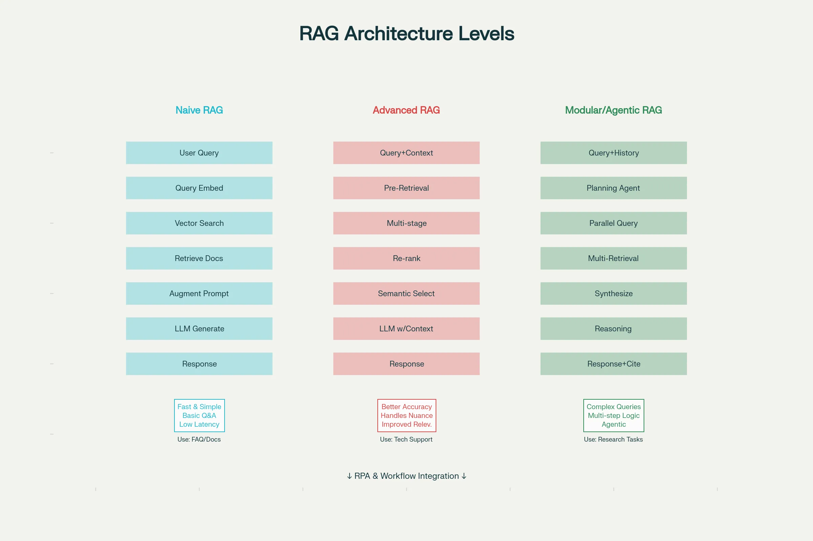

### Generative AI in Hyperautomation – Complete Learning Guide

**Generative AI represents the "cognitive transformation" layer of hyperautomation**, elevating automation from rigid rule-following to intelligent, adaptive systems that understand context, make nuanced decisions, and learn from outcomes. While traditional RPA excels at repetitive task execution and low-code platforms democratize application development, **generative AI—powered by Large Language Models (LLMs)—adds reasoning, creativity, and adaptive intelligence** that enable automation of complex, unpredictable processes previously requiring human judgment.[1][2][3][4]

### Understanding Generative AI Fundamentals

**Generative AI** is a subset of artificial intelligence trained on vast amounts of data to generate original content—text, code, images, music, video—that didn't exist before. Unlike traditional machine learning which analyzes data to make predictions or classifications, generative AI learns underlying patterns and distributions so thoroughly it can create new, authentic-appearing examples reflecting those patterns.[2][4][5]

The distinction is fundamental: **Traditional AI is analytical**—given historical data, it predicts what will happen. **Generative AI is creative**—it imagines possibilities, generates original solutions, and adapts to novel situations.[4][2]

**Large Language Models (LLMs)** are the backbone of modern generative AI. An LLM is a neural network trained using deep learning on massive textual datasets to perform natural language processing tasks including text generation, translation, question-answering, and reasoning.[1][6][7]

### How Large Language Models Work: Transformer Architecture

Understanding LLM mechanics provides insight into their capabilities and limitations.[1][6][8]

Modern LLMs use **Transformer architecture**, introduced in 2017, which revolutionized AI by replacing recurrence with **self-attention mechanisms**. Rather than processing sequences token-by-token (what, how, why, is, this, happening) sequentially, Transformers process entire sequences simultaneously, allowing the model to understand relationships between distant tokens regardless of position—"happening" can reference "why" even if separated by multiple words.[6][8]

**Tokens** are the fundamental unit—a word, subword, or even character. "Unhappy" might tokenize as ["Un", "happy"]. The LLM operates on vast numbers of parameters (billions to trillions) representing learned patterns from training data.[1][6]

**Self-Attention** is the key innovation. The model learns attention weights representing how important each token is relative to others when processing any particular token. Processing the word "bank" in "river bank" versus "savings bank" produces different attention patterns—the model attends to "river" versus "savings" respectively, fundamentally understanding context.[8][6]

**Training Process**: LLMs are trained through masked prediction on massive text corpora. The model learns to predict hidden tokens based on surrounding context. Given "The ___ are orange and ripen from ___ to red," the model learns "oranges" for the first blank and "green" for the second—capturing semantic relationships and world knowledge through pattern recognition.[6]

**Emergent Abilities**: LLMs demonstrate "emergent capabilities"—abilities not explicitly programmed but arising from scale. With sufficient parameters and training data, models suddenly demonstrate abilities to perform in-context learning, few-shot learning, and chain-of-thought reasoning that weren't present in smaller models.[1][6]

### Traditional AI vs. Generative AI: Capabilities Comparison| **Dimension** | **Traditional Machine Learning** | **Generative AI** |
|---|---|---|
| **Primary Function** | Analyze, predict, classify | Create, generate, synthesize |
| **Data Requirements** | Smaller curated datasets | Massive diverse datasets (billions of examples) |
| **Approach** | Find minimum complexity needed to make accurate predictions | Capture full complexity to recreate nuanced patterns |
| **Learning Focus** | Pattern recognition for specific outcomes | Broad pattern distribution understanding |
| **Adaptability** | Rigid—needs retraining for new scenarios | Adaptive—can generalize to novel situations |
| **Output** | Predictions, classifications, recommendations | Original content, code, ideas, solutions |
| **Key Technologies** | Decision trees, SVM, neural networks | Transformers, attention mechanisms, diffusion models |
| **Explainability** | Generally interpretable | Often opaque ("black box") |
| **Scalability** | Predictable, linear | Emergent abilities at scale |
| **Best For** | Well-defined tasks, precise decisions | Creative tasks, novel problems, communication |

[2][4][5]

### Generative AI in Hyperautomation: The Paradigm Shift

**2025 represents a turning point**: Where 2020-2023 focused on automating individual tasks through RPA, **2025 is about automating entire end-to-end processes through intelligent hyperautomation powered by generative AI**.[3][9]

**Agentic AI** emerges as the evolution of both automation and generative AI. Unlike chatbots that answer questions or RPA that executes predefined processes, **AI agents autonomously perceive situations, plan multi-step actions, execute those actions across systems, and learn from outcomes**—functioning as digital employees pursuing objectives with minimal oversight.[9][10][3]

**Market Impact is Dramatic**:

- By 2028, **15% of all daily work decisions will be made autonomously by AI agents** (up from 1% in 2024)[3]  
- **33% of enterprise software applications will feature built-in AI agents by 2028** (up from 1% in 2024)[3]  
- Organizations implementing AI at scale report **59% cost savings** and **86% productivity gains**[3]  
- **95% of all customer interactions will be handled by AI by the end of 2025**[11][12]

### How Generative AI Enhances RPA: Five Critical Dimensions

**1. Handling Unstructured Data** - Traditional RPA struggles with unstructured data (free-form text, varied document formats, handwritten notes). RPA excels at structured data flowing between systems with defined fields. Generative AI enables RPA to interpret unstructured data through natural language understanding. A customer email describing a complex issue (unstructured) flows to an LLM for comprehension, then triggers appropriate RPA workflows with extracted structured data.[13][14][15]

**2. Exception Handling and Adaptive Decisions** - RPA follows predefined rules ("if X then Y"). When situations deviate, RPA fails. Generative AI enables bots to reason about exceptions using context and judgment. Instead of failing when encountering an unexpected situation, the bot analyzes circumstances, reasons about appropriate response, potentially escalates with full context rather than vague error messages.[9][14][13]

**3. Dynamic Process Adaptation** - RPA processes remain static after deployment. Generative AI enables continuous learning and adaptation. When the bot encounters new patterns or corrections to previous decisions, LLMs update their understanding. Over time, automation becomes progressively more capable without manual reprogramming.[3][15]

**4. Natural Communication** - RPA interacts through system APIs and UI interaction—technical approaches. Generative AI enables natural language interaction. Humans describe what they need in plain language; the AI understands intent and acts. This democratizes automation beyond IT specialists to business users.[14][3][13]

**5. Synthetic Data Generation and Testing** - Generative AI can create realistic synthetic data mimicking actual scenarios while preserving privacy. RPA automation can use this synthetic data for training, testing, and validation without exposing sensitive information. This accelerates deployment while maintaining security.[13]

### Retrieval Augmented Generation (RAG): Solving the Knowledge Problem

A critical challenge with LLMs: their training data has a knowledge cutoff date. An LLM trained on data through April 2024 cannot know about events occurring in October 2024. Additionally, LLMs sometimes "hallucinate"—confidently stating false information. **Retrieval Augmented Generation (RAG)** solves these problems by augmenting LLMs with external knowledge.[16][17][18]

**Naive RAG** (simplest level) follows this process: A user query is converted to an embedding (mathematical representation capturing semantic meaning), then compared against a knowledge base of indexed documents. Similar documents are retrieved and concatenated with the original query, forming an augmented prompt sent to the LLM. The LLM generates responses grounded in actual retrieved documents rather than relying solely on training data memory.[17][16]

Example: A customer asks "What is my account balance?" The query retrieves the customer's actual account data. The LLM generates a response like "Your current balance is $5,432.18 as of today" based on retrieved real data rather than inventing a number.

**Advanced RAG** improves upon naive RAG through multiple refinements: **Pre-retrieval optimization** rewrites user queries for better matching ("What money do I have?" becomes "Customer account balance query"). **Multi-stage retrieval** combines vector search (semantic matching) with keyword search (exact term matching), retrieving documents through multiple pathways. **Post-retrieval processing** re-ranks results by relevance, filters by quality, and selects most useful chunks. This progression dramatically improves accuracy.[16][17]

**Modular/Agentic RAG** represents the frontier. Rather than simple retrieval, agentic systems decompose complex queries into focused sub-queries, execute them in parallel, synthesize results across sources, and iteratively retrieve additional context if needed. For complex questions requiring multi-step reasoning across diverse sources, agentic retrieval outperforms traditional approaches.[17][16]

Example: "Analyze how this customer's behavior has changed since Q1 and recommend actions." An agentic system breaks this into: (1) Retrieve Q1 behavior profile, (2) Retrieve current behavior data, (3) Retrieve historical trend data, (4) Execute these in parallel, then (5) Synthesize analysis, (6) Retrieve competitor benchmarking data for context, (7) Generate recommendations—all without human decomposition of the query.[17]

### Prompt Engineering: Unlocking LLM Potential 

**Prompt engineering** is the discipline of crafting inputs (prompts) to guide LLMs toward desired outputs. Unlike traditional programming where precise code produces deterministic results, LLM outputs depend heavily on prompt quality. Small wording changes produce dramatically different results.[19][20]

**Best Practices for Production-Grade Prompts**:[21][20][19]

**1. Clarity and Specificity** - Vague prompts produce vague outputs. Instead of "Analyze this customer complaint," specify "Identify the root cause of this customer complaint, rate severity (1-10), and recommend resolution path." Specificity focuses the LLM's attention.[20][21]

**2. Provide Context and Examples** - Few-shot prompting (providing examples of desired output) dramatically improves accuracy. Rather than explaining what you want, showing examples of similar problems and their solutions trains the model's understanding through demonstration.[21][20]

**3. Break Complex Tasks into Steps** - Rather than asking for the entire analysis in one query, decompose into steps: first categorize, then analyze, then recommend. This "chain-of-thought" prompting leads to more accurate reasoning.[20][21]

**4. Define Output Specifications** - Specify desired format. "Return as JSON with fields: root_cause, severity, recommended_action" produces structured output suitable for downstream automation.[21][20]

**5. Set Personas and Tone** - "You are a customer service expert" produces different outputs than generic prompts. Persona setting aligns model behavior with specific needs.[20][21]

**6. Version Control and Testing** - Treat prompts like code—maintain versions, test variations (A/B testing), and iteratively improve based on results.[21][20]

**7. Continuous Monitoring and Refinement** - In production, collect feedback, identify failure modes, and continuously improve prompts. What works initially often needs refinement as the system scales.[20][21]

### Generative AI Applications in Hyperautomation

**Customer Service Transformation**: AI agents handle initial customer inquiries through conversational understanding, retrieve relevant information from knowledge bases and transaction histories using RAG, and determine whether to provide self-service resolution, escalate with full context to human agents, or execute transactions. Result: **85% of customer interactions handled by AI, 50-80% reduction in response time, improved CSAT**.[22][23][15][24]

**Financial Services Automation**: 

- **Fraud Detection**: Generative AI analyzes transaction patterns, flags suspicious activities, and explains reasoning for human reviewers. Unlike traditional ML requiring predefined fraud signatures, GenAI adapts to novel fraud schemes.[23][24]

- **Loan Processing**: Extract data from applications, documents, and supporting materials using IDP+GenAI. Automated underwriting analyzes creditworthiness, validates income, checks regulatory compliance, makes decisions on straightforward loans, and escalates complex cases. Result: **Loan decisions in hours instead of weeks**.[24][23]

- **Claims Processing**: Classify incoming claims, extract relevant information from various document types, assess validity against policy terms, flag fraudulent indicators, route to appropriate adjusters with complete information pre-populated. Result: **Faster claim resolution, better fraud detection, improved customer satisfaction**.[23][24]

**Supply Chain Optimization**: Demand forecasting using historical data and market trends, automated logistics optimization rerouting shipments in response to disruptions, and predictive maintenance detecting equipment issues before failure. Result: **20% faster order fulfillment, 2% market share improvement**.[23]

**HR and Recruitment**: 

- **Resume Screening**: GenAI analyzes hundreds of resumes, identifies qualified candidates matching job requirements, explains reasoning, escalates borderline candidates. Result: **75% reduction in screening time**.[24][23]

- **Employee Onboarding**: Chatbots answer employee questions, IDP processes required documentation (tax forms, benefits elections), RPA creates accounts and configures systems. Result: **Accelerated onboarding, improved employee experience**.[24][23]

**Document Automation and Contract Management**: 

- **Contract Analysis**: GenAI reads contracts, extracts key obligations, deadlines, renewal terms, payment obligations, flags risk items, and populates contract management systems. Result: **75% reduction in legal review time, improved compliance**.[13][22]

- **Invoice Processing**: Extract vendor, amount, date, line items from invoices (varied formats), validate against purchase orders, automatically post to accounting systems and schedule payments. Result: **Processing costs down 50-80%, vendor payment cycle accelerated**.[22][13]

### Large Language Models: Choosing the Right Tool

Different LLM types serve different hyperautomation needs:

**Foundation Models** (GPT-4, Claude 3 Opus, Gemini Pro) are general-purpose, trained on diverse data, capable of broad tasks with strong reasoning. They cost more but handle complex, unexpected scenarios well. Ideal for customer service, complex analysis, novel problem-solving.[1][6][7]

**Domain-Specific Models** (BloombergGPT for finance, FinBERT for banking, BioGPT for healthcare) are fine-tuned on specialized data, providing superior accuracy on domain tasks compared to general models. Cost is typically moderate; speed is often better than general models due to smaller size. Ideal for regulated industries or specialized domains.[6][1]

**Code Generation Models** (GitHub Copilot, Codeium) specialized in software development tasks. Ideal for automating code generation, test creation, and technical documentation within hyperautomation workflows.[1][6]

**Small Language Models** (optimized for speed and cost) handle simple classification, summarization, and text generation tasks efficiently. Costs are significantly lower; latency is minimal. Ideal for high-volume, straightforward tasks. Hallucination risk is higher due to reduced model capacity.[6][1]

**Fine-Tuned Custom Models** trained on organization-specific data using foundation models as starting points. Custom models achieve superior accuracy on specialized tasks compared to general models. Requires investment in data collection and training but pays off for critical processes.[7][6]

**Multimodal Models** (GPT-4 Vision) process text, images, and other modalities together. Ideal for document processing combining visual and textual understanding, quality control inspections combining images with analysis, and complex workflows requiring multiple input types.[7][1][6]

**Open-Source Models** (Llama 2, Mistral, Phi) provide cost and deployment flexibility. Can be self-hosted avoiding external API dependencies, customized extensively, and run offline for sensitive applications. Require technical expertise to deploy and maintain. Performance typically lags closed commercial models.[6]

### Critical Challenges: Hallucinations, Bias, and Compliance

**Hallucinations** represent perhaps the most significant generative AI challenge. LLMs sometimes generate plausible-sounding but completely fabricated information with confidence, creating liability when used in decision-making.[25][26][27]

**Root Causes of Hallucinations**:

- **Training Data Issues**: Models trained on conflicting, outdated, or false information propagate those errors. Incomplete data creates gaps the model tries to fill through inference, sometimes incorrectly.[26][25]

- **Probabilistic Nature**: LLMs generate outputs token-by-token using probability distributions. They optimize for generating coherent text, not factual accuracy. A statistically likely continuation might be false.[25][26]

- **Design Focus**: Language models optimize for naturalness and coherence, not truth. A false but eloquent statement rates higher on model objectives than a true but awkwardly-phrased statement.[27][26][25]

**Mitigation Strategies**:

- **Retrieval Augmented Generation (RAG)**: Ground responses in actual retrieved documents rather than LLM knowledge, dramatically reducing hallucinations for knowledge-intensive tasks.[16][25]

- **Prompt Engineering**: Specific prompts requesting citations and verification reduce hallucinations. "Provide your response with citations to sources" encourages grounding.[20][25]

- **Human-in-the-Loop**: For critical decisions, humans verify outputs before action. Chatbots escalate uncertain responses rather than providing uncertain information confidently.[25]

- **Validation and Verification**: Downstream systems verify LLM outputs. If a chatbot recommends a $50,000 transaction, system checks must validate against account limits, compliance rules, and authorization.[28][25]

**Bias in Generative AI** creates another concern. Models trained on diverse internet text absorb societal biases present in training data. Gender bias, racial bias, and political bias can manifest in outputs, creating discriminatory automation.[26][27][25]

**Regulatory Compliance** becomes critical as governments introduce AI regulations:

- **EU AI Act**: The first comprehensive AI regulation treating AI systems as tiered by risk. High-risk systems face stringent requirements including impact assessments, documentation, and transparency. Fines up to €35 million or 7% of global revenue for violations.[29][30][28]

- **NIST AI Risk Management Framework**: U.S. standard emphasizing governance, risk assessment, and continuous monitoring.[30][29]

- **Industry-Specific Standards**: Financial services must comply with Basel III and Fair Lending Act. Healthcare must comply with FDA and HIPAA. Each sector imposes specific requirements.[28][29]

**Governance Requirements**:

- Establish AI governance frameworks defining policies, oversight structures, and accountability mechanisms[30][28]

- Maintain AI registers (inventories of all AI systems in use) for oversight and compliance[30]

- Implement explainability and transparency requirements, particularly for high-risk decisions[29][28][30]

- Conduct regular audits, impact assessments, and bias testing[28][30]

- Train teams on responsible AI development and deployment[28][30]

### Implementing Generative AI in Hyperautomation: Strategic Approaches

**Start with High-ROI Pilot Programs**: Begin with specific, well-defined use cases showing clear ROI (customer service, document processing, claim processing). Successful pilots demonstrate value and build organizational confidence for broader deployment.[3][13][23]

**Choose Appropriate LLM Strategy**:

- **API-Based Models** (OpenAI, Anthropic, Google): Fast to implement, no infrastructure investment, access to latest capabilities. Higher ongoing costs, vendor dependency, potential data privacy concerns.[6][7]

- **Open-Source Self-Hosted**: Lower long-term costs, data privacy, customization flexibility. Requires DevOps expertise, responsibility for security and updates, potentially lower performance.[6]

- **Fine-Tuned Custom Models**: Superior accuracy on specialized tasks. Requires investment in data collection, training, and ongoing maintenance. Justified for critical processes.[7][6]

**Combine GenAI with RAG and Existing Systems**:

- Ground LLM responses in actual company data through RAG rather than relying solely on training data knowledge
- Integrate with existing enterprise systems (ERP, CRM, databases) enabling LLMs to access real-time information
- Implement verification layers ensuring critical outputs are validated before system actions[16][17]

**Establish Governance and Monitoring**:

- Define clear policies on acceptable AI uses and prohibited applications
- Implement monitoring dashboards tracking AI system performance, error rates, and anomalies
- Conduct regular audits ensuring compliance with regulatory requirements
- Create escalation procedures for uncertain outputs rather than forcing fully autonomous decisions[28][29][30]

**Invest in Continuous Improvement**:

- Collect feedback on AI system performance and user satisfaction
- Retrain models with corrections and new examples to improve accuracy
- Monitor for bias manifestation and implement mitigation strategies
- Update prompts and configurations as business processes evolve[20][3]

### The Future: Agentic AI and Autonomous Enterprise

**Agentic AI** represents the frontier of intelligent automation. Rather than systems answering queries or executing predefined tasks, agents pursue multi-step objectives autonomously:[3][9][10]

- **Agents perceive** current situations through data access and system monitoring
- **Agents reason** about optimal actions using LLM cognition and business logic
- **Agents act** through multiple systems (RPA, APIs, databases, document systems) simultaneously
- **Agents learn** from outcomes, improving future decision-making
- **Agents escalate** to humans when judgment is required

A customer requesting "Help me resolve this billing discrepancy" triggers an agent to: retrieve billing history, identify discrepancies, analyze causation, determine appropriate resolution, execute necessary system updates, send confirmation, and follow up—all without human involvement except ensuring agent decisions align with policy.

**Digital Workforce Emergence**: Organizations deploying agentic AI report treating AI agents as team members assigned objectives:

- Productivity increases of up to 50%[15]
- Compliance violations reduced by 30%[15]
- Decision-making accelerated by 25%[24]
- Manual work reduced by 52%[24]

By 2028, **enterprises with AI agents integrated into core operations** outpace those without in speed, cost-efficiency, and agility—creating competitive advantage approaching digital imperatives.[9][3]

### Conclusion

Generative AI transforms hyperautomation from **task automation to intelligent process transformation**. Combining LLM cognition with RPA execution, low-code platforms for development, intelligent document processing for comprehension, and workflow orchestration for coordination creates **autonomous systems rivaling human intelligence while operating at machine speed and scale**.

Success requires more than technology adoption. Organizations must choose appropriate LLM strategies, implement RAG grounding responses in actual data, establish governance preventing misuse, invest in continuous improvement, and recognize agentic AI as the frontier enabling automation of complex, unpredictable processes.

**2025 is the pivotal year** where intelligence meets autonomy, where regular workflows receive real thinking, and where full-cycle process automation by agentic systems becomes the norm rather than exception across finance, HR, operations, marketing, logistics, and beyond.[3][9][10]

Those mastering generative AI in hyperautomation frameworks gain competitive advantages that may prove decisive. Those treating it as incremental feature enhancement risk obsolescence as generative AI-native competitors operate with fundamentally superior speed, cost, and agility.[9][10][3]

***

[1](https://en.wikipedia.org/wiki/Large_language_model)
[2](https://www.elastic.co/blog/traditional-ai-vs-generative-ai)
[3](https://www.turian.ai/blog/ai-trends-to-watch-in-2025)
[4](https://openlearning.mit.edu/news/exploring-shift-traditional-generative-ai)
[5](https://www.metaltoad.com/blog/generative-ai-vs-machine-learning/)
[6](https://developers.google.com/machine-learning/crash-course/llm/transformers)
[7](https://www.elastic.co/what-is/large-language-models)
[8](https://poloclub.github.io/transformer-explainer/)
[9](https://www.servicenow.com/de/products/ai-agents/agentic-ai-trends.html)
[10](https://www.linkedin.com/pulse/rise-agentic-ai-hyperautomation-softpyramid-ie8hf)
[11](https://www.k2view.com/blog/conversational-ai-for-customer-service/)
[12](https://www.teneo.ai/blog/15-conversational-ai-use-cases-transforming-enterprises-in-2025)
[13](https://www.nexgencloud.com/blog/thought-leadership/why-use-generative-ai-and-rpa-for-intelligent-automation)
[14](https://www.dchbi.com/post/how-to-leverage-generative-ai-to-enhance-rpa-in-business-processes-for-maximum-efficiency)
[15](https://www.virtualblue.co.nz/post/generative-ai-meets-rpa-unleashing-the-next-wave-of-business-transformation)
[16](https://www.promptingguide.ai/research/rag)
[17](https://learn.microsoft.com/en-us/azure/search/retrieval-augmented-generation-overview)
[18](https://testrigor.com/blog/rag-vs-ai-agents/)
[19](https://palantir.com/docs/foundry/aip/best-practices-prompt-engineering/)
[20](https://latitude-blog.ghost.io/blog/10-best-practices-for-production-grade-llm-prompt-engineering/)
[21](https://www.reddit.com/r/PromptEngineering/comments/1hv1ni9/prompt_engineering_of_llm_prompt_engineering/)
[22](https://arxiv.org/abs/2505.20733)
[23](https://kanerika.com/blogs/hyperautomation-use-cases/)
[24](https://automationedge.com/blogs/top-10-hyperautomation-use-cases-and-examples/)
[25](https://quantilus.com/article/balancing-innovation-with-risk-the-hallucination-challenge-in-generative-ai/)
[26](https://pmc.ncbi.nlm.nih.gov/articles/PMC11681264/)
[27](https://mitsloanedtech.mit.edu/ai/basics/addressing-ai-hallucinations-and-bias/)
[28](https://essert.io/key-principles-of-effective-generative-ai-governance-in-2025/)
[29](https://www.wiz.io/academy/ai-compliance)
[30](https://whisperly.ai/ai-governance/)
[31](https://www.flowforma.com/blog/ai-process-automation)