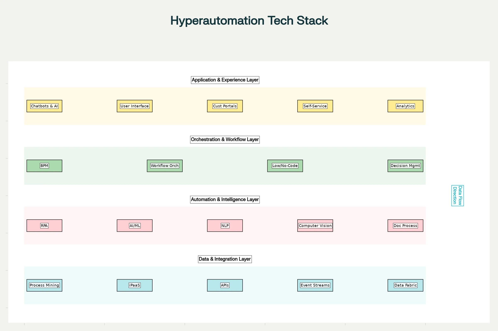
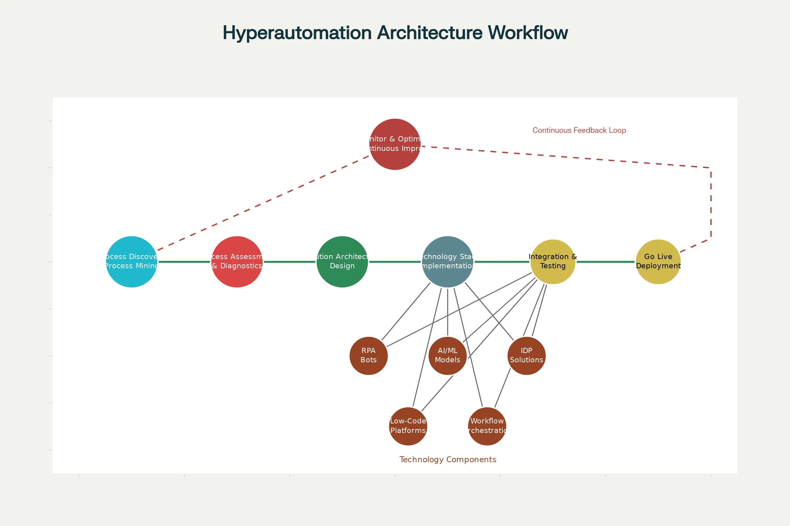

### Hyperautomation – Efficiency through Low-Code, RPA, Chatbots & Intelligent Document Processing

**Hyperautomation** is a business-driven, disciplined approach that combines multiple advanced technologies to rapidly identify, vet, and automate as many business and IT processes as possible. Unlike traditional automation that focuses on individual repetitive tasks, hyperautomation represents an end-to-end automation strategy that orchestrates diverse technologies including **artificial intelligence (AI), machine learning (ML), robotic process automation (RPA), low-code/no-code platforms, intelligent document processing (IDP), and workflow orchestration** to achieve comprehensive digital transformation.[1][2][3]

### Understanding the Core Concept

The fundamental difference between automation and hyperautomation lies in scope and intelligence. Traditional automation is confined to individual, rule-based processes and cannot adapt when exceptions arise. Hyperautomation, conversely, uses **intelligent systems that learn, adapt, and make decisions independently**, enabling organizations to automate complex workflows that involve multiple systems, data sources, and decision-making functions.[4]

Gartner, which coined the term, defines hyperautomation as leveraging a combination of machine learning, packaged software, and automation tools to deliver work. It encompasses all steps of automation itself: discover, analyze, design, automate, measure, monitor, and reassess.[5]

### The Hyperautomation Technology Stack

The hyperautomation ecosystem operates across four integrated layers, each serving distinct functions:

**Data & Integration Layer** forms the foundation. This layer includes **process mining tools** that discover and visualize workflows, identify inefficiencies, and extract digital footprints from business systems. 

**Integration Platform-as-a-Service (iPaaS)** connects disparate applications, ensuring seamless data flow across systems. 

**APIs and event streams** enable real-time communication between applications and trigger automation workflows when specific events occur. A **data fabric architecture** ensures reliable, consistent data availability across the enterprise.[6][7][8][9]

**Automation & Intelligence Layer** represents the brain of hyperautomation. 

**Robotic Process Automation (RPA)** serves as the primary task executor, automating repetitive, rule-based processes by mimicking human interactions with digital systems—clicking buttons, entering data, copying information between applications. However, RPA alone handles only structured data and predefined rules. This is where 

**Artificial Intelligence and Machine Learning** transform the system into an intelligent automation engine. AI enables complex decision-making by analyzing real-time data, recognizing patterns, and adapting to new situations. 

**Natural Language Processing (NLP)** allows systems to understand, interpret, and generate human language. 

**Computer vision** interprets visual information from documents or images. 

**Intelligent Document Processing (IDP)** combines OCR, NLP, and machine learning to extract and understand structured and unstructured data from documents without requiring pre-built templates.[2][10][11]

**Orchestration & Workflow Layer** coordinates all moving parts of the automation ecosystem. 

**Business Process Management (BPM)** platforms define, visualize, and optimize workflows. 

**Workflow orchestration** assigns tasks to appropriate executors—some to RPA bots, some to AI services, and some to humans—ensuring seamless end-to-end process flow and exception handling. 

**Low-code and no-code platforms** democratize automation by enabling **citizen developers** (business users without coding expertise) to build solutions using visual interfaces, drag-and-drop components, and pre-built modules. 

**Decision Management systems** using Decision Model and Notation (DMN) automate complex decision-making processes in a standardized, easily understandable manner.[12][13][7][14][6]

**Application & Experience Layer** delivers value to end users. 

**Chatbots and conversational AI** powered by advanced NLP provide intelligent customer support and internal assistance. 

**Portals and self-service interfaces** enable users to interact with automated processes. 

**Analytics and reporting dashboards** monitor automation performance and provide actionable insights.[15]

### Key Technologies Deep Dive

#### 1. Robotic Process Automation (RPA)

RPA is the cornerstone of hyperautomation, automating high-volume, repetitive, rule-based tasks that don't require complex decision-making. RPA bots can perform thousands of automations concurrently, handling tasks like:[16]

- Data entry and validation
- Invoice processing and payment processing
- Document management and extraction
- Customer onboarding
- Report generation and distribution
- Access provisioning and user management
- Email processing and routing

However, standalone RPA has limitations when facing exceptions, unstructured data, or situations requiring judgment. This is why it's integrated with AI and ML to create **Intelligent Automation**.[2]

#### 2. Intelligent Document Processing (IDP)

Intelligent Document Processing revolutionizes how organizations handle documents. Traditional **Optical Character Recognition (OCR)** simply converts printed and handwritten text to digital format, but IDP goes far deeper by combining multiple AI technologies:[10][17]

- **Optical Character Recognition (OCR)** converts printed text to machine-readable format
- **Handwritten Text Recognition (HTR)** recognizes and digitizes handwritten text
- **Natural Language Processing (NLP)** interprets the meaning and context of extracted text
- **Machine Learning (ML)** continuously improves accuracy as the system processes more documents
- **Image enhancement** techniques clean up poor-quality or skewed documents before text extraction

IDP can identify and extract specific data points (invoice numbers, payment amounts, contract clauses, customer names) without needing pre-designed templates. It understands context and can establish relationships between different documents or information. This enables end-to-end automation of document-heavy workflows in finance, healthcare, insurance, and legal sectors.[11][18][10]

#### 3. Low-Code and No-Code Platforms

These platforms democratize automation by eliminating the need for extensive programming expertise:[12][19][20]

| **Aspect** | **Low-Code Platforms** | **No-Code Platforms** |
|---|---|---|
| **Technical Knowledge Required** | Minimal programming skills needed | Zero coding required |
| **Development Approach** | Drag-and-drop interfaces with custom coding allowed | Visual, configuration-based entirely |
| **Target Users** | Developers needing flexibility | Business users and citizen developers |
| **Development Speed** | 10x faster than traditional coding | Rapid prototyping and deployment |
| **Examples** | OutSystems, Mendix, Tricentis Tosca | Microsoft Power Automate, Leapwork, Unqork |
| **Ideal For** | Complex solutions with custom needs | Standard business processes |

These platforms accelerate development by 10x and reduce costs by up to 80% compared to traditional development. They empower business units to build solutions tailored to their specific needs without waiting for IT departments, fostering innovation and agility.[19][20]

#### 4. Conversational AI and Chatbots

Conversational AI represents the evolution from simple rule-based chatbots to sophisticated systems powered by **advanced Natural Language Processing and generative AI**.[21][22]

Modern chatbots powered by technologies like ChatGPT can now:

- **Understand context and nuance**, not just match keywords
- **Generate dynamic responses** tailored to specific situations without predefined scripts
- **Support multiple languages** with real-time translation
- **Analyze sentiment** to detect customer frustration and adapt responses
- **Escalate intelligently** to human agents when needed
- **Learn and improve** from each interaction

In hyperautomation, conversational AI handles **self-service support**, **automated ticket categorization**, **lead qualification**, **appointment scheduling**, and **intelligent routing**. Unlike past chatbots limited to narrow functionality, modern systems can solve most customer problems without human intervention while remaining prepared to escalate when necessary.[22][23][24][21]

#### 5. Process Mining and AI-Powered Discovery

**Process mining** is the analytical foundation of hyperautomation. Using machine learning algorithms, it analyzes transactional data and event logs to **discover, visualize, and analyze real business processes** as they actually occur (not how people think they occur).[25][26]

Process mining provides three critical capabilities:

- **Process Discovery** visualizes workflows to understand sequences of activities, identify bottlenecks, detect inefficiencies, and highlight variations
- **Conformance Checking** compares actual execution against defined rules to identify deviations and non-compliance
- **Performance Analysis** identifies slow transitions, unnecessary steps, and rework cycles

This data-driven approach prevents organizations from automating flawed processes. Instead, it enables **process optimization before automation**, ensuring that hyperautomation investments deliver maximum ROI by automating improved processes rather than broken ones.[26][25]

#### 6. Workflow Orchestration and Business Process Management

**Workflow orchestration** acts as the central nervous system of hyperautomation, coordinating the various moving parts—RPA bots, AI services, human workers, and external systems—to execute complex end-to-end processes.[6][7]

Key capabilities include:

- **Process routing** directing tasks to the right executor (bot, AI service, or person)
- **Exception handling** managing situations that fall outside normal rules
- **Approval workflows** ensuring proper authorization gates
- **Real-time monitoring** tracking process metrics and performance
- **Dynamic adaptation** adjusting workflows based on runtime conditions

**Business Process Management (BPM)** tools provide this orchestration along with continuous monitoring capabilities. They ensure that all automated processes remain aligned with business objectives and compliance requirements.[15]

### Real-World Applications Across Industries

Hyperautomation delivers transformative benefits across diverse sectors. In **finance**, it automates invoice processing, loan approvals, account reconciliation, and fraud detection. Banks report processing invoices and payments with near-zero manual effort while improving accuracy and reducing duplicate payments.[27][28]

In **healthcare**, hyperautomation streamlines **claims processing, appointment scheduling, patient data management,** and **telemedicine workflows**, freeing clinical staff to focus on patient care rather than administrative tasks.[29][27]

**Supply chain management** leverages hyperautomation to combine IoT sensors for real-time inventory monitoring, AI for demand forecasting, and RPA for procurement automation. Unilever achieved better inventory planning, reduced stockouts, and significant cost savings through this integrated approach.[30]

**Manufacturing** uses hyperautomation for predictive maintenance (IoT sensors detect equipment issues before failure), quality control (AI analyzes production data in real-time), and maintenance scheduling (RPA automates work orders). Siemens reduced equipment downtime and improved product quality significantly through this strategy.[30]

**Customer service** has been revolutionized through AI-powered chatbots handling up to 85% of support interactions, with RPA automating ticket routing and data enrichment for human agents. Bank of America improved customer satisfaction and reduced response times through comprehensive hyperautomation of customer service operations.[21][30]

**Retail and e-commerce** use hyperautomation to personalize customer experiences, automate inventory management, and accelerate order processing. Companies report reduced cart abandonment rates and improved conversion through faster, more personalized service.[29]

### The Implementation Roadmap

**Phase 1: Process Discovery and Assessment** begins with organizational readiness evaluation. Teams identify current processes, assess existing automation, and evaluate organizational skills and culture. Using process mining tools, organizations discover and map workflows, identifying high-automation-potential processes and quick-win opportunities. **Process qualification and prioritization** evaluate candidates based on volume, manual effort, error rates, strategic importance, and ROI potential.[13][25][26]

**Phase 2: Design and Planning** involves designing the automation solution architecture. Teams determine which processes to automate, select appropriate technologies, and plan implementation sequence. Successful organizations start with pilot projects targeting processes with high ROI potential and technical feasibility to demonstrate value and build momentum.[31][32]

**Phase 3: Solution Design and Implementation** builds the actual automation. Teams design and deploy appropriate technologies—RPA for task execution, AI for decision-making, IDP for document handling, workflow orchestration for coordination. The solution aligns with IT governance and security requirements.[32]

**Phase 4: Deployment and Go-Live** involves production deployment and intensive monitoring. Organizations track KPIs like processing time, error rates, volume of transactions automated, and cost savings achieved.[13]

**Phase 5: Monitor and Continuously Improve** is where hyperautomation truly differentiates itself. Continuous monitoring tracks process performance against baselines and industry benchmarks. 
**Exception logging** identifies areas for improvement—if the system fails on certain document types or patterns, those examples retrain AI models for better accuracy. 
**Governance protocols** manage the automated workforce (access rights, change approvals, audits) similar to human employee management. Organizations adopt **agile enhancement cycles**, regularly updating automation logic as business rules change and gradually expanding automation to adjacent processes.[33][32][13]

### Quantifying ROI and BenefitsOrganizations implementing hyperautomation report compelling financial returns:[31][32]

- **Cost reductions** ranging from 10% to 50% within the first year
- **ROI** between 30% to 200% within the first year
- **Processing time** reduced by 50-75% through automation and optimization
- **Error rates** reduced by 50-92% through consistent, rule-based execution
- **Freed-up resources** equivalent to 2-3 full-time employees per automation initiative

**Time saved per process** directly translates to resource savings. **Error reduction** provides tangible quality improvements and compliance benefits. **Technology cost versus manual labor cost** often shows break-even within months as automation scales.[32][31]

Beyond financial metrics, hyperautomation delivers:

- **Improved customer satisfaction** through faster, more accurate service
- **Higher employee engagement** by freeing staff from tedious work for strategic initiatives
- **Enhanced compliance** through consistent, auditable automation
- **Scalability** allowing organizations to handle volume growth without proportional cost increase
- **Business agility** enabling faster adaptation to changing market conditions or regulatory requirements[13]

### Challenges and Success Factors

**Initial investment costs** present significant barriers, particularly for smaller organizations. Solution: Start with pilot projects demonstrating ROI before scaling enterprise-wide. High upfront costs for technology, implementation, and training are offset by quick ROI in high-volume processes.[31]

**Skill gaps** across organization require new competencies in process analysis, automation development, and AI/ML. Solution: Invest in training, build centers of excellence, and consider partnerships with automation consultants.[13][31]

**Change management** resistance from employees fearing job loss requires transparent communication about how automation frees staff for higher-value work rather than eliminating roles.[13]

**Legacy system integration** complexity can make connecting outdated systems challenging. Modern iPaaS platforms and API management tools solve this by providing flexible integration regardless of underlying system age.[6][7][8]

**Automating broken processes** wastes investment. Solution: Precede automation with process mining and optimization to eliminate inefficiencies before automating.[25][26]

Success factors include:

- **Executive sponsorship** aligning hyperautomation with strategic business goals
- **Proper process analysis** ensuring automation targets genuinely high-value opportunities
- **Phased implementation** starting with pilots to demonstrate value
- **Strong governance** managing automation as centralized capability
- **Continuous optimization** viewing automation as ongoing journey rather than one-time project
- **Cross-functional collaboration** between business analysts, IT, and process experts[32][13]

### The Future of Hyperautomation

**Generative AI integration** represents the next frontier. Generative AI can describe processes in plain English, generate automation workflows automatically, create test cases, summarize documents, and write customized responses—dramatically accelerating development and expanding automation possibilities.[34][35]

**Autonomous decision-making** will evolve from human-in-the-loop (humans reviewing all decisions) to human-on-the-loop (humans overseeing strategy while AI/automation handles execution), with bots making independent decisions on routine matters.[36]

**End-to-end intelligent automation** will become standard, combining generative AI, IoT, blockchain, and advanced analytics into fully autonomous business operations. Predictive analytics and scenario-based analysis (digital twins) will optimize processes before problems occur.[25][34]

**Hyperautomation as competitive advantage** will transition from differentiator to baseline requirement. Organizations that master hyperautomation will operate with dramatically lower costs, higher quality, and greater agility than competitors.[32][25]

### Conclusion
Hyperautomation represents a fundamental shift in how organizations approach work. By combining RPA's task execution capability, AI's intelligence and learning ability, low-code platforms' accessibility, intelligent document processing's unstructured data handling, conversational AI's customer interaction capabilities, and workflow orchestration's coordination—organizations create self-driving processes that continuously improve.

The technology stack exists. Implementation methodologies are proven. Real-world success stories across industries demonstrate substantial ROI. The question for organizations is not whether to adopt hyperautomation, but **how quickly they can implement it to gain competitive advantage** while the transformation window remains open.[1][13][32][30]

***

[1](https://business-unicorns.de/en/lexikon/hyperautomation)
[2](https://www.automationanywhere.com/rpa/hyperautomation)
[3](https://www.hyland.com/en/resources/terminology/what-is-hyperautomation)
[4](https://www.connectwise.com/blog/hyperautomation-vs-rpa)
[5](https://www.blueprintsys.com/blog/rpa/what-is-hyperautomation)
[6](https://camunda.com/resources/hyperautomation-guide/)
[7](https://www.sap.com/westbalkans/products/technology-platform/workflow-management.html)
[8](https://www.workato.com/the-connector/api-management-integration-unified/)
[9](https://boomi.com/blog/ipaas-vs-api-management-differences/)
[10](https://start.docuware.com/what-is-intelligent-document-processing)
[11](https://camunda.com/platform/intelligent-document-processing/)
[12](https://www.qualitestgroup.com/insights/blog/hyper-automation-with-low-or-no-code-automation/)
[13](https://www.turian.ai/blog/hyperautomation)
[14](https://4513465.fs1.hubspotusercontent-na1.net/hubfs/4513465/TheUltimateGuidetoBuildingYourHyperautomationTechStack.pdf)
[15](https://www.sap.com/products/technology-platform/process-automation/what-is-hyperautomation.html)
[16](https://crm.lunatec.de/en/news/what-is-hyperautomation-a-comprehensive-introduction)
[17](https://buildsimple.com/en/blog/ocr-vs-intelligent-document-processing-idp-was-ist-der-unterschied/)
[18](https://netfira.com/what-is-intelligent-document-processing/)
[19](https://www.plabs.id/en/journal/the-role-of-low-code-and-no-code-platforms)
[20](https://github.com/Mintahandrews/Low-Code-No-Code-Platforms)
[21](https://helpjuice.com/blog/ai-customer-service?kb_language=ja_JP)
[22](https://www.netguru.com/blog/ai-chatbots-improving-customer-service)
[23](https://www.rapidcanvas.ai/blogs/the-evolution-of-natural-language-processing-from-chatbots-to-conversational-ai)
[24](https://automationedge.com/conversational-ai-and-automation/)
[25](https://dxc.com/in/en/insights/perspectives/paper/maximize-value-through-process-mining-and-hyperautomation-strategies-synergies-and-the-road-ahead)
[26](https://afry.com/sites/default/files/2024-10/hyperautomation_process_mining_and_intelligence_afry_article.pdf)
[27](https://research.aimultiple.com/robotic-process-automation-use-cases/)
[28](https://www.mulesoft.com/automation/rpa-examples)
[29](https://www.executiveautomats.com/resources/articles/hyperautomation-examples-benefits-and-case-studies-executive-automats)
[30](https://routeget.com/casestudy/case-studies-of-successful-hyperautomation-implementations/)
[31](https://turbotic.com/blog/hyperautomation/)
[32](https://accesa.eu/resources/driving-efficiency-and-roi-through-hyperautomation-real-world-use-cases)
[33](https://www.ltimindtree.com/wp-content/uploads/2025/03/Deep-Point-of-View-Hyperautomation-POV.pdf?pdf=download)
[34](https://soais.com/hyperautomation-meets-generative-ai-unlocking-smarter-automation_new/)
[35](https://dev.to/vaib/unlocking-hyperautomation-how-generative-ai-is-transforming-rpa-4bin)
[36](https://torq.io/blog/what-is-hyperautomation/)
[37](https://www.comidor.com/knowledge-base/hyperautomation-kb/what-is-hyperautomation-definition-examples-and-insights/)
[38](https://pickyassist.com/blog/hyper-automation-in-customer-service/)
[39](https://appian.com/learn/topics/robotic-process-automation/robotic-process-automation-real-world-examples)
[40](https://www.jitterbit.com/blog/what-is-hyperautomation/)
[41](https://www.emakin.com/hyperautomation-strategies-end-to-end-digitalization-of-enterprise-processes)
[42](https://xenoss.io/blog/enterprise-hyperautomation-case-studies)
[43](https://autogpt.net/the-role-of-ai-and-machine-learning-in-driving-hyper-automation/)
[44](https://frends.com/ipaas/hyperautomation)
[45](https://ittech-pulse.com/our-tech-insights/ai-and-hyperautomation-the-building-blocks-of-the-autonomous-enterprise/)
[46](https://roboyo.global/app/uploads/2023/07/WP-Conversational-AI.pdf)
[47](https://eviden.com/insights/blogs/core-technologies-for-driving-hyperautomation/)
[48](https://www.thinkowl.com/benefits-of-conversational-ai)