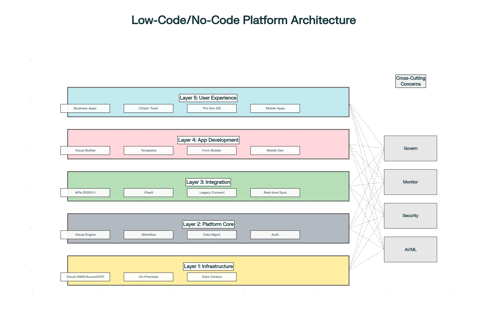
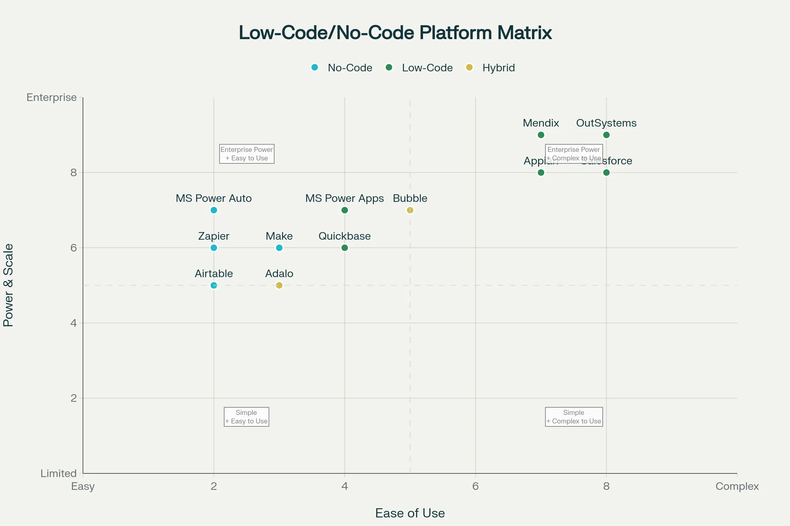
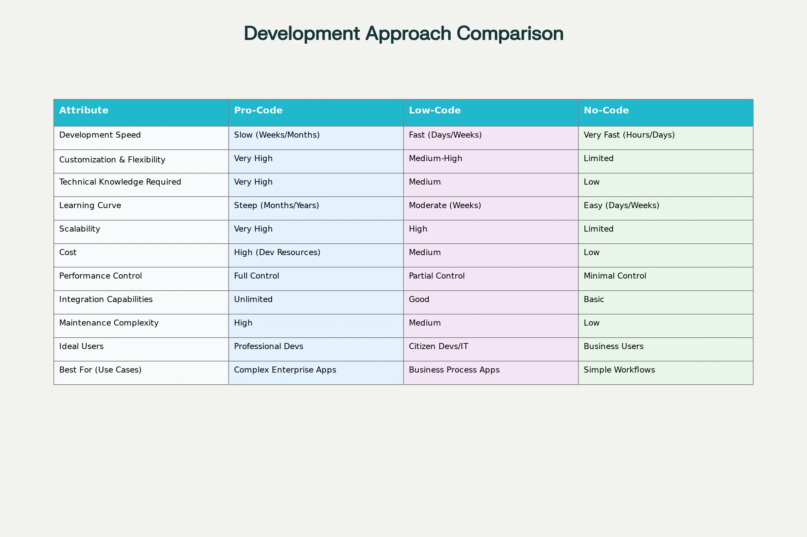

### Low-Code/No-Code Platforms – Democratizing Application Development

**Low-code and no-code (LCNC) development represents a fundamental shift in how software is created.** Instead of requiring expert developers to manually write thousands of lines of code, these platforms use visual interfaces, drag-and-drop components, and pre-built templates to enable users of any technical level to build functional applications rapidly. This democratization of app development addresses the critical software development bottleneck while empowering organizations to innovate faster than ever before.[1][2][3]

### Core Definitions and Distinctions

**Low-code development platforms (LCDPs)** allow users to create applications with **minimal coding required**. These platforms use visual development tools, drag-and-drop interfaces, and automation to reduce the volume of hand-coded programming, but still allow developers to write custom code when specific business logic demands it. Low-code platforms target **professional developers** seeking to accelerate development by eliminating repetitive, boilerplate code, while also enabling **citizen developers** (non-technical business users) to build moderately complex solutions.[1][4][5][6]

**No-code development platforms (NCDPs)**, by contrast, eliminate coding entirely. Users build applications exclusively through visual interfaces—drag-and-drop components, point-and-click configuration, flowchart-style logic builders—without writing any code whatsoever. No-code platforms democratize development even further, making it accessible to **non-technical business users, marketers, and operational staff** with zero programming experience.[5][2][3][1]

| **Aspect** | **Low-Code** | **No-Code** |
|---|---|---|
| **Technical Requirement** | Basic coding skills optional | Zero coding knowledge needed |
| **Target Users** | Professional developers + Citizen developers | Business users, non-technical staff |
| **Development Speed** | Fast (10x traditional coding) | Fastest (minimal setup required) |
| **Customization** | High (code extensions possible) | Limited (pre-configured components) |
| **Scalability** | Very high for enterprise apps | Medium (better for simple use cases) |
| **Steepness of Learning Curve** | Moderate | Very gentle |
| **Training Requirements** | Some technical training needed | Minimal or no training |
| **Best Use Cases** | Complex apps, enterprise workflows, legacy modernization | Rapid prototyping, simple workflows, basic portals |
| **Integration Capability** | Extensive (APIs, custom connectors) | Good (basic integrations) |
| **Platform Cost** | Higher (per user/environment licensing) | Lower (simpler pricing models) |

The key distinction centers on **customization flexibility and scalability**.  Low-code remains under IT governance with professional developers controlling critical components, while no-code often runs parallel to IT, empowering non-technical staff to independently create solutions.[1]

### The Compelling Business Case for LCNC

The adoption of low-code and no-code solutions has reached inflection point across organizations globally. Currently, **84% of businesses already leverage LCNC solutions**, with **70% of new business applications expected to use these platforms by 2025**, up from less than 25% in 2020. This explosive growth reflects three critical business pressures:[7][8][9]

**Developer Shortage Crisis**: A significant shortage of skilled software developers plagues the industry. LCNC platforms address this by enabling non-developers to build solutions, multiplying development capacity without requiring scarce developer talent.[2][7]

**Acceleration Imperative**: Traditional development cycles spanning months to years cannot match the speed required in today's competitive landscape. LCNC delivers application deployment in weeks or days rather than months.[10][2]

**Cost Optimization**: By reducing dependency on expensive specialized developers and accelerating time-to-market, organizations save 30-50% on development costs while enabling faster business value realization.[3][2][7]

Research firm Gartner predicts the LCNC market will exceed **$65 billion by 2030**, representing sustained double-digit growth. The market has already exceeded $30 billion in 2024, making it one of technology's fastest-growing segments.[9]

### Why Citizen Developers Are Reshaping Development

**Citizen developers** are non-IT professionals who create business applications using low-code or no-code tools. Gartner predicts that by 2025, **citizen developers will outnumber traditional developers by 4 to 1** in large organizations, with non-IT professionals comprising **80% of no-code and low-code users by 2026**, up from 60% in 2021.[2][8]

This shift isn't about eliminating professional developers—it's about **multiplication through enablement**. Citizen developers extend IT department capacity by handling routine, business-specific application development while professional developers focus on complex systems, custom algorithms, and architectural decisions. An HR manager can build their own employee onboarding system. A logistics coordinator can create a custom tracking application. A sales director can design a client management portal—all without waiting for IT backlogs or hiring additional developers.[4][2]

However, this empowerment requires governance. Organizations must establish **Centers of Excellence (CoE)** providing training, enforcing security standards, monitoring application development, and ensuring compliance with regulatory requirements.[11][12]

### Low-Code/No-Code Platforms Architecture

A typical LCNC platform consists of five integrated layers. The **Infrastructure Layer** (bottom) provides cloud hosting options through major providers like AWS, Azure, or Google Cloud, plus on-premises alternatives for organizations with specific data residency requirements. This foundation ensures scalability, reliability, and security.

The **Platform Core Layer** includes the visual development engine that translates drag-and-drop actions into actual code, the workflow orchestration engine coordinating task execution, data management systems, and authentication/authorization mechanisms safeguarding sensitive information.

The **Integration & Connectivity Layer** represents a critical differentiator. Enterprise systems rarely exist in isolation—they must connect to hundreds of other applications, databases, and services. LCNC platforms provide **5000+ pre-built connectors** (standardized integration adapters) for popular business applications like Salesforce, SAP, Oracle, and thousands of others. They also provide **APIs** for connecting to custom or legacy systems, **real-time data synchronization** capabilities, and **event-driven architecture** support where changes in one system automatically trigger actions in others.

The **Application Development Layer** is where users build. Visual interface builders let non-technical users drag interface components onto a canvas, seeing real-time previews. Pre-built templates for common applications (employee onboarding, expense approval, customer portals) accelerate development from scratch. Workflow builders let users define business logic visually—if expense > $5000, require VP approval; else, manager approval only. For low-code platforms, developers can extend functionality by writing custom code when visual tools reach their limits.

The **User Experience Layer** (top) delivers applications to end users through web portals, mobile apps, dashboards, and portals. The same platform that developers used to build the application now serves it to business users.

Cross-cutting concerns—Security & Compliance, Governance & Monitoring, AI/ML capabilities—run vertically through all layers, ensuring every component adheres to security policies, compliance regulations, and organizational governance standards.

### Key Capabilities and Features

**Visual Development Interfaces** eliminate the need to understand programming syntax. Drag-and-drop builders allow users to assemble applications like building blocks. Conditional logic is set up through flowchart-style interfaces ("if customer status = premium, then apply 20% discount"). Data flows between components through visual connectors. Anyone comfortable with spreadsheets or PowerPoint can quickly learn to build functional applications.[1][6][3]

**Pre-Built Templates and Components** accelerate development dramatically. Rather than starting from blank canvas, organizations typically find 80-90% of their requirements exist in pre-built modules. Templates for employee onboarding, expense approval, customer feedback collection, project management, and countless other common processes are immediately available. Developers customize these templates to organizational specifics rather than building from scratch.[3][1]

**Extensive Integration Capabilities** connect LCNC applications to the broader application ecosystem. Modern LCNC platforms provide thousands of pre-built connectors enabling seamless data flow between applications. Advanced platforms offer **Integration Platform-as-a-Service (iPaaS)** features for complex integration scenarios, **API management** for controlling access and usage, and **real-time synchronization** where data changes automatically propagate across systems.[13][1]

**Workflow Automation** embeds business process logic directly into applications. Rather than building separate workflow systems, LCNC platforms include robust workflow orchestration, allowing approval chains, escalation rules, conditional routing, and human task assignment to be defined visually and executed automatically.[1][3]

**AI-Powered Features** increasingly enhance LCNC platforms. Some platforms now include **AI builders** that suggest next steps based on previous actions, generate code from natural language descriptions, extract text from images automatically, or predict customer behavior from historical patterns. Generative AI integration enables developers to describe desired functionality in English, with the platform automatically generating implementation code.[14][15]

**Mobile App Development** is built into many LCNC platforms. Rather than requiring separate mobile developers using Swift or Kotlin, these platforms allow building mobile applications with the same drag-and-drop approach as web applications, automatically adapting interfaces for different screen sizes.[16][1]

### Market-Leading Platforms by Category

**Enterprise-Grade Low-Code Platforms** dominate large organization adoption:

**Mendix** stands as the market leader according to Gartner's Magic Quadrant for enterprise low-code application platforms. Mendix emphasizes **model-driven development**, visual application modeling, comprehensive testing capabilities, excellent logging and monitoring, and a large marketplace of third-party extensions. Its Marketplace provides hundreds of pre-built modules extending platform capabilities. Mendix suits medium to large businesses needing to balance rapid development with governance and scalability. The platform offers local testing environments, continuous quality assurance, and strong collaboration tools—making it ideal for enterprise development teams. Learning curve is steeper than some competitors, but the power and scalability justify the investment.[17][18]

**OutSystems** competes closely with Mendix, offering powerful omnichannel application development with strong AI and IoT integration. OutSystems emphasizes **one-click deployment**, extensive customization for IT teams who prefer deep configuration control, mature performance dashboards, and robust security capabilities. OutSystems works well for large organizations where IT teams want significant customization depth, though community support is less developed than Mendix. Initial costs are higher but decrease at scale.[18][17]

**Microsoft Power Apps** provides a pragmatic entry point for organizations already invested in the Microsoft ecosystem (Office 365, SharePoint, Teams, Azure). Tight integration with Microsoft applications enables rapid development of internal business applications. For simple to moderately complex applications, Power Apps offers great flexibility and cost-effectiveness. However, for highly complex applications, organizations need to integrate additional Microsoft services like Azure App Service, increasing complexity and costs. Strong support from Microsoft's large community makes learning easier than enterprise competitors.[17][18]

**Appian** specializes in breaking down data silos and enabling process automation across enterprise systems. Appian particularly excels at complex approval workflows, document-heavy processes, and organizations needing sophisticated business process management capabilities.[18]

**No-Code Automation Platforms** focus on connecting existing applications and automating workflows between them:

**Zapier** stands as the no-code automation titan with **5000+ pre-built app integrations**—the largest in the industry. Zapier's trigger-and-action model ("When X happens in App A, do Y in App B") makes automation accessible to anyone. Pricing is affordable, learning curve is gentle, and the platform excels at rapid automation development. However, Zapier reaches functional limits on complex branching logic, heavy looping, or scenarios requiring sophisticated decision-making. It works best for straightforward automations connecting existing applications.[14]

**Make** (formerly Integromat) provides more powerful workflow orchestration than Zapier for users willing to learn slightly more complex interfaces. Make enables sophisticated branching logic, looping, array handling, and AI agent capabilities—making it suitable for more complex automation scenarios than typical no-code tools.[14]

**Airtable** uniquely merges spreadsheet simplicity with database power and built-in automation. Its killer feature is treating data as the automation trigger—when a database record changes status, automatically trigger notifications or actions. Airtable's spreadsheet-like interface appeals to non-technical users, but automation capabilities are less powerful than dedicated orchestration platforms. It works best for teams already using Airtable as their data repository.[14]

**Microsoft Power Automate** (Power Platform's automation component) integrates deeply with Microsoft 365 applications—Outlook, Teams, SharePoint, Excel. For organizations fully invested in Microsoft, Power Automate provides native automation without leaving the ecosystem. However, it has a steeper learning curve than simpler no-code tools and can feel overwhelming for non-technical users.[14]

**Quickbase, Salesforce Platform, Zoho Creator** and numerous other platforms serve specific industry verticals or organizational sizes, each with distinct strengths in their respective domains.[18]

### Comparing Across the Development Spectrum

**Development Speed** dramatically favors LCNC approaches. No-code platforms enable application delivery in **hours or days**. Low-code platforms, still 10x faster than traditional development, typically require **weeks** for moderate complexity. Traditional pro-code development requires **months to years** for equivalent functionality.[10][6]

**Customization and Flexibility** represent the inverse tradeoff. No-code platforms offer **limited customization**—users are constrained to available pre-built components and configurations. Low-code platforms provide **moderate customization** through extending with custom code when visual tools prove insufficient. Pro-code development offers **unlimited customization** but requires far more time and cost.[6][10]

**Learning Curve and Accessibility** favors newer approaches. No-code platforms typically require **little to no training**—anyone with basic computer skills can start building within hours. Low-code platforms require **basic technical understanding** and may need formal training. Pro-code demands **advanced technical expertise** developed over years.[1][5]

**Scalability and Enterprise Readiness** actually favor pro-code and high-end low-code platforms. No-code platforms **struggle to scale** complex, large-scale enterprise applications due to rigid constraints. Low-code platforms from vendors like Mendix and OutSystems handle enterprise-scale applications with thousands of concurrent users. Pro-code enables unlimited scalability but requires corresponding development investment.[1][10]

**Cost Profile** is complex and context-dependent. No-code platforms **minimize upfront and ongoing costs**, ideal for small organizations or cost-conscious initiatives. Low-code platforms offer **mid-range pricing** with per-user licensing (typically $10-50/user/month) plus platform fees. Pro-code development requires **expensive specialized developers** ($100-200/hour or $120,000-250,000/year salary). However, total cost depends on application complexity—simple applications favor no-code on cost, while complex enterprise applications may be cheaper long-term with low-code than maintaining expensive developer teams.[10][6]

### Critical Challenges and Governance
**Vendor Lock-In** represents perhaps the most significant long-term risk. Applications built on a specific platform become difficult and expensive to migrate to alternatives, creating strong vendor dependency. Organizations might build 50 applications on Platform A, only to discover changing business needs would be better served by Platform B. Switching costs become prohibitive. **Mitigation**: Carefully evaluate vendor stability, roadmap alignment, and community health before commitment. For critical applications, consider maintaining platform-agnostic architectural principles and APIs.[11][19]

**Security and Compliance Risks** emerge when non-technical citizens build applications without adequate security understanding. Common vulnerabilities include weak authentication, inadequate access controls, and data exposure. No-code developers may not implement encryption, properly validate inputs, or restrict data access to appropriate users.[12][20][11]

**Mitigation strategies** include:

- Establishing a **Center of Excellence** providing guidance and approval gates
- Implementing **role-based access controls** separating Makers (developers), Reviewers (approvers), and Admins (governance)
- Enforcing **data loss prevention (DLP) policies** preventing sensitive data from flowing to unapproved destinations
- Requiring **security training** for citizen developers
- Conducting **regular security audits** of citizen-developed applications
- Limiting sensitive data access to those with proven security understanding[20][11][12]

**Shadow IT and Governance Challenges** arise when business units create unsupervised applications outside IT control. While democratization is desirable, uncontrolled proliferation of applications creates security gaps, performance issues, and compliance violations. **Mitigation**: Establish clear governance frameworks defining which platforms are approved, who can develop, what data can be accessed, required approvals, and audit requirements.[21][11][12]

**Limited Customization** is a hard technical ceiling in no-code platforms. When business requirements don't fit pre-built components, no-code solutions reach dead-end. Complex applications with sophisticated business logic often exceed no-code capabilities.[10][6]

**Scalability and Performance** can degrade as applications grow. Data volumes multiplying, user counts increasing, and complex workflows can overtax simpler platforms. **Mitigation**: Evaluate scalability capabilities during platform selection. Choose enterprise-grade platforms for mission-critical applications. Plan architecture considering future growth rather than current requirements.[22][23]

### Implementation Best Practices for Organizations 

**Start with a Center of Excellence (CoE)** model rather than uncontrolled citizen development. A CoE team includes IT architects, business analysts, and experienced developers who:

- Define security and compliance standards all LCNC applications must follow
- Maintain approved templates and reusable components
- Provide training and mentorship for citizen developers
- Review applications before production deployment
- Monitor performance and security across all LCNC applications[11][12]

This approach balances democratization benefits with necessary governance controls.[12]

**Begin with Pilot Projects** targeting high-ROI use cases with clear benefits. Quick wins build organizational confidence and demonstrate value before enterprise-wide adoption. Typical pilot candidates include simple workflows, internal process automation, or customer-facing portals. Success stories help justify expanded LCNC investment.[19]

**Invest in Training and Talent Development** for both professional developers and citizen developers. Formal training programs help participants understand platform capabilities, best practices, and security/governance requirements. Mentoring programs pair experienced developers with new users.[24][25]

**Establish Clear Governance Policies** documenting approved platforms, development standards, security requirements, data access controls, and approval processes. Written governance prevents ambiguity and ensures consistent implementation across the organization.[21][11][12]

**Implement Lifecycle Management** covering design, development, testing, deployment, and monitoring. Define approval gates, require testing before production, establish version control, and maintain audit trails documenting who made changes and when.[21]

**Choose Platforms Strategically** based on organizational requirements rather than adopting every available tool. Evaluate against criteria including ease of use, scalability, integration capabilities, security features, vendor viability, and total cost of ownership. Different platforms suit different use cases—standardize on 1-2 core platforms to reduce complexity and maximize leverage.[19]

### The Future State: Convergence with AI

The next evolution involves **seamless integration of generative AI** with LCNC platforms. Developers will describe functionality in natural language ("Create a customer feedback form that automatically routes feedback to responsible department heads"), and the platform will generate the implementation automatically. **Natural language interfaces** will make platform accessibility even broader, requiring virtually zero technical understanding. **Autonomous agents** powered by AI will monitor applications, predict issues before they occur, and suggest optimizations based on usage patterns.[15][26]

This evolution positions low-code and no-code platforms as the **default approach** to application development, with pro-code reserved for highly specialized scenarios requiring custom algorithms or extreme performance optimization.[8][9]

### Conclusion

Low-code and no-code platforms represent a permanent shift in software development, not a temporary trend. By 2025, **70% of new enterprise applications will use LCNC technologies**. Organizations embracing this shift gain competitive advantage through faster delivery, lower costs, and broader innovation. Those clinging to traditional development approaches risk obsolescence as competitors outpace them in delivery speed and agility.[8]

The decision is not whether to adopt LCNC—the market has already answered that question decisively. The decision is **how quickly and comprehensively your organization can master these platforms** while maintaining necessary security, governance, and quality standards. Success requires strategic platform selection, professional governance frameworks, and investment in citizen developer enablement. With these foundations in place, LCNC platforms unlock innovation and efficiency previously constrained by developer scarcity and development timelines.[1][2][7][8]

---

[1](https://www.ibm.com/think/topics/low-code-vs-no-code)
[2](https://www.newhorizons.com/resources/blog/low-code-no-code)
[3](https://www.walkme.com/glossary/low-code-or-no-code-platform/)
[4](https://www.planetcrust.com/types-of-citizen-developers-a-comprehensive-guide/)
[5](https://www.sap.com/products/technology-platform/build/what-is-low-code-no-code.html)
[6](https://zapier.com/blog/low-code-vs-no-code/)
[7](https://www.precedenceresearch.com/low-code-and-no-code-development-platforms-market)
[8](https://www.hostinger.com/tutorials/low-code-trends)
[9](https://www.integrate.io/blog/no-code-transformations-usage-trends/)
[10](https://trio.dev/low-code-vs-pro-code-vs-no-code/)
[11](https://quixy.com/blog/low-code-governance-and-security/)
[12](https://www.huntress.com/cybersecurity-101/topic/low-code-platform-security)
[13](https://dev.to/aws-builders/integrating-low-code-high-code-solutions-effectively-p6d)
[14](https://getlate.dev/blog/no-code-automation-platforms)
[15](https://dev.to/vaib/unlocking-hyperautomation-how-generative-ai-is-transforming-rpa-4bin)
[16](https://www.activepieces.com/blog/tools-for-citizen-developers-in-2024)
[17](https://saxon.ai/blogs/power-apps-vs-mendix-vs-outsystems-comparison-of-low-code-development-platforms/)
[18](https://www.clevr.com/blog/six-best-low-code-platforms)
[19](https://www.mtlc.co/how-smes-can-choose-the-right-low-code-no-code-platform/)
[20](https://eternitech.com/securing-and-governing-no-code-low-code-platforms/)
[21](https://www.nutrient.io/blog/enterprise-governance-guide/)
[22](https://impalaintech.com/blog/low-code-scalability/)
[23](https://parallel-minds.com/understanding-scalability-in-low-code-development/)
[24](https://www.convertigo.com/low-code-development-platform-guide/low-code-development-platform-why-smbs-are-ideal-users)
[25](https://app-web-entwicklung.de/en/general/low-code-no-code-2024-fast-app-creation-for-kmus/)
[26](https://soais.com/hyperautomation-meets-generative-ai-unlocking-smarter-automation_new/)
[27](https://www.servicenow.com/de/now-platform/low-code-vs-no-code.html)
[28](https://fliplet.com/blog/what-is-low-code-no-code-development-guide-and-best-platforms/)
[29](https://zapier.com/blog/make-alternatives/)
[30](https://jdicentral.com/top-5-low-code-platforms/)
[31](https://www.activepieces.com/blog/18-best-no-code-alternatives-to-zapier-2025-update)
[32](https://www.sencha.com/blog/4-low-code-software-development-platforms-ranked-by-scalability/)