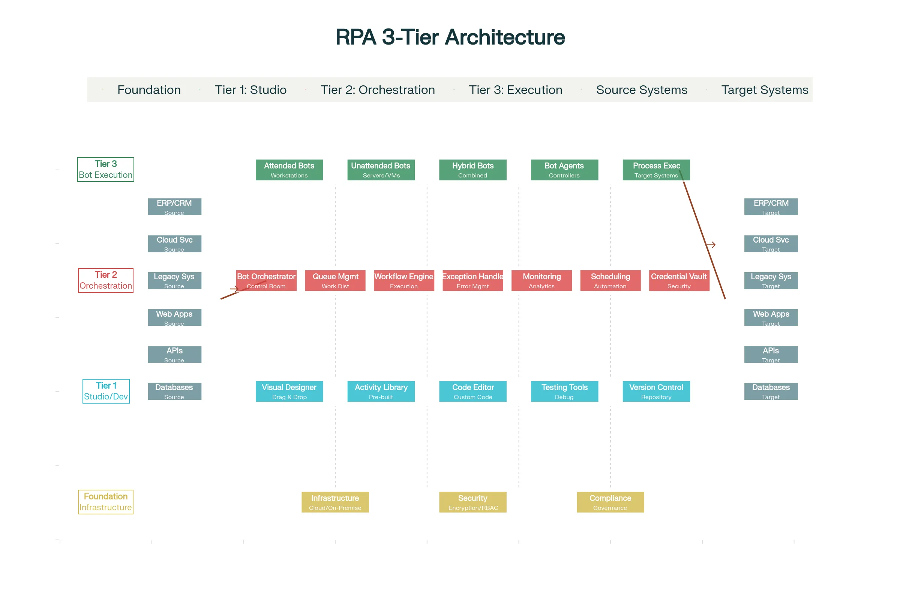
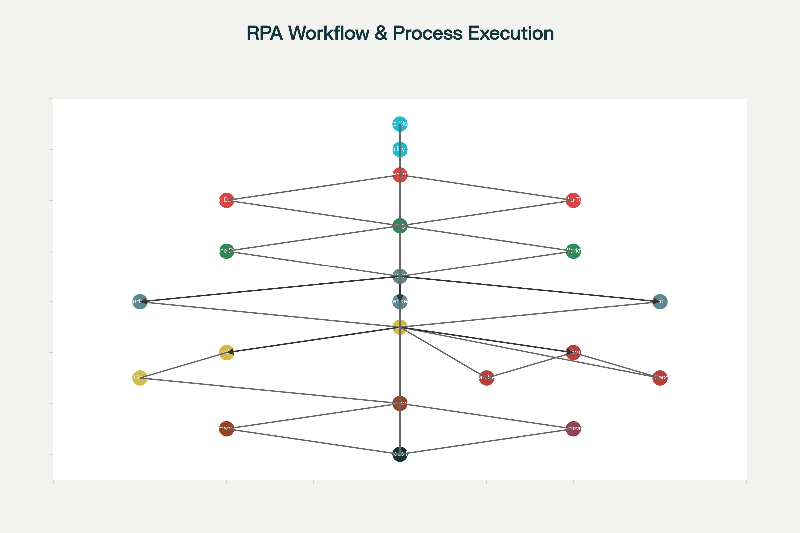

### Robotic Process Automation (RPA)

**Robotic Process Automation (RPA) is a form of business process automation technology that uses software robots (bots) to automate repetitive, rule-based tasks performed by humans**, such as data entry, form processing, document handling, and system integration across enterprise applications. Unlike traditional automation which requires custom coding for each process, RPA mimics human interactions with digital systems—clicking buttons, entering data, copying information between applications, navigating systems—allowing organizations to rapidly automate high-volume, repetitive work that previously required manual labor.[1][2][3]

RPA serves as a foundational component of hyperautomation and intelligent automation ecosystems, working alongside AI, machine learning, and low-code platforms to create end-to-end automated business processes. When combined with artificial intelligence and natural language processing, RPA transforms into **Intelligent Automation**—capable of handling exceptions, learning from outcomes, and making complex decisions beyond simple rule-based execution.[2][4][1]

### Understanding RPA Fundamentals
At its core, RPA operates on a straightforward principle: **record and replay**. A human performs a business process while the RPA platform records every action—mouse clicks, keyboard inputs, data entries, system navigation. The system then creates a reusable automation script that the bot repeats thousands of times with perfect consistency. This approach differs fundamentally from traditional system integration or API-based automation because RPA works at the **user interface (UI) level**, making it compatible with legacy systems that lack modern APIs or direct integration capabilities.[2][4]

**Why RPA Succeeds Where Traditional Automation Fails**: Legacy systems, third-party applications, and systems requiring human-like screen interaction cannot be easily automated through traditional APIs. RPA solves this by automating "the last mile"—interacting with systems exactly as humans do. This makes RPA the practical solution for modernizing operations without expensive system replacements.[2]

### The Three Pillars of RPA Technology
The complete RPA ecosystem consists of three essential components that function as an integrated system:[4][5]

**The Studio (Development Environment)** is where business processes are designed and configured. Developers or business users use visual process designers with drag-and-drop interfaces to build automation workflows. Pre-built activity libraries contain components for common tasks (open browser, click button, extract data, send email), dramatically accelerating development compared to custom coding. Version control, testing tools, and debugging capabilities ensure quality before deployment. The studio transforms visual workflow definitions into executable automation scripts.[5][4]

**The Orchestrator (Control Room)** functions as the central management hub for the RPA environment. It schedules bot execution, manages work distribution through queues (ensuring load balancing across available robots), monitors real-time performance, and maintains activity logs for audit compliance. The orchestrator implements security governance—credential management, role-based access control, permission enforcement—treating bots like digital employees requiring appropriate access controls and monitoring. It provides dashboards showing bot utilization, process metrics, and exception tracking. For large enterprises managing hundreds of bots, the orchestrator becomes essential for governance and scalability.[4][5]

**The Bots (Execution Engines)** are the robots themselves—software agents that execute the workflows defined in Studio according to triggers and schedules set in the Orchestrator. Bots run on servers, virtual machines, or user workstations and interact directly with applications to perform the work.[5][4]

### RPA Architecture and System Design

The RPA platform architecture consists of three integrated tiers. **The Studio Tier** (development layer) provides the visual development environment, activity libraries, testing tools, and version control repository. Developers assemble automation workflows by dragging pre-built components onto a canvas, connecting them logically, and configuring parameters—all without writing code (though low-code/pro-code capabilities exist for complex logic).

**The Orchestration Tier** (management layer) coordinates all RPA activities. The orchestrator schedules bots, distributes work through queues, monitors execution, enforces security policies, manages credentials in secure vaults, and provides analytics. The queue management system is particularly important in enterprise deployments—instead of bots having direct assignments, work items enter queues that available bots process in optimal order, ensuring load balancing and maximum efficiency. Workflow engines orchestrate complex multi-bot processes where tasks might route to different bots based on business rules.

**The Bot Execution Tier** (operational layer) is where bots run. Attended robots sit on user workstations assisting human workers. Unattended robots run on backend servers executing processes independently during off-hours. Hybrid robots combine both capabilities. All bots receive their instructions from the orchestrator and interact with target systems through UI automation, API calls, or database connections. The orchestrator monitors bot status, collects execution logs, and escalates exceptions to humans when needed.

**Integration Points** connect RPA to the broader application ecosystem. Bots receive inputs from source systems (databases, APIs, file shares, web services), perform transformations or routing, and push results to target systems. The same bot process might interact with legacy ERP systems (through UI automation), cloud applications (through APIs), databases (through direct queries), and file systems—all coordinated by the orchestration layer.

**Security Foundation** runs throughout the architecture. Credential vaults store system passwords securely—bots retrieve credentials just-in-time rather than storing them, eliminating exposure risk. Role-based access control determines who can view, modify, or execute particular bots. Encrypted audit trails record every action for compliance verification.

### RPA Process Lifecycle and Workflow

**Phase 1: Process Discovery and Assessment** begins with identifying automation candidates. Organizations analyze existing processes to find high-volume, repetitive, rule-based workflows with clear entry points and exit criteria. Process mining tools analyze event logs and system transactions to discover what actually happens (not what documentation claims), identify inefficiencies, and flag automation opportunities. This phase qualifies candidates based on criteria like transaction volume, manual effort, error rates, strategic importance, and expected ROI. Quick-win processes (simpler with high ROI) are often prioritized first to demonstrate value and build organizational confidence.

**Phase 2: Bot Design and Development** involves configuring the automation workflow. Developers (or business analysts using low-code platforms) specify the exact sequence of steps the bot follows, including decision logic ("if expense > $5000, escalate; else, approve"), data transformations, and system interactions. The studio's visual workflow builder allows defining complex logic—loops, conditions, error handling—without code for standard scenarios.

**Phase 3: Configuration and Exception Handling** defines how the bot handles normal operations and abnormal situations. Developers configure retry logic (if a system is temporarily unavailable, retry 3 times before escalating), exception handling (if data validation fails, log the error and notify a human), and timeout parameters. Well-designed automation anticipates common issues and handles them gracefully—recovering from transient failures, rolling back partial transactions that fail midway, notifying supervisors of genuine exceptions requiring human judgment.[6]

**Phase 4: Testing and Quality Assurance** validates automation accuracy before production deployment. Test data flows through the bot in controlled environments, verifying it processes correctly, handles exceptions appropriately, and produces accurate outputs. Performance testing confirms the bot maintains speed with high-volume processing.

**Phase 5: Deployment** moves automation to production. Organizations deploy bots to appropriate infrastructure—attended robots to user workstations, unattended robots to servers. Deployment requires careful scheduling to avoid disrupting ongoing operations, often happening during maintenance windows or gradually with parallel processing.

**Phase 6: Execution and Monitoring** activates the bot to perform real work. Orchestrators trigger execution based on schedule (daily at midnight), event (new item enters a queue), or manual request (user initiates through portal). Bots execute with complete transparency—every action is logged, every data point is recorded. Supervisors monitor dashboards showing bot status, processing volume, success rates, and exceptions requiring human attention.

**Phase 7: Continuous Optimization** is an ongoing journey rather than one-time project. Analytics reveal bottlenecks, slowdowns, or error patterns. Process improvements from human feedback are continuously deployed to bots. Machine learning models built from historical data help bots handle exceptions more intelligently. This continuous improvement creates a virtuous cycle where automation becomes progressively smarter and more efficient over time.

### Three Types of RPA Robots: Attended, Unattended, and Hybrid

RPA robots serve different operational roles, and organizations often deploy different types depending on specific use cases:[7][8]

**Unattended RPA robots** operate fully autonomously without human involvement. They execute predictable, repetitive processes running on backend servers according to schedules (midnight batch processing) or event triggers (new order received). Unattended bots excel at back-office automation—invoice processing, data migration, batch reporting, compliance checks. A company might run 100 unattended bots overnight processing invoices, generating reports, and reconciling accounts. Unattended RPA shines when processes are completely standardized with no judgment required and no human intervention during execution.[8][7]

Example: A manufacturing company uses unattended RPA to process 500 daily invoices from suppliers. Bots log into the AP system, extract invoice data from emails, validate against purchase orders, code expenses to correct accounts, and route for payment. This runs nightly with zero human intervention.

**Attended RPA robots** (also called Robotic Desktop Automation) work alongside humans, assisting them within their existing workflows. These robots run on employee workstations and are triggered by user actions during their workday. In a call center scenario, when a customer calls, the attended robot simultaneously logs into the CRM and retrieves the customer's account information, displaying it on the agent's screen while they remain on the call. The robot handles the data retrieval task while the agent handles customer conversation, combining human intelligence with robotic efficiency.[7][8]

Example: In loan processing, an attended robot helps loan officers by automatically retrieving customer documents from multiple systems, populating loan application forms with extracted data, and flagging missing information. The loan officer focuses on evaluating creditworthiness while the bot handles tedious data entry and retrieval.

**Hybrid RPA robots** blend attended and unattended capabilities, handling processes that require both human judgment and automated execution. A hybrid process might execute unattended overnight (robots run batch operations), then during business hours route exceptions to humans through attended robots that assist with resolution. This approach maximizes efficiency by letting bots handle routine volumes at night, then providing augmented human workers during the day for complex or exception cases.[9][8]

Example: In mortgage underwriting, unattended bots overnight collect documents, extract data using OCR, perform initial eligibility checks, and flag complete applications for approval. During business hours, attended robots help human underwriters review flagged applications, extract complex information, and prepare communications to applicants.

### How RPA Actually Works: The Technical Implementation

When developing an RPA solution, developers follow these key steps:

**1. Process Analysis and Standardization**: Before automation, the process must be standardized. If 10 loan officers handle applications 10 different ways, RPA cannot effectively automate—it would need 10 different bots. The first step is documenting the standard process flow, decision points, and expected outcomes.

**2. Workflow Design**: Using the studio's visual designer, developers map the workflow. This includes defining all steps (click button, enter data, validate), decision paths (if condition is true, go path A; else path B), loops (repeat for each item in list), and exception handling (if timeout occurs, retry 3 times then escalate).

**3. Activity Configuration**: Pre-built activities are configured with specific parameters. An "open browser" activity specifies which URL to open. A "click button" activity specifies which button to click (located using image recognition, XPath, or coordinate-based positioning). A "read spreadsheet" activity specifies which cells to read. Most automation is configuration—specifying which elements to interact with and what values to use—rather than coding.

**4. Data Variable Definition**: The bot needs places to store data it collects and uses. Developers define variables (like containers holding data) for customer name, invoice amount, transaction ID, etc. Variables flow through the workflow, allowing data extracted in one step to be used in later steps.

**5. Exception Handling Rules**: Developers define what happens when things go wrong. If a system is temporarily unavailable, the bot retries. If data validation fails, the error is logged and a supervisor notified. If unexpected situations occur, the bot either attempts recovery or escalates to human judgment.

**6. Integration Configuration**: The bot must connect to target systems. This might involve logging in using secured credentials (retrieved from the credential vault just-in-time), navigating through UI elements, calling APIs directly, or querying databases. The integration approach depends on system capabilities—modern systems with APIs get called directly, legacy systems requiring UI interaction use screen-based automation.

### Key RPA Capabilities and Use Cases

**Data Entry and Form Processing**: Bots extract data from emails, documents, or systems and populate forms in target applications. This eliminates the most time-consuming aspect of many back-office processes.[10][11][12]

**Invoice and Document Processing**: Bots use OCR to read physical or digital documents, extract relevant data (invoice number, amount, vendor), validate against business rules, and route for payment. ArcelorMittal Nippon Steel processes 300,000 annual invoices from 10,500+ vendors using RPA, maintaining optimal cash flow and vendor relationships.[11]

**Data Migration and System Integration**: Bots migrate data between systems during upgrades or consolidations without writing custom integration code. They extract from source systems and load into targets, handling transformation and validation in between.

**Report Generation and Distribution**: Bots extract data from multiple systems, consolidate into reports, apply formatting, and distribute to stakeholders on schedule. Finance teams that previously spent days compiling monthly financial statements now have them automated.

**Customer Service and Support**: Bots pre-populate customer information for support representatives, route tickets to appropriate teams, and escalate complex issues. Sharp, a Japanese electronics manufacturer, reduced average handle time by 63% through attended RPA assisting help desk employees.[11]

**HR and Payroll Processing**: Bots automate employee onboarding (creating accounts, setting up payroll, enrolling in benefits), process expense reports, and manage benefit changes. Manual processes that previously took days now complete overnight.

**Compliance and Audit**: Bots continuously monitor systems for compliance violations, generate audit reports documenting all actions taken, and escalate suspicious activities. This provides the comprehensive audit trails required by regulators.[13]

**Finance and Accounting**: Month-end close processes—reconciliation, expense coding, report generation—that typically consume weeks can be substantially automated, compressing close timelines significantly.[10]

### Leading RPA Platforms: Market Landscape

**UiPath** dominates the market based on user-friendliness and rapid deployment capability. UiPath emphasizes ease of use with extensive pre-built activities and community-contributed components. The platform offers cloud-based orchestration, scalable architecture, and strong AI capabilities integrating computer vision and NLP. UiPath excels for organizations prioritizing rapid automation rollout and ease of use, particularly strong for mid-market companies and digital-native organizations. However, some enterprise customers find UiPath requires more management overhead at extreme scale compared to Blue Prism. UiPath pricing is moderate ($3,990/user/year) with flexible licensing models. Community support is exceptional with extensive online resources, making it ideal for organizations beginning their RPA journey.[14][15][16][17]

**Automation Anywhere** positioned itself as a cloud-native, all-inclusive platform. It integrates RPA, intelligent document processing, advanced analytics, and AI into a single platform rather than requiring third-party additions. Automation Anywhere emphasizes security with comprehensive compliance certifications (ISO 27001, SOC 2, FISMA controls) and bot security frameworks. The platform scales well and suits organizations needing integrated capabilities. Automation Anywhere appeals to enterprises wanting a comprehensive solution and organizations prioritizing advanced security. The learning curve is slightly steeper than UiPath, and pricing is lower ($750 entry level) with good scalability. Automation Anywhere's Bot Store provides pre-built solutions accelerating deployment.[15][16][14]

**Blue Prism** represents the "old guard" choice for enterprise-grade requirements. Blue Prism emphasizes robust security, comprehensive governance, and complete auditability—critical for heavily regulated industries. The platform uses a client-server architecture designed from inception for enterprise deployments with stringent control requirements. Blue Prism bots can interact with legacy systems flawlessly, and the platform provides sophisticated exception handling and process reliability. However, Blue Prism requires significant technical expertise (built on C# requiring developer skills), has steeper learning curves, and carries higher implementation costs. Blue Prism suits large organizations where control and compliance trump ease of use, particularly in finance, insurance, and regulated industries where governance is non-negotiable. Pricing starts around $10,000 annually with significant implementation costs.[16][17][14][15]

**Microsoft Power Automate** integrates tightly with Microsoft 365 ecosystems, offering cloud-based workflow automation. For organizations already invested in Microsoft technology (Outlook, Teams, SharePoint, Office), Power Automate provides native automation without leaving the ecosystem. The learning curve is moderate, with good community support. However, Power Automate's capabilities are more limited than dedicated RPA platforms—it excels at workflows between Microsoft applications but struggles integrating external systems or complex legacy system interaction. Power Automate costs $5/month, making it the most affordable option for simple automation. It suits SMBs already in the Microsoft ecosystem wanting to avoid dedicated RPA platform costs.[17][14][15]

**Mendix** is less focused on pure RPA than full application development, but increasingly incorporates intelligent automation capabilities. Mendix emphasizes model-driven development, mobile-first application building, and low-code/high-productivity development. It serves organizations wanting to combine custom application development with automation within a single platform. Mendix particularly suits organizations building custom applications alongside automation rather than purely automating existing processes.[18]

### RPA's Business Impact and ROI Metrics

Organizations implementing RPA report compelling financial and operational benefits. **Cost savings** typically range from 10-50% of process costs within the first year of implementation, with some achieving higher savings in highly repetitive processes. **Return on investment** ranges from 30-200% within the first year depending on process selection and implementation efficiency.[19][20]

**Processing speed improvements** are dramatic—RPA accelerates process cycles by 50-75%, compressing timelines from weeks to days or hours. Data entry errors decrease by 50-92% through bot consistency. These quality improvements compound through downstream processes, preventing cascading errors.[19]

**Resource productivity** multiplies as freed-up staff redirect to higher-value work. Each automated process typically frees 2-3 full-time equivalent employees who can be redeployed to strategic initiatives, customer service, analysis, or other high-value activities. The human element remains critical—bots handle volume, humans handle judgment.[19]

**Business agility** improves when organizations handle volume spikes through bot scaling without hiring. Need to process 50% more invoices? Add 50% more bot capacity without proportional cost increase.

**Key ROI Metrics to Track**:

- **Process cycle time**: Days/hours to complete a process before and after automation
- **Cost per transaction**: What does each transaction cost to process manually vs. with RPA?
- **Error rates**: Manual error percentages vs. automated accuracy
- **Productivity gains**: Hours saved × labor cost = cost reduction
- **Throughput increases**: Volume processed per time period
- **Compliance adherence**: Percentage of processes following regulations
- **Customer satisfaction**: CSAT scores before and after automation implementation
- **Employee satisfaction**: Whether freed-up work makes jobs more engaging

Successful RPA implementations establish baseline metrics before automation, set targets post-automation, and track actual achievement to validate ROI and guide continuous improvement.[20][21]

### RPA Limitations and Exception Handling

Despite its power, RPA has inherent limitations important to understand for realistic expectations:

**Rule-Based Constraints**: RPA excels with structured, rule-based processes where the logic is clear: "if X then Y." It struggles with processes requiring nuanced judgment, subjective decisions, or unstructured reasoning. A bot cannot decide whether a refund request is justified—only whether it meets predefined criteria.[22][23]

**Fragility with System Changes**: RPA at the UI level breaks when underlying application interfaces change. A minor update to a system's screen layout (button in different position, field added) can break automation until developers update the bot. This creates ongoing maintenance burden as organizations update systems.[6][22]

**Exception Handling Gaps**: When situations deviate from the standard process, RPA robots typically stall. Unattended bots will log the error and wait for human intervention. Attended robots will notify their human assistant. Handling exceptions requires building graceful recovery logic, logging detailed information, and escalating appropriately. Well-designed RPA anticipates common exceptions and handles them; unexpected exceptions escalate to humans.[6]

**Exception Categories**: 

- **Business Exceptions** arise from business logic violations (invoice amount doesn't match PO, customer credit limit exceeded, missing required data). Bots should catch these, log details, and escalate to business owners who can manually resolve or provide direction for automation updates.
  
- **Application Exceptions** arise from technical issues (system timeout, UI element not found, database connection lost). Bots should implement retry logic (attempt 3 times with delays), then if still failing, escalate to IT.[6]

**Graceful Recovery**: Well-designed RPA implements recovery procedures. If a bot partially completes a transaction then fails, it should roll back to a consistent state rather than leaving partial data. It should log what happened, preserve data for manual review, and start the next transaction fresh.[6]

### RPA Security and Compliance

RPA introduces significant security considerations requiring careful governance:

**Credential Management**: Bots often need access to multiple systems, requiring storage and management of many credentials. **Best practice**: Use centralized credential vaults rather than embedding credentials in code, implement just-in-time credential provisioning (credentials are temporary rather than permanent), rotate credentials regularly, and audit credential usage.[24][25][26]

**Data Exposure Risks**: Bots move high volumes of sensitive data between systems, creating exposure opportunities. Data might accidentally be copied to unsecured locations, sent to wrong recipients, or left in logs or temporary files. **Mitigation**: Encrypt data in transit and at rest, encrypt temporary files, implement data loss prevention (DLP) policies limiting where sensitive data flows, sanitize logs removing sensitive information, and implement strict access controls.[25][26]

**Compliance Violations**: Improper RPA implementation violates regulations like GDPR, HIPAA, SOX, or PCI-DSS. **Compliance risks** include inadequate audit trails for regulatory reporting, improper data retention/disposal, segregation-of-duties violations where automation bypasses required human approvals, and exposure of regulated data. **Solutions**: Implement comprehensive audit logging, enforce data retention policies, implement approval workflows properly, encrypt regulated data, and conduct regular compliance audits.[26][24]

**Access Control**: Bots must follow enterprise identity and access management (IAM) policies. **Best practice**: Implement role-based access control (RBAC) where bot roles determine what systems they can access, periodically review bot permissions ensuring they haven't drifted, monitor bot activities detecting anomalies, treat bots like digital employees with security requirements.[24][26]

**Integration Security**: Each integration point (to databases, APIs, external systems) represents potential vulnerability. **Protections**: Use APIs rather than UI automation where possible (APIs provide better security), encrypt API communications, validate and sanitize all inputs, implement rate limiting preventing abuse, and segment networks preventing bot network access from compromising entire infrastructure.[25][26]

### Critical Implementation Best Practices

**Start with Process Mining**: Before selecting processes for automation, use process mining tools analyzing actual workflows to identify high-ROI candidates rather than automating processes business stakeholders think are high-volume.[20]

**Select High-ROI Pilot Processes**: Begin with processes offering quick ROI to demonstrate value and build organizational confidence. Successful pilots fund expansion.[20]

**Establish a Center of Excellence (CoE)**: Rather than having individual teams build automation independently, establish a CoE providing expertise, standards, templates, and governance. This ensures security, compliance, reusability, and knowledge sharing.[27]

**Implement Governance Frameworks**: Define policies for what processes can be automated, who can develop bots, what systems can be connected, security standards, and approval requirements. Without governance, bots become shadow IT security risks.[24][26]

**Invest in Training**: Build internal expertise through formal training, certifications, and hands-on projects. Organizations maintaining sustainable RPA programs invest in people, not just tools.[27]

**Prioritize Exception Handling**: Well-designed automation anticipates exceptions and handles them gracefully. This reduces human burden and makes automation reliable.[6]

**Monitor Continuously**: Implement monitoring dashboards tracking bot health, performance, error rates, and exception frequency. Early detection of issues prevents downstream problems.[27]

### The Future: From RPA to Intelligent Autonomous Automation

RPA is not becoming obsolete—it's evolving. The industry is moving from **simple RPA** (rules-based, fragile, human-dependent for exceptions) to **Intelligent RPA** (combining RPA with AI, ML, NLP, computer vision) to **Agentic Process Automation (APA)** (autonomous agents that perceive context, learn, and adapt without human programming for every scenario).[1][28][23][27][29]

**Generative AI Integration** enables bots to understand unstructured data (documents, emails, customer messages) in natural language, extract meaning automatically, draft natural language responses, and handle exceptions intelligently by reasoning through solutions rather than following rigid rules.[28][23][27]

**Self-Healing Bots** embedded with AI detect when automation breaks (due to system changes, data format changes), diagnose issues, and implement fixes automatically—eliminating manual maintenance burden.[29]

**Agentic Automation** represents the frontier. Rather than recording human actions and replaying them, agents understand business objectives, perceive current situation context, reason about optimal actions, execute those actions, and learn from outcomes. Agents can handle complex, unstructured problems and adapt dynamically without explicit programming for every scenario.[28][29]

**The Autonomous Enterprise** emerges as automation becomes autonomous. Systems don't wait for human commands—they perceive opportunities, execute autonomously, and escalate only genuinely exceptional situations requiring human judgment. This represents the maturation from tool-based automation to operational transformation.[29]

### Conclusion

Robotic Process Automation has proven itself as critical business infrastructure, with millions of bots now operating globally across virtually every industry. The market reached approximately $1.4 billion in 2019 and is projected to grow to **$23.9 billion by 2030**, representing sustained adoption and expansion.[10][15]

RPA succeeds not through replacing humans but through **multiplication through augmentation**. Humans freed from tedious repetitive work focus on judgment, creativity, and strategic value. Bots handle volume with perfect consistency. This combination drives dramatic productivity increases, cost reductions, and improved quality.

The future belongs to organizations mastering RPA combined with AI and low-code automation as a fundamental operational capability. Those still relying on manual processes or legacy automation approaches face competitive disadvantage as automation-native competitors outpace them in speed, cost, and agility.[1][27]

***

[1](https://www.uipath.com/rpa/robotic-process-automation)
[2](https://www.sap.com/products/technology-platform/process-automation/what-is-rpa.html)
[3](https://www.ibm.com/think/topics/rpa)
[4](https://electroneek.com/blog/how-rpa-works/)
[5](https://www.servicenow.com/docs/bundle/zurich-integrate-applications/page/product/rpa-core/concept/rpa-arch-workflow.html)
[6](https://www.cai.io/resources/thought-leadership/rpa-exception-handling-be-in-control-or-be-controlled)
[7](https://business.canon.com.au/insights/robotic-process-automation-attended-vs-unattended-robots)
[8](https://www.zaptest.com/6-types-of-rpa-robotic-process-automation-you-need-to-know)
[9](https://www.uipath.com/hubfs/Whitepapers/eGuide%20to%20the%20six%20automation%20scenarios.pdf)
[10](https://jelvix.com/blog/rpa-use-cases)
[11](https://www.itransition.com/rpa/manufacturing)
[12](https://research.aimultiple.com/robotic-process-automation-use-cases/)
[13](https://thecompliancedigest.com/how-governance-risk-and-compliance-are-embracing-robotic-process-automation-rpa/)
[14](https://savemyleads.com/blog/other/blue-prism-vs-uipath-vs-automation-anywhere)
[15](https://www.zucisystems.com/blog/rpa-tool-comparison/)
[16](https://www.zenesys.com/uipath-vs-automation-anywhere-vs-blueprism-comparing-rpa-tools)
[17](https://rpaautomationsystem.com/uipath-vs-automation-anywhere-vs-blue-prism/)
[18](https://jdicentral.com/top-5-low-code-platforms/)
[19](https://smartdev.com/the-complete-guide-to-rpa-cost-pricing-roi-hidden-expenses/)
[20](https://automate.fortra.com/resources/guides/understanding-rpa-roi-how-measure-it-and-why-its-important)
[21](https://www.gdsonline.tech/a-guide-to-measuring-rpa-roi/)
[22](https://www.tungstenautomation.de/learn/blog/rpa-vs-ml-vs-ai-comparison)
[23](https://kissflow.com/workflow/merging-rpa-and-ai-for-intelligent-automation/?hs_amp=true)
[24](https://optiblack.com/insights/10-rpa-security-best-practices-for-compliance)
[25](https://www.adminbyrequest.com/en/blogs/how-robotic-process-automation-rpa-creates-security-risks)
[26](https://www.onepotenza.com/blog/intelligent-automation/rpa-security-and-compliance/)
[27](https://www.auxiliobits.com/blog/rpa-in-2025-trends-tools-and-what-cios-should-prepare-for/)
[28](https://www.appliedai.de/en/insights/generative-ai-agents-in-action/)
[29](https://www.tredence.com/blog/rpa-automation-in-agentic-ai)
[30](https://www.linkedin.com/pulse/tech-stack-agentic-process-automation-fbgpf)
[31](https://enterprisersproject.com/article/2019/5/rpa-robotic-process-automation-how-explain)