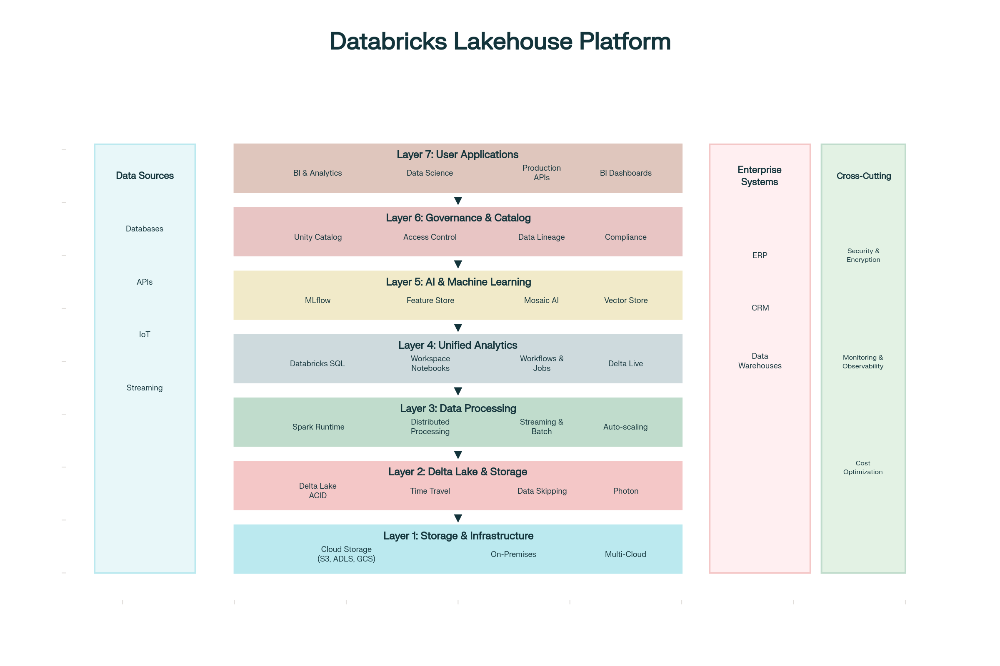
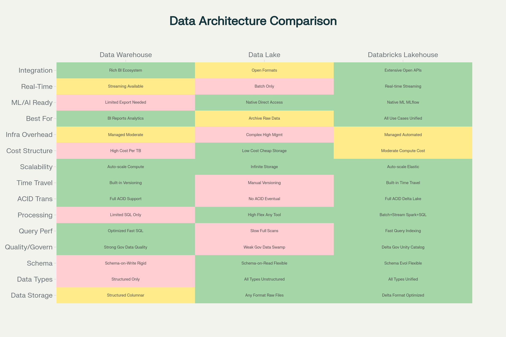
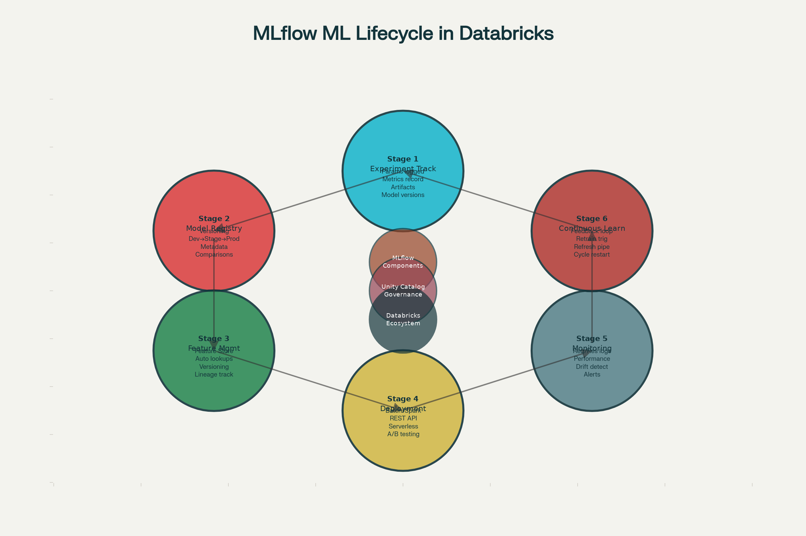

## Databricks – Complete Learning Guide

**Databricks is a unified data and AI platform that combines the flexibility and cost-efficiency of data lakes with the data management, ACID transactions, and performance of data warehouses**, creating what the industry calls a **"Lakehouse"**. Founded by the original creators of Apache Spark, Databricks provides an integrated environment for data engineering, data science, machine learning, and business analytics—enabling organizations to derive insights and AI value from all their data with unprecedented speed and efficiency.[1][2][3][4][5]

### Understanding the Data Lakehouse Architecture

Traditional data architectures forced painful tradeoffs. **Data warehouses** provided fast queries and governance but required upfront data transformation, couldn't handle unstructured data efficiently, and became expensive at scale. **Data lakes** offered flexibility and scalability for raw data storage but lacked structure, governance, and query performance, frequently becoming "data swamps"—disorganized masses of data difficult to access or use.[6][7][8]

**Databricks Lakehouse** eliminates this tradeoff by implementing data warehouse structures and governance directly on low-cost cloud object storage (S3, Azure Blob Storage, Google Cloud Storage), the same infrastructure data lakes use. This achieves warehouse-like reliability and performance while maintaining lake-like flexibility and cost efficiency.[7][3][5]

### Core Databricks Architecture: Seven-Layer Stac

**Layer 1: Cloud Storage Foundation** - Data lives in cost-efficient cloud object storage from your choice of provider (AWS S3, Azure Blob Storage, Google Cloud Storage). Databricks doesn't lock data into proprietary formats; instead, data remains accessible to any tool supporting standard formats.[1][2]

**Layer 2: Delta Lake—The Intelligent Storage Layer** - Rather than raw object storage, Databricks overlays **Delta Lake**, an open-source storage format adding warehouse-like features to data lakes:[3][1]

- **ACID Transactions** ensure data consistency. If a write operation fails midway, previous data isn't corrupted; either the entire transaction completes or none does
- **Schema Enforcement** prevents incorrect data shapes from entering tables
- **Time Travel** enables accessing previous data versions, critical for compliance and debugging
- **Unified Batch and Streaming** processes both historical data and real-time streams using the same code
- **Data Skipping** automatically optimizes queries by skipping data files unlikely to contain matching records

**Layer 3: Compute Processing** - **Apache Spark**, the distributed processing engine powering Databricks, handles massive data volumes in parallel. Databricks optimizes Spark significantly beyond open-source:

- **Photon Engine** (proprietary acceleration) delivers 5x faster SQL queries compared to open-source Spark[2]
- **Adaptive Query Execution (AQE)** re-optimizes queries during execution based on actual data patterns[9]
- **Auto-scaling clusters** automatically add/remove compute resources based on workload, optimizing costs[1]
- **Serverless options** eliminate cluster management—users submit jobs; Databricks manages infrastructure[1]

**Layer 4: Analytics & Orchestration** - Unified interfaces for different personas:

- **SQL Analytics** for BI analysts and SQL practitioners
- **Collaborative Notebooks** for data scientists and engineers (supporting Python, SQL, R, Scala)
- **Delta Live Tables** (DLT) for declarative data pipeline definitions
- **Workflows** for orchestrating multi-step processes[1]

**Layer 5: AI & Machine Learning** - Native ML capabilities integrated with data:

- **MLflow** manages the complete machine learning lifecycle from experimentation through production deployment[10][11][12]
- **Feature Store** simplifies feature engineering and ensures consistent feature definitions across training and serving[11][10]
- **Mosaic AI** provides automated model training, fine-tuning of foundation models, and serverless model serving[10][11]
- **Vector databases** enable embedding-based search for RAG (Retrieval Augmented Generation) powering generative AI applications[10]

**Layer 6: Governance & Catalog** - **Unity Catalog** provides enterprise-grade data governance:[13][14][15]

- **Unified Catalog** provides single view of all data and AI assets across clouds
- **Automated PII Detection** identifies and tags sensitive data automatically[13]
- **Attribute-Based Access Control (ABAC)** implements fine-grained permissions based on data characteristics[15][13]
- **Data Lineage** tracks data flow and transformations for compliance and debugging[14][13]
- **Request for Access (RFA)** enables users to request access to protected data with approval workflows[13]

**Layer 7: User Applications** - BI tools, APIs, serving endpoints, and dashboards consuming platform capabilities

### Data Warehouse vs Data Lake vs Lakehouse: Strategic Comparison

| **Dimension** | **Data Warehouse** | **Data Lake** | **Databricks Lakehouse** |
|---|---|---|---|
| **Best For** | Structured analytics, BI, dashboards | Raw storage, future-proofing, ML experiments | Everything—unified approach |
| **Data Types** | Structured only | All types equally | All types equally |
| **Query Speed** | Very fast (optimized) | Slow (requires processing) | Fast (optimized, warehouse-like) |
| **Scalability** | Limited by storage cost | Excellent, cost-efficient | Excellent, cost-efficient |
| **Governance** | Built-in, mature | Requires external tools | Built-in with Unity Catalog |
| **ML/AI Ready** | Not ideal | Better for raw data | Ideal—native support |
| **Storage Separation** | No—compute coupled to storage | Yes—full separation | Yes—full separation |
| **Schema Flexibility** | Fixed schemas | Schema-on-read | Flexible—schema-on-read or write |
| **ACID Transactions** | Yes | No | Yes (via Delta Lake) |
| **Time Travel/Versioning** | Limited | No | Yes |
| **Integration** | BI-heavy | Spark, ML frameworks | Everything—open formats |
| **Implementation Complexity** | Low | Moderate-High | Moderate |
| **Total Cost of Ownership** | High (often requires separate DL) | Medium but operational overhead | Medium-Low for complete solution |

[6][16][8][17]

The key insight: **If your organization needs both analytics (warehouse use case) AND machine learning (lake use case), maintaining separate systems costs more than Databricks Lakehouse's unified approach**.[17][18]

### Machine Learning Lifecycle with MLflow

**MLflow** represents Databricks' contribution to the machine learning community, providing open-source tools for managing the complete ML lifecycle within the Databricks platform. MLflow consists of four core components:[10][11][12]

**MLflow Tracking** records experiments as they run. When data scientists train models, MLflow automatically logs:

- **Parameters** (learning rate, tree depth, etc.)
- **Metrics** (accuracy, loss, F1 score, etc.)
- **Artifacts** (trained model files, plots, reports)
- **Environment** (Python version, libraries used)

This enables comparing model versions systematically—not through poorly named files ("model_final.pkl", "model_final_v2.pkl", "model_FINAL_REAL.pkl") but through tracked experiments showing exact parameters and results.[12][19]

**Model Registry** centralizes model management:

- **Versioning** tracks model versions and transitions
- **Stage Management** moves models through Development → Staging → Production stages
- **Annotations** attach business context explaining why certain models were chosen
- **Integration with Unity Catalog** enables fine-grained access control on models

Governance questions ("Who deployed this model?", "When?", "What was the approval?") are answered through audit trails.[11][10]

**Feature Store** solves a critical ML problem: feature inconsistency. Features computed for training sometimes differ from features computed during serving, producing model degradation. Databricks Feature Store:

- Defines features once in a central location
- Enables consistent feature retrieval during training and serving
- Versioning ensures training used consistent features
- Automated lookups reduce application complexity[10][11]

**Mosaic AI Model Serving** deploys models to production:

- **Batch serving** on Spark for processing large datasets
- **Real-time REST API serving** for online predictions (latency < 100ms)
- **Serverless options** eliminating infrastructure management
- **Monitoring and request logging** for observability

Each request is logged with inputs, outputs, and latency, enabling detection of model drift or performance degradation.[11][10]

### Delta Lake: The Storage Revolution

Delta Lake distinguishes Databricks from other analytics platforms. Rather than storing raw Parquet files (standard data format), Delta Lake adds a transaction log tracking all modifications to data.[1][3]

**ACID Guarantees** ensure data consistency. Multiple processes can write to the same table concurrently without corrupting data. Transactions either fully complete or fully roll back—no partial writes leaving data inconsistent.[1]

**Schema Evolution** allows tables to adapt over time. A new column can be added without reprocessing existing data. Type changes (widening int to long) happen automatically.[3][1]

**Time Travel** enables accessing historical data versions. "Show me how this table looked on 2025-10-15" is possible. This is critical for compliance (regulatory audits require recreating data as it was), debugging (if processing failed, rerun with yesterday's data), and analysis (comparing current vs. historical data).[3][1]

**Data Skipping** optimizes query performance by skipping data files unlikely to contain matching records. Delta Lake automatically collects min/max values for columns. When executing a query filtering where `date > 2025-06-01`, files with max dates < 2025-06-01 are skipped entirely.[9][20]

**Performance Impact**: Databricks reports **8x query speedup** in some benchmarks through Dynamic File Pruning alone.[20]

### Real-World Databricks Applications

**Financial Services**: Fraud Detection running real-time ML models on transaction streams, detecting suspicious patterns instantly and flagging for review. Banks process millions daily, identifying fraud within seconds. HP Print uses Databricks for real-time insights engine automating SQL generation and visualization. Result: immediate business insights rather than daily reports.[21][22]

**Manufacturing**: Predictive Maintenance analyzes IoT sensor data from factory equipment, predicting failures hours before they occur. Lennox uses Databricks analyzing HVAC installation data, identifying discrepancies between design and field performance, enabling algorithm optimization. Insulet achieved **12x faster real-time data processing** moving to Databricks.[21]

**E-Commerce & Retail**: Real-time personalization recommending products based on browsing behavior as customers browse. Albertsons serves pricing models at scale—triggering thousands of models in a single click with near-real-time response. Joby supports electric air taxi development, pushing real-time test data to engineers accelerating prototyping.[22][21]

**Media & Gaming**: Minecraft reduced processing time by **66%** moving to Databricks, now using data and AI to enhance gaming experience. Trek shifted from legacy warehouse to Databricks, achieving **80% acceleration in time-to-analytics**.[22][21]

**Security & Defense**: Barracuda's XDR (Extended Detection & Response) built a real-time security analytics platform on Databricks, leveraging Spark Structured Streaming and detection-as-code CI/CD pipelines for enhanced scalability and accuracy.[21]

**Supply Chain**: Real-time monitoring of logistics metrics enables rapidly identifying and addressing bottlenecks. T-Mobile manages hundreds of terabytes daily with Databricks, optimizing networks, managing energy, and supporting community initiatives.[21]

### Unity Catalog: Governance at Scale

**Unity Catalog** changes how organizations approach data governance. Rather than external governance layers frequently out-of-sync with actual data, Unity Catalog embeds governance within the data platform.[13][14][15]

**Automated PII Discovery** scans newly ingested data, identifying sensitive information (names, emails, SSNs, credit card numbers) through pattern recognition and contextual analysis. Auto-generated tags flag sensitive data, enabling appropriate access controls.[13]

**Attribute-Based Access Control (ABAC)** implements scalable governance through policy attributes. Policies cascade from parent catalogs through schemas to individual tables. For example, "Users with 'finance' attribute can access tables tagged 'financial_data'" applies across hundreds of tables without manual configuration.[15][13]

**Data Lineage** tracks data flow—which tables produced this table, which downstream models consume this table. This provides critical compliance visibility: "What systems did this data flow through?" and "Where could this sensitive data have spread?".[14][13]

**Governance Hub** centralizes stewardship—viewing metadata, lineage, access policies, and data usage all in one place.[13]

**Cost Implication**: Organizations previously requiring separate governance platforms (Collibra, Alation, Alation) alongside their data platform now integrate governance directly, reducing operational complexity and cost.[13]

### Databricks Pricing and Cost Optimization
Databricks pricing depends on workload type and cloud provider:

**DBU (Databricks Unit) Pricing**:
- **All-purpose compute** (interactive notebooks, SQL): ~$0.40-0.55/DBU (Standard/Premium on Azure)
- **Job compute** (automated jobs): ~$0.15-0.30/DBU (cheaper due to predictability)
- **Serverless compute** (no infrastructure management): ~$0.88-0.95/DBU (premium for convenience)[23][24]

**Cloud Provider Differences**:
- **Azure**: Databricks and VM costs appear on single Azure bill[25][23]
- **AWS/GCP**: Databricks charges (DBUs) and cloud infrastructure (EC2/GCE) billed separately, offering cost transparency[23][25]

**Cost Optimization Strategies**:
- Use job clusters instead of all-purpose clusters when possible (50-70% cost savings)[24][23]
- Leverage reserved instances/commitments if workloads are predictable[23]
- Optimize cluster sizing—right-sizing prevents over-provisioning[23]
- Use serverless only for one-off workloads; interactive workloads benefit from instance reuse[24][23]
- Implement data partitioning and caching reducing data scanned per query[9]

Example: **Trek achieved 65% reduction in data refresh time** and implicitly lower costs through optimization.[21]

### Databricks vs. Snowflake: Strategic Choice

Both are leaders in cloud analytics but serve different primary use cases:[17][26][18]

**Snowflake Advantages**:
- Simpler for SQL-first, BI-focused organizations
- Superior performance on concurrent SQL queries (dashboard users)
- Lower learning curve for SQL practitioners
- Built-in data sharing capabilities[26][17]

**Databricks Advantages**:
- Superior for machine learning and AI workflows
- Better handling of unstructured data (documents, images, video)
- More flexible—bring your own cloud storage
- Lower total cost for organizations combining analytics + ML[18][17]
- Open data formats (Delta, Iceberg, Parquet)—less vendor lock-in[18]

**Decision Factors**:
- **Choose Snowflake** if: Primary need is BI/SQL analytics, minimal ML, traditional SQL skills in organization
- **Choose Databricks** if: ML/AI is central strategy, need to process unstructured data, prioritize cost over simplicity, want open formats[17][26][18]

Organizations using both—Snowflake for BI reporting, Databricks for ML—is increasingly common, with data flowing from Databricks → Snowflake for BI consumption.[17]

### Integrating Databricks into Hyperautomation Workflows

Databricks amplifies hyperautomation by providing the **data intelligence layer**:

1. **RPA + Databricks**: RPA bots collect transactional data flowing into Delta Lake. Databricks processes volumes that traditional databases struggle with, enabling RPA to operate on rich, processed data rather than raw transactions.

2. **Intelligent Document Processing + Databricks**: IDP extracts data from documents; Databricks stores in Delta Lake with governance. ML models on Databricks improve IDP accuracy through continuous learning.

3. **Generative AI + Databricks**: LLMs require access to current data for RAG (Retrieval Augmented Generation). Databricks' Vector Store and Feature Store enable maintaining embeddings and current contexts for gen AI applications.

4. **Real-Time Automation**: Databricks Structured Streaming processes event streams in real-time, enabling RPA bots or APIs to react instantly to business events.

Example Workflow: Customer data flows through RPA into Databricks, ML models detect churn risk, high-risk customers trigger automated outreach through chatbots, results feed back into Databricks improving models—continuous learning hyperautomation cycle.[27][21]

### Best Practices for Databricks Success

**Start with Use Case Selection**: Focus on high-value problems—fraud detection, demand forecasting, customer churn prediction, preventive maintenance—where ROI is clear.[21]

**Implement Delta Lake Everywhere**: Don't maintain parallel Parquet/CSV formats. Convert all analytics to Delta Lake, enabling governance and time travel.[1]

**Use Unity Catalog from Day One**: Implementing governance after data proliferation is exponentially harder. Start with careful access control and classification.[13][15]

**Adopt MLflow for All ML**: Even small experiments should use MLflow tracking, preventing accumulation of undocumented models.[12][19]

**Optimize for Cost**: Right-size clusters, use job compute for scheduled workloads, leverage serverless sparingly.[23][24]

**Build Internal Expertise**: Databricks requires understanding both Spark distributed computing and data science/ML. Invest in team training.[27]

### The Future: Databricks + GenAI + Hyperautomation

**Databricks Genie** represents the future—natural language interfaces enabling anyone to generate SQL and analyses using English: "Create a dashboard showing sales trends by region." The system generates SQL automatically, executes queries, and creates visualizations.[21]

**AI Agent Integration** with Databricks enables autonomous data workflows—agents monitoring data quality, detecting anomalies, triggering investigations, and recommending optimizations without human intervention.[28]

**Unified Data + AI** is the ultimate direction: organizations with Databricks as their data foundation, generative AI models accessing current data through RAG, RPA executing on analysis results, and chatbots interfacing with end users—creating fully autonomous, continuously-learning business processes.[27][21][28]

### Conclusion

Databricks represents the evolution beyond data warehouses and data lakes, combining their strengths into a unified lakehouse architecture. For organizations implementing hyperautomation with AI and machine learning at scale, **Databricks provides the data foundation enabling intelligent, adaptive, real-time automation**.[1][2][3][5]

The platform's maturity (now widely used by enterprises processing petabytes daily), comprehensive ML support (MLflow), governance capabilities (Unity Catalog), and real-time processing (Structured Streaming) make it the platform choice for sophisticated automation and analytics initiatives.[27][21][22]

Organizations currently managing separate data warehouses for analytics and data lakes for ML operations should seriously evaluate consolidating onto Databricks—often achieving **30-50% cost savings** while improving agility, governance, and decision-making speed.[17][18]

---

[1](https://www.integrate.io/blog/mastering-data-lifecycle-databricks-data-management-demystified/)
[2](https://dev.to/anil_kumarmoka_f93e418d0/databricks-platform-unlocking-big-data-analytics-and-machine-learning-at-scale-4d1d)
[3](https://learn.microsoft.com/en-us/azure/databricks/lakehouse/)
[4](https://www.databricks.com/spark/about)
[5](https://www.databricks.com/glossary/data-lakehouse)
[6](https://hatchworks.com/blog/databricks/data-lake-vs-data-warehouse-vs-data-mart/)
[7](https://hatchworks.com/blog/databricks/databricks-lakehouse-fundamentals/)
[8](https://www.montecarlodata.com/blog-data-warehouse-vs-data-lake-vs-data-lakehouse-definitions-similarities-and-differences/)
[9](https://learn.microsoft.com/en-us/azure/databricks/lakehouse-architecture/performance-efficiency/best-practices)
[10](https://learn.microsoft.com/en-us/azure/databricks/mlflow/)
[11](https://docs.databricks.com/aws/en/mlflow/)
[12](https://www.linkedin.com/pulse/mlflow-full-lifecycle-management-machine-learning-nebojsha-antic--tmnpe)
[13](https://www.analytica.net/blogs/intelligent-data-governance-with-databricks-unity-catalog/)
[14](https://learn.microsoft.com/en-us/azure/databricks/data-governance/)
[15](https://www.databricks.com/product/unity-catalog)
[16](https://www.chaossearch.io/blog/databricks-data-lakehouse)
[17](https://dateonic.com/databricks-vs-snowflake-comparison/)
[18](https://bpcs.com/blog/databricks-vs-snowflake)
[19](https://www.woodmark.de/de/blog-detail/mlflow-mit-databricks)
[20](https://www.databricks.com/blog/2020/04/30/faster-sql-queries-on-delta-lake-with-dynamic-file-pruning.html)
[21](https://www.databricks.com/blog/data-intelligence-action-100-data-and-ai-use-cases-databricks-customers)
[22](https://www.databricks.com/blog/data-ai-use-cases-worlds-leading-companies)
[23](https://cloudchipr.com/blog/databricks-pricing)
[24](https://www.cloudoptimo.com/blog/a-complete-guide-to-databricks-pricing-and-cost-management/)
[25](https://www.hardwinsoftware.com/blog/databricks-on-aws-vs-azure-vs-gcp-in-depth-comparison-how-to-choose/)
[26](https://snowstack.ai/blog/databricks-vs-snowflake-2025-comparison)
[27](https://xorbix.com/insights/real-time-analytics-with-databricks-empowering-faster-business-insights/)
[28](https://www.linkedin.com/pulse/rise-agentic-ai-hyperautomation-softpyramid-ie8hf)
[29](https://www.databricks.com/de/glossary/what-is-unified-ai)
[30](https://www.linkedin.com/pulse/databricks-sql-series-optimizing-data-queries-part-2-kolluru-ddeqe)
[31](https://www.databricks.com/glossary/real-time-analytics)