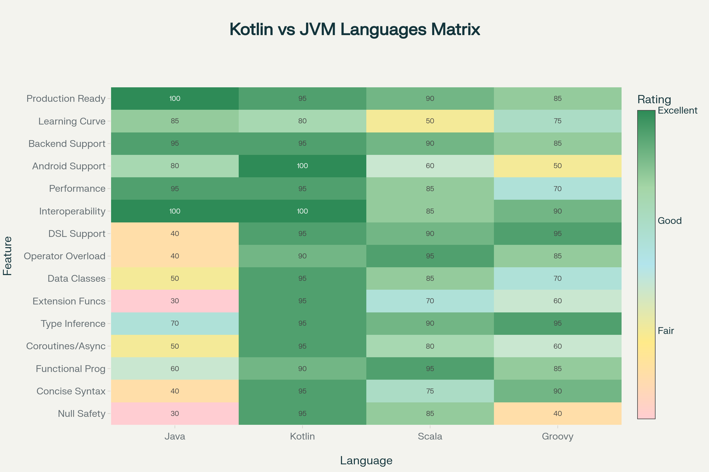
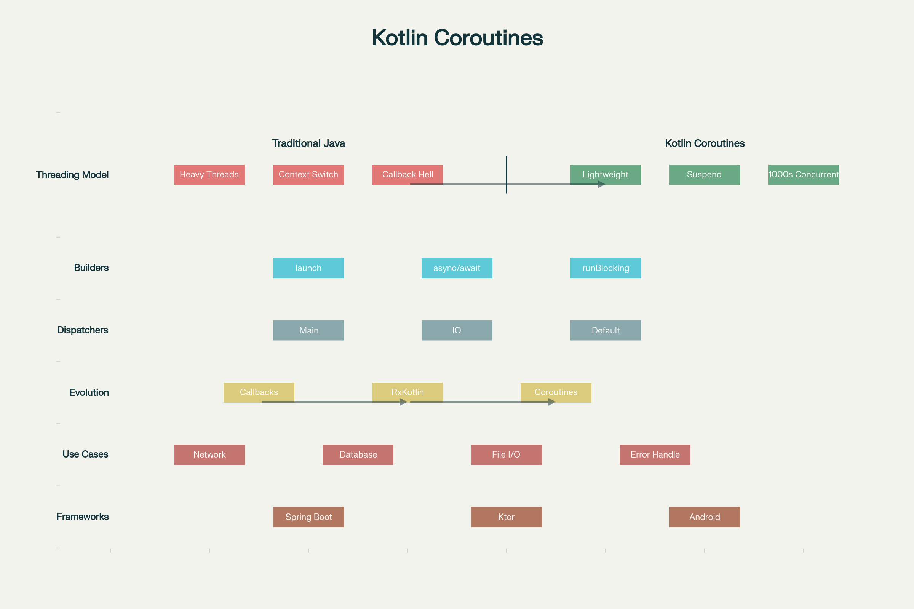
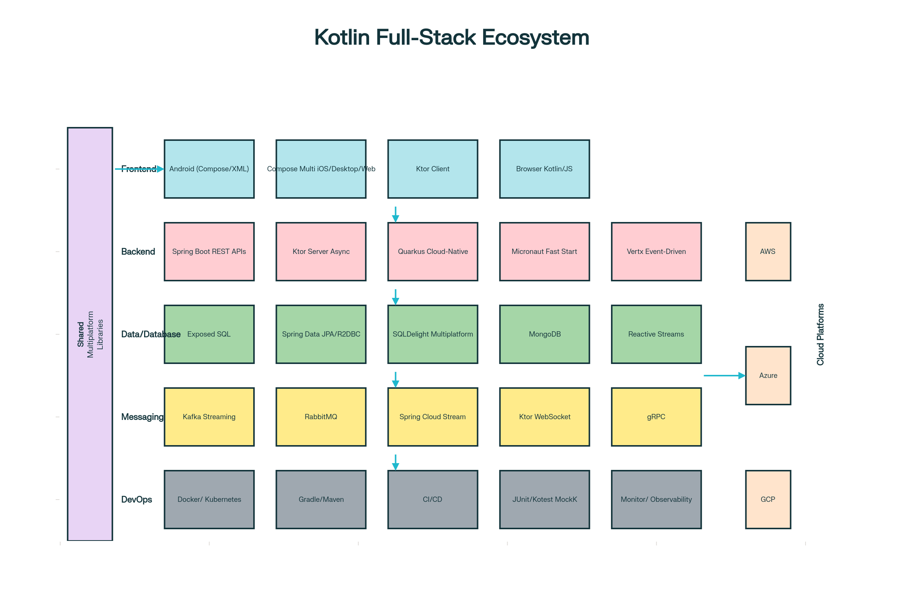

### Kotlin – Complete Learning Guide for Full-Stack Development & Hyperautomation

**Kotlin is a modern, statically-typed programming language developed by JetBrains (creators of IntelliJ IDEA) that runs on the Java Virtual Machine (JVM), enabling developers to write expressive, concise code with superior null safety, powerful functional programming capabilities, and native support for asynchronous programming through coroutines.** Officially adopted by Google as the preferred language for Android development in 2019, Kotlin has evolved into a full-stack development platform enabling everything from Android and iOS mobile apps to cloud-native microservices to desktop and web applications—all using a single language and shared code.[1][2][3][4][5][6]

### Why Kotlin for Hyperautomation and Full-Stack Development?

In the hyperautomation context we've explored throughout this conversation, **Kotlin offers unique advantages for implementing end-to-end automation platforms**:

**1. Backend Automation Services**: Kotlin with Spring Boot enables building robust microservices consuming data from RPA bots, feeding into machine learning pipelines, orchestrating workflows, and exposing APIs for automation platforms.[7][4][8]

**2. Coroutine-Based Concurrency**: Hyperautomation processes handle high concurrency—thousands of concurrent bot executions, parallel ML model inferences, concurrent API requests. Kotlin coroutines enable writing concurrent code that looks sequential and maintains full scalability.[9][10]

**3. Multiplatform Development**: A single Kotlin codebase runs on Android, iOS, desktop, and web—enabling building automation interfaces for any platform.[5][6][11]

**4. Seamless Java Interoperability**: Organizations with existing Java-based systems integrate Kotlin seamlessly without rewrites. Kotlin uses all Java libraries, frameworks, and existing infrastructure.[3][12][13]

**5. Type Safety and Null Safety**: Kotlin's strict null handling and type safety catch errors at compile time, critical for automation systems where bugs can propagate at scale through thousands of processes.[2][12][14]

### Kotlin Fundamentals: Language Features



**Null Safety**: Kotlin eliminates `NullPointerException` through compile-time null safety. Variables are non-nullable by default; nullable variables are explicitly marked with `?`:[2][3][14]

```kotlin
// Non-nullable string - cannot be null
val name: String = "John"

// Nullable string - can be null  
val optionalEmail: String? = null

// Safe call operator - returns null if optionalEmail is null
val emailLength = optionalEmail?.length

// Elvis operator - use default if null
val email = optionalEmail ?: "no-email@example.com"
```

**Concise Syntax**: Kotlin eliminates boilerplate Java requires. Data classes automatically provide constructors, getters, setters, `equals()`, `hashCode()`, and `toString()`:[12][14][2]

```kotlin
// Kotlin data class - one line
data class User(val id: Int, val name: String, val email: String)

// Equivalent Java class - dozens of lines with getters, setters, equals, hashCode, toString
public class User {
    private int id;
    private String name;
    private String email;
    // ... constructors, getters, setters, equals, hashCode, toString
}
```

**Functional Programming Support**: Kotlin treats functions as first-class citizens, enabling functional programming paradigms alongside object-oriented programming:[14][15][12]

```kotlin
// Higher-order functions (functions taking/returning functions)
fun <T, R> List<T>.transform(mapper: (T) -> R): List<R> {
    return map(mapper)
}

// Lambda expressions
val numbers = listOf(1, 2, 3, 4, 5)
val doubled = numbers.map { it * 2 }  // Lambda syntax
val squared = numbers.map { x -> x * x }

// Extension functions (adding methods without inheritance)
fun String.isValidEmail(): Boolean {
    return this.contains("@")
}

val isValid = "user@example.com".isValidEmail()
```

**Smart Casts**: Kotlin's compiler intelligently handles type casting, eliminating verbose casting boilerplate:[12][14]

```kotlin
// Instead of Java's verbose instanceof + cast
val obj: Any = "Hello"
if (obj is String) {
    // obj is automatically cast to String here
    println(obj.length)
}
```

**Default Arguments and Named Parameters**: Eliminating constructor/method overloading:[3][14]

```kotlin
fun sendEmail(
    to: String,
    subject: String = "No Subject",
    body: String = "",
    priority: Int = 0
) {
    // ...
}

// Can call with defaults or override specific ones
sendEmail("user@example.com")
sendEmail("user@example.com", subject = "Important", priority = 1)
```

### Kotlin Coroutines: Asynchronous Programming Revolution



**Traditional Java Threading Model** creates one thread per concurrent operation. With thousands of RPA bots executing simultaneously, managing thousands of threads becomes problematic—each thread consumes significant memory, context switching overhead multiplies, and debugging becomes nearly impossible.[9][10][16]

**Kotlin Coroutines** solve this through lightweight concurrency. Coroutines suspend without blocking threads, enabling thousands of concurrent operations on a handful of actual threads. The magic: code looks sequential (easy to read), but executes concurrently (efficient):[10][9]

```kotlin
// Traditional callback approach - callback hell
getUserData(id) { user ->
    getOrders(user.id) { orders ->
        getOrderDetails(orders[0].id) { details ->
            println(details)
            // Nested callbacks become unreadable
        }
    }
}

// Kotlin coroutine approach - sequential, readable, concurrent
suspend fun getOrderSummary(id: Int) {
    val user = getUserData(id)  // Suspends, doesn't block
    val orders = getOrders(user.id)
    val details = getOrderDetails(orders[0].id)
    println(details)
}

// Calling from other coroutines
GlobalScope.launch {
    getOrderSummary(123)
}
```

**Key Coroutine Concepts**:[9][10]

**`suspend` functions** can be paused and resumed. When a suspend function waits for I/O, it doesn't block the underlying thread—the thread can execute other coroutines:[9]

```kotlin
suspend fun fetchUserData(id: Int): User {
    // This can suspend without blocking threads
    return withContext(Dispatchers.IO) {
        // Network request happens here
        networkClient.getUser(id)
    }
}
```

**`async` and `await`** enable structured concurrency for parallel operations:[10][9]

```kotlin
// Launch multiple concurrent operations, wait for all
suspend fun loadPage() {
    val userData = async { fetchUserData(123) }
    val posts = async { fetchUserPosts(123) }
    val comments = async { fetchComments(123) }
    
    // Wait for all to complete
    val user = userData.await()
    val userPosts = posts.await()
    val userComments = comments.await()
    
    displayPage(user, userPosts, userComments)
}
```

**`launch`** for fire-and-forget operations without blocking:[9]

```kotlin
launch {
    // This runs concurrently, doesn't block caller
    updateAnalytics()
}
```

**Dispatchers** control which thread runs the coroutine:[9]

- `Dispatchers.Main` - UI thread (Android/Desktop)
- `Dispatchers.IO` - optimized for I/O operations (network, files)
- `Dispatchers.Default` - CPU-intensive operations
- `Dispatchers.Unconfined` - inherits from caller

**Practical Hyperautomation Use Case**:[10][9]

In a hyperautomation scenario processing thousands of customer records through RPA bots and ML models:

```kotlin
suspend fun processCustomers(customerIds: List<Int>) {
    customerIds.map { id ->
        async {
            // Each customer processed concurrently
            val customer = fetchCustomerData(id)
            val rpaResult = executeRPABot(customer)
            val mlPrediction = runMLModel(rpaResult)
            storeResults(id, mlPrediction)
        }
    }.awaitAll()
}

// Instead of sequential processing (days), process thousands concurrently (minutes)
GlobalScope.launch {
    processCustomers((1..10000).toList())
}
```

### Building Backend Services: Spring Boot + Kotlin



**Spring Boot is the dominant framework for building microservices**, and Kotlin has first-class support:[7][4][8][17]

```kotlin
// Spring Boot application in Kotlin
@SpringBootApplication
class AutomationServiceApplication

fun main(args: Array<String>) {
    runApplication<AutomationServiceApplication>(*args)
}

// Controller endpoints
@RestController
@RequestMapping("/api/automation")
class AutomationController(val automationService: AutomationService) {
    
    @PostMapping("/execute")
    suspend fun executeWorkflow(@RequestBody request: WorkflowRequest): WorkflowResponse {
        // Suspend function - coroutine-based, non-blocking
        return automationService.executeWorkflow(request)
    }
    
    @GetMapping("/status/{workflowId}")
    suspend fun getStatus(@PathVariable workflowId: String): WorkflowStatus {
        return automationService.getWorkflowStatus(workflowId)
    }
}

// Service layer with business logic
@Service
class AutomationService(
    val rpaBotManager: RPABotManager,
    val mlModelService: MLModelService,
    val workflowRepository: WorkflowRepository
) {
    suspend fun executeWorkflow(request: WorkflowRequest): WorkflowResponse {
        // Launch RPA bot
        val rpaResult = rpaBotManager.executeBot(request.botId, request.data)
        
        // Run ML model for intelligence
        val mlPrediction = mlModelService.predict(rpaResult)
        
        // Store results
        val workflowExecution = WorkflowExecution(
            id = UUID.randomUUID().toString(),
            botId = request.botId,
            rpaResult = rpaResult,
            mlPrediction = mlPrediction,
            timestamp = Instant.now()
        )
        workflowRepository.save(workflowExecution)
        
        return WorkflowResponse(workflowExecution)
    }
}

// Data classes - minimal boilerplate
data class WorkflowRequest(
    val botId: String,
    val data: Map<String, Any>
)

data class WorkflowResponse(
    val workflowId: String,
    val status: String,
    val result: Map<String, Any>
)
```

**Reactive Programming with Spring WebFlux**: For extreme concurrency (thousands of simultaneous requests), Spring WebFlux + Kotlin enables non-blocking request handling:[17]

```kotlin
@RestController
class ReactiveController(val service: ReactiveService) {
    
    @GetMapping("/process/{id}")
    fun processData(@PathVariable id: String): Mono<Result> {
        return service.processAsync(id)
    }
    
    @GetMapping("/stream")
    fun streamResults(): Flux<Event> {
        return service.streamEvents()
    }
}
```

### Building Lightweight APIs: KtorFor organizations preferring minimalist frameworks, **Ktor** offers lightweight Kotlin-first development:[6][18][19]

```kotlin
fun Application.module() {
    install(ContentNegotiation) {
        json()
    }
    
    routing {
        // RESTful endpoints
        get("/tasks") {
            val tasks = taskRepository.getAllTasks()
            call.respond(tasks)
        }
        
        post("/tasks") {
            val task = call.receive<Task>()
            val saved = taskRepository.saveTask(task)
            call.respond(HttpStatusCode.Created, saved)
        }
        
        delete("/tasks/{id}") {
            val id = call.parameters["id"] ?: return@delete
            val deleted = taskRepository.deleteTask(id)
            call.respond(if (deleted) HttpStatusCode.NoContent else HttpStatusCode.NotFound)
        }
    }
}

fun main() {
    embeddedServer(Netty, port = 8080, module = Application::module).start(wait = true)
}
```

### Full-Stack Development: Compose Multiplatform**Compose Multiplatform** enables building UIs for Android, iOS, desktop, and web using **Kotlin and Jetpack Compose**, sharing code across platforms:[5][6][11]

```kotlin
// Shared code - runs on all platforms
@Composable
fun App() {
    MaterialTheme {
        var customerName by remember { mutableStateOf("") }
        var workflowStatus by remember { mutableStateOf<WorkflowStatus?>(null) }
        
        Column {
            TextField(
                value = customerName,
                onValueChange = { customerName = it },
                label = { Text("Enter Customer ID") }
            )
            
            Button(onClick = {
                launch {
                    workflowStatus = executeWorkflow(customerName)
                }
            }) {
                Text("Execute Automation")
            }
            
            workflowStatus?.let {
                Text("Status: ${it.status}")
                Text("Result: ${it.result}")
            }
        }
    }
}
```

This single code runs on:
- **Android** - native performance
- **iOS** - native performance
- **Desktop** - via JVM
- **Web** - via WebAssembly

### Testing Kotlin Applications**Unit Testing**: Kotlin integrates seamlessly with JUnit and specialized Kotlin testing frameworks:[20][21][22]

```kotlin
// Unit test using kotlin.test
class CalculatorTest {
    private val calculator = Calculator()
    
    @Test
    fun testAdd() {
        assertEquals(4, calculator.add(2, 2))
    }
    
    @Test
    fun testDivideByZero() {
        assertFailsWith<ArithmeticException> {
            calculator.divide(10, 0)
        }
    }
}

// Using MockK for mocking
class WorkflowServiceTest {
    private val rpaBotManager = mockk<RPABotManager>()
    private val service = WorkflowService(rpaBotManager)
    
    @Test
    fun testExecuteWorkflow() = runTest {
        every { rpaBotManager.executeBot(any(), any()) } returns "success"
        
        val result = service.executeWorkflow("bot1", mapOf("key" to "value"))
        
        verify { rpaBotManager.executeBot("bot1", mapOf("key" to "value")) }
        assertEquals("success", result)
    }
}
```

**Integration Testing**: Test entire microservices with real databases and services:[21][20]

```kotlin
@SpringBootTest
class WorkflowControllerIntegrationTest {
    @Autowired
    private lateinit var webTestClient: WebTestClient
    
    @Test
    fun testExecuteWorkflow() {
        webTestClient.post()
            .uri("/api/automation/execute")
            .bodyValue(WorkflowRequest(botId = "bot1", data = emptyMap()))
            .exchange()
            .expectStatus().isOk
            .expectBody<WorkflowResponse>()
            .consumeWith { result ->
                assert(result.responseBody?.workflowId != null)
            }
    }
}
```

### Kotlin Microservices Architecture Best Practices**1. Domain-Driven Design (DDD)**: Organize services around business capabilities, not technical layers:[8]

```kotlin
// Package structure following DDD
com.example.automation
├── customer                // Customer bounded context
│   ├── controller
│   ├── service
│   ├── repository
│   └── entity
├── workflow                // Workflow bounded context
│   ├── controller
│   ├── service
│   └── repository
└── shared                  // Shared kernel
    ├── dto
    └── exception
```

**2. Loose Coupling via APIs**: Services communicate through well-defined REST APIs or messaging, not shared databases:[8]

```kotlin
// Customer Service - owns customer data
@RestController
class CustomerController(val service: CustomerService) {
    @GetMapping("/customers/{id}")
    suspend fun getCustomer(@PathVariable id: String): Customer {
        return service.findCustomer(id)
    }
}

// Workflow Service - calls Customer Service API
@Service
class WorkflowService(val httpClient: HttpClient) {
    suspend fun startWorkflow(customerId: String) {
        // Call API, not shared database
        val customer = httpClient.get("http://customer-service/customers/$customerId")
        // Process workflow...
    }
}
```

**3. Event-Driven Architecture**: Services communicate through events asynchronously:[17][8]

```kotlin
// Event definition
data class WorkflowCompletedEvent(
    val workflowId: String,
    val status: String,
    val result: Map<String, Any>,
    val timestamp: Instant = Instant.now()
)

// Publishing events (Producer)
@Service
class WorkflowService(val kafkaTemplate: KafkaTemplate<String, WorkflowCompletedEvent>) {
    suspend fun completeWorkflow(workflowId: String, result: Map<String, Any>) {
        kafkaTemplate.send("workflow-completed", workflowId, 
            WorkflowCompletedEvent(workflowId, "completed", result)
        )
    }
}

// Consuming events (Consumer)
@Service
class NotificationService {
    @KafkaListener(topics = ["workflow-completed"])
    suspend fun onWorkflowCompleted(event: WorkflowCompletedEvent) {
        sendNotification("Workflow ${event.workflowId} completed with status ${event.status}")
    }
}
```

**4. Resilience Patterns**: Handle failures gracefully:[17][8]

```kotlin
@Service
class ResilientWorkflowService(val rpaBotManager: RPABotManager) {
    
    // Circuit breaker - fail fast after repeated failures
    @CircuitBreaker(name = "executeBot", fallbackMethod = "executeBot FallBack")
    suspend fun executeBot(botId: String): String {
        return rpaBotManager.executeBot(botId)
    }
    
    suspend fun executeBotFallBack(botId: String, exception: Exception): String {
        logger.error("Bot execution failed, using fallback", exception)
        return "FALLBACK_EXECUTED"
    }
    
    // Retry with exponential backoff
    @Retry(name = "executeBot", fallbackMethod = "executeBot FallBack")
    suspend fun executeWithRetry(botId: String): String {
        return executeBot(botId)
    }
}
```

### Kotlin in Hyperautomation ContextKotlin enables implementing complete hyperautomation stacks:

**1. Orchestration Layer**: Kotlin microservice coordinating RPA bots, AI models, and workflows:[4][8]

```kotlin
@Service
class HyperautomationOrchestrator(
    val rpaBotManager: RPABotManager,
    val mlModelService: MLModelService,
    val workflowEngine: WorkflowEngine
) {
    suspend fun executeCompleteWorkflow(customerId: String) {
        // Step 1: Extract data via RPA
        val extractedData = rpaBotManager.executeExtraction(customerId)
        
        // Step 2: Enrich with ML predictions
        val enrichedData = mlModelService.enrichData(extractedData)
        
        // Step 3: Execute business logic
        workflowEngine.executeWorkflow(enrichedData)
    }
}
```

**2. Data Pipeline**: Processing automation data at scale:[6][4]

```kotlin
@Service
class DataPipelineService(val kafkaTemplate: KafkaTemplate<String, WorkflowData>) {
    
    suspend fun processPipeline() = coroutineScope {
        // Process in parallel - thousands of workflows concurrently
        (1..10000).map { workflowId ->
            async {
                val data = fetchWorkflowData(workflowId)
                val processed = processData(data)
                publishResult(processed)
            }
        }.awaitAll()
    }
}
```

**3. API Gateway for Automation Platform**: Single entry point for all automation requests:[8]

```kotlin
@RestController
class AutomationGateway(val workflowService: WorkflowService) {
    
    @PostMapping("/api/v1/workflows")
    suspend fun submitWorkflow(@RequestBody request: WorkflowRequest): WorkflowResponse {
        return workflowService.submit(request)
    }
    
    @GetMapping("/api/v1/workflows/{id}/status")
    suspend fun getStatus(@PathVariable id: String): WorkflowStatusResponse {
        return workflowService.getStatus(id)
    }
    
    @PutMapping("/api/v1/workflows/{id}/cancel")
    suspend fun cancelWorkflow(@PathVariable id: String): CancellationResponse {
        return workflowService.cancel(id)
    }
}
```

### Comparing Kotlin to Java for Hyperautomation| **Aspect** | **Java** | **Kotlin** |
|---|---|---|
| **Code Volume** | ~300 lines for simple service | ~150 lines (50% less) |
| **Null Crashes** | Common - requires defensive null checks | Rare - compile-time null safety |
| **Concurrency** | Threads, complex threading | Lightweight coroutines, sequential code style |
| **Development Speed** | Slower due to boilerplate | Faster, cleaner code |
| **Learning Curve** | Easy for Java developers | Easy for Java developers, slightly steeper otherwise |
| **Microservices** | Excellent with Spring Boot | Excellent with Spring Boot, Ktor, Quarkus |
| **Android** | Supported but cumbersome | Google's preferred choice, Jetpack Compose |
| **Full-Stack** | Separate languages needed | Single language via Kotlin Multiplatform |
| **Performance** | Excellent | Identical (compiles to same JVM bytecode) |
| **Ecosystem** | Massive, mature | Large, rapidly growing |
| **Production Use** | Decades of stability | Bank-grade reliability (used by Netflix, Uber, Google) |

### Conclusion**Kotlin represents the evolution of the JVM ecosystem for modern application development.** For organizations implementing hyperautomation, Kotlin offers:

- **Concise Backend Services**: Build microservices with 50% less code than Java
- **Efficient Concurrency**: Coroutines enable handling thousands of concurrent automation processes
- **Full-Stack Capabilities**: Single language from mobile frontends to cloud backends
- **Production Maturity**: Used by Netflix, Uber, Google, and countless enterprises
- **Seamless Integration**: Use all existing Java libraries without modification
- **Type Safety**: Catch errors at compile-time, reducing production issues

Organizations automating complex business processes can implement complete hyperautomation platforms—combining RPA, AI/ML, low-code platforms, workflow orchestration, and intelligent document processing—using Kotlin throughout the stack, from backend automation services to mobile interfaces.

As hyperautomation matures from isolated process automation to enterprise-wide intelligent automation platforms, Kotlin's combination of developer productivity, runtime efficiency, type safety, and ecosystem maturity positions it as the language of choice for building next-generation automation infrastructure.

***

[1](https://blog.krybot.com/t/kotlin-programming-ideas-combat/27525)
[2](https://www.hellobizmia.com/insights/kotlin-vs-java-which-one-to-pick-in-2025-for-building-apps)
[3](https://en.wikipedia.org/wiki/Kotlin)
[4](https://tucanoo.com/how-to-build-a-microservices-based-crm-using-spring-boot-kotlin-and-react/)
[5](https://www.youtube.com/watch?v=1ZWJ8V37Ay0)
[6](https://ktor.io/docs/full-stack-development-with-kotlin-multiplatform.html)
[7](https://piotrminkowski.wordpress.com/2019/01/15/kotlin-microservice-with-spring-boot/)
[8](https://www.linkedin.com/pulse/best-architecture-practices-spring-boot-kotlin-ahmad-alqaisi-jevfc)
[9](https://kotlinlang.org/docs/coroutines-overview.html)
[10](https://www.youtube.com/watch?v=zS5GLpgWNKQ)
[11](https://www.jetbrains.com/help/kotlin-multiplatform-dev/compose-multiplatform-create-first-app.html)
[12](https://stepmediasoftware.com/blog/difference-between-kotlin-and-java/)
[13](https://betterprogramming.pub/kotlin-runs-on-the-jvm-just-like-java-how-does-it-provide-so-many-great-features-b27ed269015b)
[14](https://www.imaginarycloud.com/blog/kotlin-vs-java)
[15](https://codefinity.com/blog/Java-vs-Kotlin:-A-Comprehensive-Comparison-for-Developers)
[16](https://www.baeldung.com/kotlin/coroutines-vs-rxkotlin)
[17](https://moldstud.com/articles/p-integrating-kotlin-with-microservices-architecture)
[18](https://www.youtube.com/watch?v=U5j-_YncxOQ)
[19](https://ktor.io/docs/creating-http-apis.html)
[20](https://www.baserock.ai/blog/automate-kotlin-integration-tests-baserock)
[21](https://testrigor.com/kotlin-testing/)
[22](https://www.diffblue.com/resources/kotlin-unit-testing-guide/)
[23](https://www.reddit.com/r/Kotlin/comments/1mfli9e/best_practices_for_structuring_largescale_kotlin/)
[24](https://blog.stackademic.com/modern-android-development-with-jetpack-compose-and-kotlin-920d83dc9fbf)
[25](https://www.zybooks.com/catalog/mobile-app-development-android-jetpack-compose/)
[26](https://www.xenonstack.com/blog/hyperautomation-use-case)
[27](https://www.cmarix.com/blog/future-of-rpa-in-business-automation/)
[28](https://www.inspirisys.com/blog-details/Top-10-Microservices-Design-Patterns-Maximize-Your-Business-Potential/165)
[29](https://www.entrans.ai/blog/top-hyperautomation-companies)
[30](https://www.reddit.com/r/androiddev/comments/1j3sirh/testing_instrumentation_vs_integration_vs_unit_vs/)