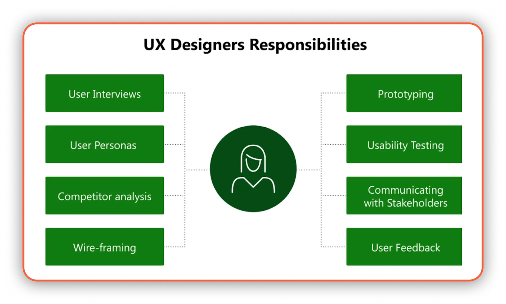
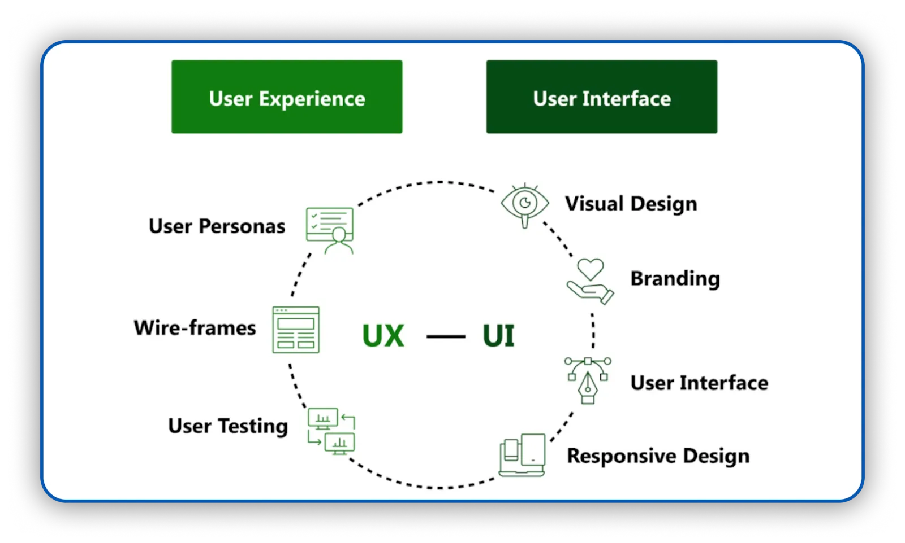

# A Product Manager’s Guide

## Overview
In the evolving landscape of product development, understanding each team member’s role and responsibilities is critical to building successful products.  
As a **Product Manager (PM)**, you act as the conductor — aligning vision, execution, and collaboration across cross-functional teams.  

By the end of this guide, you will:
- Identify and articulate the primary responsibilities of UX and UI designers.  
- Differentiate between UX, UI, and Visual Design skill sets.  
- Understand how to coordinate effectively with design, development, QA, marketing, and stakeholder teams.  
- Learn how to foster motivation, resolve conflicts, and drive success through collaboration.

---

## 1. User Experience (UX) Design

### What UX Designers Do
UX Designers lead **user-centered design** efforts, focusing on **usability, functionality, and intuitive interaction**.  
Their goal: ensure every interaction feels meaningful, efficient, and human.

**Core Responsibilities**
- Conduct user interviews and usability testing  
- Analyze behavioral data and pain points  
- Create user flows, personas, and wireframes  
- Develop prototypes and conduct iterative testing  
- Collaborate with stakeholders for feedback alignment  

**Example:**  
A UX designer working on a data analytics platform may map out user flows that simplify complex dashboards, helping users interpret data more intuitively.

### Key Deliverables
- 📄 **User Flows** – mapping each step of a user journey  
- 👥 **Personas** – fictional yet data-backed user profiles  
- 🧩 **Wireframes** – low-fidelity structural blueprints  
- 🧪 **Prototypes** – interactive models for usability testing   

### Impact
UX Designers ensure that the product:
- Solves real user problems  
- Minimizes friction and confusion  
- Balances business goals with user satisfaction  

---

## 2. User Interface (UI) Design

UI Designers transform wireframes into **beautiful, interactive experiences**.  
They define **visual style, consistency, and accessibility**, ensuring that the interface is not just usable — but delightful.

**Core Focus Areas**
- Color palettes and typography aligned with brand identity  
- Iconography, spacing, and hierarchy for clarity  
- Responsive layouts for multiple devices  
- Micro-interactions and animations to enhance engagement  

**Example:**  
A UI designer working on a logistics app might define a color-coded system for tracking shipments — instantly communicating status through intuitive visuals.

**Tools Commonly Used:** Figma, Adobe XD, Sketch, InVision   

### UX vs UI: The Connection
| UX Design | UI Design |
|------------|------------|
| Focuses on user flow and experience | Focuses on visual layout and interaction |
| Research-driven | Aesthetic-driven |
| Wireframes, prototypes, personas | Color, typography, iconography |
| Determines how it works | Determines how it looks |

Both work together — UX defines the structure; UI brings it to life.

---

## 3. Visual Design and Brand Strategy

Visual design translates brand identity into sensory experiences that **evoke emotion and recognition**.

### Key Elements
- 🎨 **Color Psychology** – Blue (trust), Green (calm), Red (energy)  
- 🔤 **Typography** – Serif (classic), Sans-serif (modern)  
- 🖼 **Imagery** – Authentic, minimalist, or vibrant based on brand tone  
- 💫 **Consistency** – Across all touchpoints for stronger brand recall  

**Example:**  
A SaaS product using bold geometric shapes and vibrant colors signals innovation and reliability.

Visual design = Emotional storytelling + Brand differentiation + User trust.

---

## 4. Product Management and Team Coordination

PMs orchestrate all moving parts:
- Set clear **vision and strategy**  
- Define **goals, metrics, and timelines**  
- Facilitate **cross-functional collaboration**  
- Conduct **regular check-ins** for progress and morale  

Strong coordination helps every team member understand how their work contributes to the larger picture.

---

## 5. Motivation, Recognition, and Performance Tracking

High-performing teams thrive on **motivation and recognition**.

- Celebrate individual and team achievements  
- Use **milestone dashboards** to visualize progress  
- Offer constructive feedback regularly  
- Keep discussions transparent and outcome-oriented  

---

## 6. Conflict Resolution and Stakeholder Collaboration

### When Conflicts Arise
Differences are natural — for example:
- UX may prioritize functionality  
- UI may emphasize visual appeal  

**Product Manager’s Role**
1. Facilitate open dialogue  
2. Listen to all perspectives  
3. Use data to ground decisions  
4. Seek integrative (not compromising) solutions  

With stakeholders, PMs mediate competing visions by:
- Gathering facts and context  
- Presenting insights with objective data  
- Aligning everyone around shared goals  

Conflict → Collaboration → Stronger outcomes.

---

## 7. Design & Development Collaboration

**Designers** conceptualize ideas; **Developers** bring them to life.

- Early collaboration ensures feasibility and efficiency  
- Shared tools (Figma → React components) reduce rework  
- Engineers provide technical feedback during design  
- Agile ceremonies like sprint planning bridge both sides  

**Developer Roles**
- Front-end: Interface and interaction logic  
- Back-end: Data, APIs, and server-side logic  
- Full-stack: Both ends, common in lean teams  

---

## 8. Quality Assurance (QA) and Testing

QA ensures the product works as intended — securely and reliably.

**Key Practices**
- Write and execute test plans  
- Perform manual and automated tests  
- Log bugs via CI/CD pipelines  
- Validate fixes and performance metrics  

Quality is a **team responsibility**, not a final step.

---

## 9. Technical Writing and Documentation

Technical writers create resources that empower users and internal teams alike.

**Types of Documentation**
- User manuals & onboarding guides  
- Knowledge bases & FAQs  
- API documentation for developers  

Good documentation = fewer support tickets + faster adoption.

---

## 10. Marketing and Product Launch

Marketing converts features into stories.  

**Core Activities**
- Define target audiences and messaging  
- Build campaigns (videos, emails, social media)  
- Develop case studies and whitepapers  
- Measure engagement via analytics tools  

Launch success depends on **coordination between PM, Marketing, and Sales**.

---

## 11. Stakeholder Engagement and Feedback Loops

PMs keep stakeholders informed and aligned through:
- Regular progress reports  
- Product roadmaps & dashboards  
- Data-driven presentations  

Continuous feedback ensures transparency, trust, and shared ownership.

---

## 12. Agile Development Practices

Agile supports **iterative improvement** and **collaboration**.  

**Key Frameworks:** Scrum, Kanban  
**Roles:**
- Product Owner – prioritizes work  
- Scrum Master – facilitates process  
- Dev Team – executes tasks  

Short sprints, retrospectives, and daily stand-ups ensure flexibility and learning.

---

## 13. DesignOps & DevOps

- **DesignOps** scales design systems, tools, and workflows  
- **DevOps** automates deployment and testing for reliability  

Both aim to reduce silos, improve collaboration, and accelerate delivery.

---

## 14. Customer Success & Post-Launch Support

Support teams ensure users achieve desired outcomes through:
- Onboarding and training  
- Issue resolution  
- Collecting user feedback for improvements  

Their insights directly shape future product iterations.

---

## 15. Accessibility, Inclusivity, and Ethics

Inclusive design benefits everyone.

**Core Principles**
- Meet **WCAG** accessibility standards  
- Ensure color contrast, keyboard navigation, and screen reader compatibility  
- Protect user data and privacy  
- Consider global and cultural inclusivity  

Ethical, accessible products foster trust and long-term loyalty.

---

## 16. Integrating AI and Emerging Technologies

AI and ML are transforming product development.

**PM’s Responsibility**
- Understand AI’s potential and limitations  
- Ensure responsible and transparent usage  
- Balance automation with human empathy  

Cross-functional collaboration ensures AI enhances — not replaces — user value.

---

## 17. Measuring Success and Continuous Improvement

### Quantitative Metrics
- Retention rate  
- Conversion rate  
- Feature adoption  
- NPS (Net Promoter Score)

### Qualitative Feedback
- User interviews  
- Open-ended surveys  
- Usability testing  

Combine data and human insights to understand both **what** is happening and **why**.

---

## 18. Embracing Feedback-Driven Design

Feedback is a growth engine — for both product and team.

- Use surveys, interviews, and support channels  
- Conduct regular retrospectives  
- Encourage transparency and learning  

Continuous feedback → Continuous improvement.

---

## 19. Navigating Global Collaboration

Distributed teams are now the norm.

**Best Practices**
- Use asynchronous communication tools (Notion, Slack, Miro)  
- Maintain detailed documentation  
- Respect time zones and cultural differences  
- Foster empathy and trust across borders  

Diversity drives creativity and resilience.

---

## Conclusion

A successful product manager doesn’t just manage tasks — they **understand people**.  
By learning the roles, motivations, and collaboration patterns within your team, you enable synergy, innovation, and sustainable success.  

> “Products succeed not just because of great strategy, but because of great teamwork.”

---

### Key Takeaways
- Understand roles → Build empathy  
- Communicate clearly → Build trust  
- Iterate continuously → Build better products  
- Celebrate success → Build motivation  

---

### 🏷 Recommended Tags
`#ProductManagement` `#TeamCollaboration` `#UXDesign` `#UIDesign` `#Leadership` `#Agile` `#DesignOps` `#DevOps` `#UserResearch`

---

### 📚 Suggested Reading
- *Inspired* by Marty Cagan  
- *Lean UX* by Jeff Gothelf  
- *The Design of Everyday Things* by Don Norman  

---

