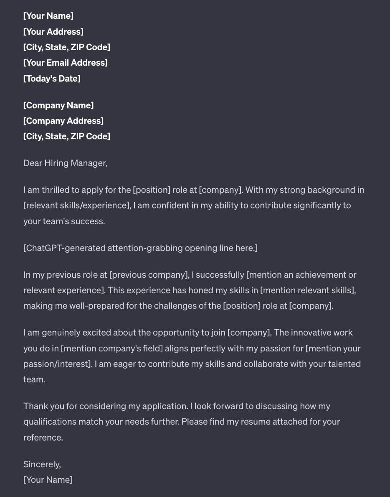

# Job Search Prompts Master Template

This markdown file provides a structured format for adding prompts across different categories of job search strategies. Each section includes a **Copy & Paste Prompt Block** where you can insert, expand, and store as many prompts as needed.


## 1. Position Finding

#### Prompt Title
```

Your prompt here...
```

---

## 2. General Job Search


#### Prompt Title
```
Your prompt here...
```

---

## 3. Skill Gap Analysis

#### Prompt Title
```
Your prompt here...
```

---

## 4. Resume & Job Description Match Analysis


#### Resume Matching 
```
Analyze my resume against this job description and provide: 
1) Match score (0-100%), 
2) Top 5 missing keywords, 
3) Experience gaps, 
4) Specific phrases to incorporate. 
Resume: [PASTE YOUR RESUME TEXT] 
Job Description : [PASTE YOUR JOB DESCRIPTION]
```

---

## 5. Buzzword Detection


#### Prompt Title
```
Your prompt here...
```

---

## 6. Improvement Suggestions (Resume / Cover Letter / LinkedIn)


#### Prompt Title
```
Your prompt here...
```

---

## 7. Job Search by Location


#### Prompt Title
```
Your prompt here...
```

---

## 8. Job Search Based on Skill Gaps & Best Fit Matching


#### Prompt Title
```
Your prompt here...
```

---

## 9. Jobs by Posting Time (2 hours / 1 day / 48 hours / 1 week / 1 month)


#### Prompt Title
```
Your prompt here...
```

---

## 10. Resume Readability Test


#### Prompt Title
```
Your prompt here...
```

---

## 11. ATS Resume Checker


#### Prompt Title
```
Your prompt here...
```

---

## 12. Resume Roast (Casual or Harsh)


#### Prompt Title
```
Your prompt here...
```

---

## 13. Career Personality Tests / Strength Assessments


#### Prompt Title
```
Your prompt here...
```

---

## 14. AI Career Clock (Career Path Projection)


#### Prompt Title
```
Your prompt here...
```

---

## 15. LinkedIn Profile Generator / Optimization


#### Prompt Title
```
Your prompt here...
```

---

## 16. Harsh Judgements for Resume & Cover Letter Improvements


#### Prompt Title
```
Your prompt here...
```

---

## 17. Job Search Keywords & SEO Optimization


#### Prompt Title
```
Your prompt here...
```

---

## 18. Skills Improvement Roadmaps


#### Prompt Title
```
Your prompt here...
```

---

## 19. Networking and Outreach Prompt Templates


#### Prompt Title
```
Your prompt here...
```

---

## 20. Cover Letter Writer / Enhancer

#### Cover Letter Master
```
Please help me write a compelling, story-driven cover letter.
Here's my resume: [PASTE]
Here's the job description: [PASTE]
[Detailed instructions for full letter]
```

#### General Cover Letter Prompts
```
Write a professional cover letter for a [Job Title] position at [Company Name] using my resume below as a reference.
My resume: [PASTE]
```

```
Create a concise and persuasive cover letter that highlights my qualifications for [Job Title] at [Company Name].
My resume: [PASTE]
```

#### Customization and Tone-Based Prompts
```
Write a formal cover letter for a corporate job in finance that emphasizes my leadership and analytical skills.
```
```
Draft a cover letter with a conversational and friendly tone for a startup role in marketing.
```

#### Industry-Specific Cover Letter Prompts
```
Compose a cover letter for a software engineering position emphasizing my coding skills and project experience.
```
```
Write a compelling cover letter for a healthcare role, showcasing my experience in patient care and teamwork.
```

#### Entry-Level and Career Change Prompts
```
Help me write a cover letter for my first job after college, highlighting my internships and academic achievements.
```
```
I am switching careers from sales to UX design. Write a cover letter that highlights my transferable skills.
```

#### Personalized and Storytelling-Based Prompts
```
Use a storytelling approach to craft a compelling cover letter that explains my journey into [Industry].
```
```
Create a cover letter that connects my personal experiences with my passion for [Field].
```
Here are four ChatGPT prompts for crafting cover letters that we absolutely love. Feel free to personalize them based on your experience, target companies, and job titles:
```
    1) "Write a conversational cover letter for a [position] role at [company] using my resume below as a reference."
    2) "Draft a persuasive cover letter in 150 words or less highlighting my qualifications and enthusiasm for the [position] at [company] using my resume achievements below."
    3) "Create a compelling cover letter that explains why I am the best fit for the [position] at [company]. Use the StoryBrand Framework to structure it."
    4) "Compose a professional cover letter demonstrating how my abilities align with the requirements for the [position] at [company]. Use the information below as a guide."
```

#### Cover Letter Example Template
 

---

## 21. Mock Interview Questions & Feedback


#### Prompt Title
```
Your prompt here...
```

---

## 22. Salary Research & Negotiation Strategies


#### Prompt Title
```
Your prompt here...
```

---

## 23. Portfolio / GitHub Profile Improvement


#### Prompt Title
```
Your prompt here...
```

---

## 24. Career Switching / Transition Planning


#### Prompt Title
```
Your prompt here...
```

---

## 25. Job Market Trends & Industry Insights


#### Prompt Title
```
Your prompt here...
```

---

## 26. Personal Branding Strategy


#### Prompt Title
```
Your prompt here...
```

---

## 27. Productivity & Job Search Planning Systems


#### Prompt Title
```
Your prompt here...
```

---

## 28. Professional Email Templates (Cold Outreach, Follow-ups)


#### Prompt Title
```
Your prompt here...
```

---

## 29. Remote Job Search Optimization


#### Prompt Title
```
Your prompt here...
```

---

## 30. Freelancing / Side Hustle Opportunity Explorer


#### Prompt Title
```
Your prompt here...
```

---

## 31. Job Search Automation & Tracking Systems (Spreadsheets, Notion, etc.)


#### Prompt Title
```
Your prompt here...
```

---

## 32. Industry-Specific Job Search Prompts (IT, Finance, Marketing, etc.)


#### Prompt Title
```
Your prompt here...
```


## 33. Interview Preparation Master Prompt (Copy–Paste Ready)

#### Prompt Title
```
🔹 Interview Preparation Master Prompt (Copy–Paste Ready)

**Prompt:**

Act as a **Senior Interview Consultant, Hiring Manager, and Technical Interviewer** with deep industry experience.
Your task is to **fully prepare me for an interview** based on the **Job Description provided below**.

### Job Description:

```
[PASTE THE FULL JOB DESCRIPTION HERE]
```
### Your Responsibilities:

Provide a **complete, structured, and in-depth interview preparation guide**, covering **technical, behavioral, system design, and role-specific expectations**.

---

## 1️⃣ Role & Company Expectations

* Summarize the role in **simple, practical terms**
* What the company is **really looking for** beyond the JD
* Key responsibilities translated into **interview expectations**
* Common mistakes candidates make for this role

---

## 2️⃣ Keywords, Skills & Technologies Breakdown

Extract **ALL keywords** from the job description and organize them into:

* Core technical skills
* Programming languages
* Frameworks & libraries
* Databases & storage
* Cloud & DevOps tools
* Architecture & system design concepts
* Security, performance & scalability concepts
* Soft skills & behavioral competencies

For **each keyword or technology**, include:

* What it is
* Why it matters for this role
* Depth of knowledge expected (Basic / Intermediate / Advanced)

---

## 3️⃣ Technology-Wise Preparation Topics

For **each technology or skill**, list:

* Core concepts
* Advanced concepts
* Real-world use cases
* Best practices
* Common interview traps & misconceptions
* How interviewers evaluate this skill

---

## 4️⃣ Technical Interview Questions (With Topics)

Provide **interview questions categorized by difficulty**:

### 🔹 Beginner / Screening Questions

* Questions
* What the interviewer is testing

### 🔹 Intermediate Questions

* Scenario-based questions
* Debugging or optimization questions

### 🔹 Advanced / Expert Questions

* Architecture & design questions
* Performance & scalability problems
* Trade-off and decision-making questions

Include:

* Expected answer structure
* Key points interviewers look for

---

## 5️⃣ System Design & Architecture (If Applicable)

* System design topics relevant to the role
* Common system design interview questions
* High-level architecture diagrams (described in text)
* Scalability, availability, and fault-tolerance concepts
* Design trade-offs and real-world constraints

---

## 6️⃣ Behavioral & HR Interview Preparation

* Common behavioral questions
* STAR-method sample answer structure
* Leadership, teamwork, conflict resolution, and ownership questions
* Red flags interviewers watch for

---

## 7️⃣ Resume & Experience Mapping

* How to map my past experience to this role
* Which projects to highlight
* How to explain gaps or role changes
* Strong vs weak example answers

---

## 8️⃣ Hands-On & Practical Preparation

* Coding practice topics
* Sample coding challenges
* Mock interview exercises
* Mini-projects or demos to prepare
* GitHub / portfolio suggestions

---

## 9️⃣ Final 7-Day / 14-Day Interview Preparation Plan

* Day-wise preparation schedule
* Priority topics
* Revision checklist
* Last-minute interview tips

---

## 🔟 Interview Day Strategy

* How to approach technical rounds
* How to clarify questions
* How to handle unknown questions
* How to communicate clearly and confidently

---

### Output Expectations:

* Use **clear headings**
* Use **bullet points and tables where helpful**
* Be **practical, interview-focused, and realistic**
* Assume I want to **crack the interview**, not just learn theory

**Do not skip any section. Be exhaustive and detailed.**

```
---

#### ✅ How to Use This Prompt

1. Copy everything above
2. Paste into ChatGPT
3. Add the **actual Job Description**
4. Optionally add:

   * Your experience level (e.g., “3 years backend developer”)
   * Target company name
   * Interview type (Product / Service / Startup / FAANG)

---


## 34. Resume + JD Interview Analysis Master Prompt (Copy–Paste Ready)

This prompt forces the AI to:

* Read your **resume like a real interviewer**
* Map it **line-by-line to the JD**
* Generate **personalized interview answers**
* Highlight **strengths, gaps, and improvement actions**
* Produce a **full interview-ready report**

#### Prompt Title
```
Below is a **second master prompt** designed specifically to **analyze your RESUME + JOB DESCRIPTION together** and then **answer every section from the previous Interview Consultant prompt**, with **customized examples, model answers, and gap analysis**.

This prompt forces the AI to:

* Read your **resume like a real interviewer**
* Map it **line-by-line to the JD**
* Generate **personalized interview answers**
* Highlight **strengths, gaps, and improvement actions**
* Produce a **full interview-ready report**

---

## 🔹 Resume + JD Interview Analysis Master Prompt (Copy–Paste Ready)

**Prompt:**

Act as a **Senior Interview Consultant, Technical Hiring Manager, and Career Coach**.
You must **analyze my Resume and the provided Job Description together** and generate a **fully customized interview preparation report**.

---

## Inputs

### 📄 Job Description:

```
[PASTE FULL JOB DESCRIPTION HERE]
```

### 📄 My Resume:

```
[PASTE FULL RESUME HERE]
```

---

## Objectives

You must:

* Strictly follow the **Interview Preparation Framework** defined below
* Base **all answers, examples, and explanations on my resume**
* Fill gaps with **realistic, interview-safe examples**
* Think like an interviewer evaluating *my profile for this role*

---

## INTERVIEW PREPARATION FRAMEWORK (MANDATORY)

### 1️⃣ Role Fit & Readiness Assessment

* How well my profile fits the role (Strong / Medium / Weak)
* Key strengths from my resume aligned to the JD
* Missing skills or experience gaps
* Risk areas interviewers may challenge
* How to position myself confidently despite gaps

---

### 2️⃣ Resume ↔ JD Keyword & Skill Mapping

Create a table with:

* JD keyword / requirement
* Where it appears in my resume (project, role, skill)
* Depth demonstrated (Basic / Intermediate / Advanced)
* Interview talking points

Highlight:

* Strongly matched skills
* Partially matched skills
* Missing but learnable skills

---

### 3️⃣ Technology & Topic Preparation (Resume-Based)

For **each technology, tool, and concept** from the JD:

* My current level (from resume evidence)
* What interviewers expect
* Gaps to close
* Topics I must prepare
* How to explain my experience clearly in interviews

---

### 4️⃣ Personalized Technical Interview Questions & Answers

Generate **custom interview questions** and **model answers** based on:

* My projects
* My tools & technologies
* My responsibilities

Include:

#### 🔹 Screening Questions

* Question
* Sample answer **based on my resume**
* What the interviewer is evaluating

#### 🔹 Intermediate Questions

* Scenario-based questions from my past work
* Debugging / optimization / design questions
* Step-by-step model answers

#### 🔹 Advanced Questions

* Architecture or system-level questions
* Trade-offs and decision-making
* How I should structure my answer

---

### 5️⃣ Project Deep-Dive Preparation

For **each major project on my resume**:

* Project summary (interview-ready)
* Architecture explanation
* My specific contributions
* Challenges faced and solutions
* Metrics, impact, and outcomes
* Possible follow-up questions & strong answers

---

### 6️⃣ System Design & Architecture (If Applicable)

* Design questions relevant to the JD
* How my past experience maps to system design expectations
* How to explain scalability, performance, and reliability
* Sample system design answer using my background

---

### 7️⃣ Behavioral & HR Questions (Resume-Based)

Provide **custom STAR-format answers** using:

* My real experiences
* My projects and roles

Include questions on:

* Leadership
* Conflict resolution
* Failure & learning
* Ownership & accountability
* Working under pressure

---

### 8️⃣ Coding & Practical Round Preparation

* Coding topics I must focus on
* Example problems aligned to the JD
* How my past coding experience supports this role
* Common mistakes to avoid

---

### 9️⃣ Resume Improvement Suggestions (Optional but Valuable)

* Resume gaps exposed by the JD
* Bullet-level improvements
* Stronger wording for impact
* Skills to add or emphasize

---

### 🔟 Final Interview Readiness Report

* Overall readiness score (out of 10)
* Strengths to highlight
* Weak areas to prepare
* 7-day / 14-day personalized preparation plan
* Final interview tips tailored to my profile

---

## Output Rules

* Use **clear headings and subheadings**
* Use **tables and bullet points**
* Be **resume-driven and interview-realistic**
* Avoid generic advice
* Assume this is a **high-stakes interview**

**Do not skip any section. Provide deep, actionable detail.**
```

## ✅ How This Prompt Helps You

✔ Turns ChatGPT into your **personal interview coach**
✔ Generates **resume-specific answers**
✔ Prepares you for **technical + behavioral rounds**
✔ Exposes **hidden interview risks**
✔ Saves **weeks of manual prep**

---